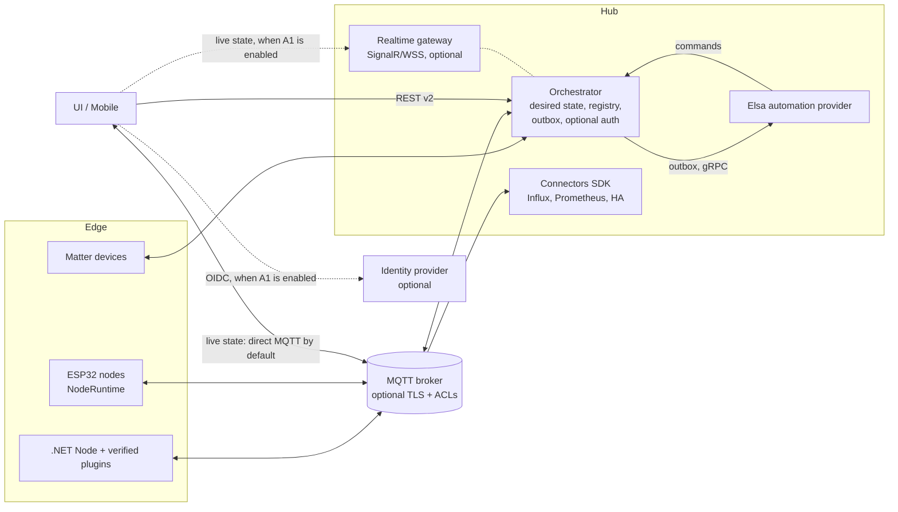

# RIoT2 platform review (September 2026)

This document records a full review of every RIoT2 repository: the bugs found and fixed, the open
issues backlog, implementation plans for the maintainability work, and proposals for architecture
changes and new features. Each repository's own
README/CLAUDE.md has been updated to match the code as it is now; this file is the cross-repository
summary.

## 1. Scope and verification

All 15 repositories were reviewed: Core, Orchestrator, Node, Devices, RasPi.Devices, Elsa,
Connector.InfluxDB, UI, Mobile, Matter (library, ControlBridge, Controller, OnOffSample),
Ard.Shared, Ard.M5Core2.Node, Ard.M5Dial.Node, Ard.WiegandI2C, and Tests.

Final verification (no `RIOT2_*` environment variables set):

| Component | Command | Result |
|---|---|---|
| RIoT2.Core | `dotnet build` | 0 warnings, 0 errors |
| RIoT2.Tests (Core, Orchestrator, Influx) | `dotnet test` | 212/212 passed (baseline: 8 of 194 failing on timeouts) |
| RIoT2.Net.Orchestrator | `dotnet build` | 0 warnings, 0 errors |
| RIoT2.Net.Node | `dotnet test` | 23/23 passed |
| RIoT2.Net.Devices | `dotnet test` | 31/31 passed (baseline 23) |
| RIoT2.Net.RasPi.Devices | `dotnet test` | 114/114 passed (baseline 111), warnings 1 → 0 |
| RIoT2.Matter | `dotnet test RIoT2.Matter.sln` | 56/56 passed (baseline 52), 0 warnings |
| RIoT2.Elsa | `dotnet test RIoT2.Elsa.sln` | 11/11 passed, NU1903 vulnerable SQLite warning fixed |
| RIoT2.Connector.InfluxDB | `dotnet build` | 0 warnings, 0 errors |
| RIoT2.Mobile | `dotnet test` + Windows build | 14/14 passed; Windows build fixed (it was failing) |
| RIoT2.UI | `npm test`, `npm run typecheck`, `npm run build` | 12/12 passed (baseline 8), type-check clean |
| RIoT2.Ard.M5Core2.Node / M5Dial.Node | `pio run` | Both boards build |
| Core compatibility | Every Core-consuming repo built against a package packed from current Core source | All compile, no source changes needed |

The ESP32 native unit tests (`RIoT2.Ard.Shared/tests`) need a host C++ compiler, and none was
available on the review machine, so they were not run. `RIoT2.Ard.WiegandI2C` has no PlatformIO
project, so it was reviewed but not built.

## 2. Things the maintainer has to do

These can't be done in code. Do them first.

1. **Rotate the leaked credentials and scrub them from git history.** The following were committed
   to public repositories and are still in history:
   - `RIoT2.Net.Orchestrator`: `bin/Debug/net9.0/StoredObjects/**` was tracked and contains a real
     Netatmo `clientId`, `clientSecret`, access token and refresh token (and other node config).
     The files are now untracked (`git rm --cached`) and `bin/` is ignored.
   - `RIoT2.Connector.InfluxDB`: `Properties/launchSettings.json` held a real InfluxDB token.
   - `RIoT2.Elsa`: the Elsa identity JWT signing key was hard-coded in `Program.cs`. It now comes from
     `ELSA_IDENTITY_SIGNING_KEY`.
   - `RIoT2.Mobile`: `Platforms/Android/google-services.json` contains the Firebase client API key.
     This key is not a server secret, but it should be restricted to the Android package and
     signing SHA in Google Cloud.

   Revoke and reissue the Netatmo app secret and tokens, the InfluxDB token and the MQTT passwords,
   then remove the files from history (for example `git filter-repo --path <file> --invert-paths`)
   and force-push. This is needed even on an isolated network: the repositories are public, so
   anyone can use the cloud credentials (Netatmo, InfluxDB) directly.
2. **Cut a Core release and align all consumers.** Consumers currently pin different Core versions:
   Orchestrator, Elsa and Influx use `0.1.41`; Node, Devices and RasPi use `0.1.43`. The security
   fixes in Core (serialization binder, zip-slip guard) only reach them after you tag
   `RIoT2.Core 0.1.44` and bump every `PackageReference` to it. The compatibility build above
   confirms no consumer code changes are needed. Afterwards, release the Node image and the Devices
   plugin zip together.
3. **Plan the .NET runtime upgrade.** .NET 8 (Influx) and .NET 9 (Orchestrator, Node, plugins,
   Matter, Mobile) both reach end of support in November 2026. Elsa already targets .NET 10 LTS.
   Move everything to `net10.0` in one coordinated release: TFMs, Docker base images, CI
   `setup-dotnet`, and the MAUI workloads. Core stays on `netstandard2.0`.
4. **Read the upgrade notes in section 4 before deploying the new images.** Ports, container users
   and required environment variables have changed.

## 3. Fixes applied

### Security

| Area | Fix |
|---|---|
| Core `Utils/Json.cs` | `TypeNameHandling.Auto` deserialization (used on REST-posted and MQTT-advertised configuration, where `ReportTemplate.Model`/`CommandTemplate.Model` are `object`) now goes through a restrictive `RIoT2SerializationBinder`. It allows only RIoT2 assemblies, primitives, arrays and generic collections of allowed types, which closes a remote deserialization-gadget vector. |
| Core `NodeConfigurationServiceBase` | Plugin package file names are sanitized and zip extraction is blocked outside `Plugins/` (zip-slip). |
| Orchestrator `FileObjectStore`, `MatterBridgeService` | Path traversal through stored object ids/type names and Matter credential paths is blocked; bad input returns 400. |
| Node `DownloadController` | Rejects traversal, absolute paths and encoded separators. |
| Devices `WebhookController` | 64 KiB request limit; a null body returns 400 instead of a 500. |
| Devices `NetatmoBase`, sample configs | Tokens are no longer logged; sample secrets were removed from `ApSystems`/`Messaging`. |
| Elsa | The hard-coded JWT signing key was removed (`ELSA_IDENTITY_SIGNING_KEY` is required outside Development). The vulnerable `SQLitePCLRaw` is pinned to 2.1.12. |
| UI | `v-html` XSS in the cron tooltip was removed. `entrypoint.sh` no longer logs secrets, escapes values safely and uses `printenv`. nginx sends security headers. |
| Mobile | Android Auto Backup of preferences is disabled. |
| Firmware | OTA over HTTPS now validates the root CA. Wiegand26 parity is validated. MQTT port input is validated. The configuration download is capped at 32 KiB. |
| Matter | TLV nesting depth is limited, unterminated containers are rejected, and CASE rejects non-uncompressed ECDH keys. |
| All Dockerfiles | Baked-in sample MQTT credentials, IPs and fixed node/orchestrator GUIDs are removed. Previously, two containers started with defaults shared the same id. |

### Correctness and reliability

- **Core:** `ToEpoch()` handled local-time `DateTime` values incorrectly (all current callers pass
  `UtcNow`, so existing data is not affected). `AdvertisementData` parsed beacon payloads as ASCII
  instead of hex. Test timeouts were stabilized.
- **Orchestrator:** storage change events are now raised outside the storage lock, which removes a
  deadlock risk. Startup fails fast on missing or invalid required environment variables. There is
  a `/health` check that includes MQTT connection state.
- **Node / plugins:** the webhook service crashed when a webhook had no subscriber. Electricity
  price refresh had a precision bug. Hue used an `async void` listener. MQTT/Web commands were not
  awaited.   RFID reads failed on the first read and on short payloads, and the I2C interrupt only read 1 byte
    of the 3-byte Wiegand code. GPIO/serial resources in `CoverDisplay`/`UartService` were not
    disposed; the CoverDisplay buttons now stay active when the display auto-off timer fires. Devices/RasPi were aligned to Core `0.1.43` (the
  Node host version). Startup fails fast on missing environment variables, and `/health` was added.
- **Elsa / Influx:** `.Result`/`Task.WaitAll` sync-over-async calls in activities and UI hint
  providers were replaced with `await`. The gRPC trigger returns `InvalidArgument` for bad JSON
  instead of an internal error. `RIoTDataService` uses an injected `HttpClient` and escaped ids.
  Configuration is validated at startup. `/health` and `/healthz` were added.
- **UI:** the variable write called a REST endpoint that doesn't exist
  (`GET /api/variable/{id}/value`). Button state compared the whole report object instead of its
  value. Primitive equality was wrong. Several widgets used non-reactive watcher sources. Arrays
  were detected as entities. MQTT publish/subscribe ran before the client existed. Malformed MQTT
  messages crashed the app.
- **Mobile:** the Windows build failed because stale `obj/` output was being compiled.
- **Firmware:** the provisioning restart timer broke on `millis()` rollover.
- **Matter:** the UDP receive loop died if a datagram handler threw.

### Hygiene

- Build output and device logs that had been committed (`RIoT2.Core/bin`, `RIoT2.Net.Orchestrator/bin`,
  `RIoT2.Ard.M5Core2.Node/logs`) are untracked, and the `.gitignore` files now use generic
  `bin/`/`obj/` rules.
- Broken replacement characters (U+FFFD) were fixed in the Core, Node, Devices, RasPi and Matter
  ControlBridge docs, and stale documentation was corrected across all repositories.

All changes are uncommitted in each repository's working tree, ready for review.

## 4. Upgrade notes (breaking deployment changes)

| Image | Change | Action |
|---|---|---|
| orchestrator | Listens on **8080** and runs as non-root UID **1654** | Map `-p 80:8080` (or set `ASPNETCORE_HTTP_PORTS`). `sudo chown -R 1654:1654` the host directories mounted at `/app/StoredObjects`, `/app/Logs` and `/app/MatterCredentials`. With `--network host`, the non-root process can't bind ports below 1024. |
| orchestrator, node, elsa, influxdb | Required environment variables have no defaults; startup fails with a clear log if they are missing or invalid | Set them explicitly (see the profile README). |
| elsa | Web on **8080**, gRPC still on **5003**, non-root, `ELSA_IDENTITY_SIGNING_KEY` required in Production | Generate a key with `openssl rand -base64 48`, `chown` `/app/Data`, and point `RIOT2_WORKFLOW_URL` at the mapped web port. |
| influxdb | Listens on **8080**, non-root | Update the port mapping. |
| ui | No default MQTT values. Env values are rendered again on every container start (previously only on the first start). | Set the `VITE_MQTT_*` variables. |
| node | Still port 80 and root (GPIO, D-Bus and serial need privileges) | Only the environment variable requirement changes. |

Health endpoints: orchestrator/node/elsa/influx expose `GET /health` (elsa and influx also keep
`/healthz`). The UI image has a `wget` health check on `/`.

## 5. Open issues backlog

These were deliberately not changed in this pass because they need a design decision or a
coordinated contract change.

**Deployment context.** Today RIoT2 runs on an isolated network with a single user. Every device
on that network is trusted, and nothing is exposed to the Internet except the platform's own
outbound calls to cloud services (Netatmo, electricity price and so on). The severities below are
rated for that context. Issues that only matter once the system is reachable by untrusted devices
or by more than one user are listed separately in 5.2 as optional hardening, delivered through
architecture item A1. They don't block production use in the current setup.

### 5.1 Applies now

| # | Severity | Component | Issue | Recommendation |
|---|---|---|---|---|
| 1 | High | CI/CD | Only Matter runs build and test on push/PR. Every other repo publishes on tag without running tests. The NuGet token goes through `--store-password-in-clear-text` in a build layer. `actions/create-release@v1` is deprecated. The plugin zip uses a hand-maintained DLL list. `docker commit` is used to inject manifests. | Add PR validation workflows everywhere (the reusable workflow from M7 step 1), BuildKit secrets, `softprops/action-gh-release`, zip the whole publish folder, and pass the manifest as a build-arg/label. |
| 2 | Medium | Orchestrator / Influx | No durable delivery. Reports to Elsa and writes to Influx are lost on restart or outage. | Add an outbox/spool with retry and backoff (A3). |
| 3 | Medium | Core | `MqttClient` publishes without checking that the client is started. QoS is not configurable. `DeviceSchedulerService` does sync-over-async. Cancellation support is limited. | Add a guarded async publish API with a QoS parameter and `CancellationToken` everywhere. |
| 4 | Medium | Node / Devices | Some `async void`/blocking code remains in Eufy/Netatmo/Bluetooth, so an exception there can crash the node. | Migrate to async `Task` methods. |
| 5 | Medium | Node | Downloaded plugin zips are not integrity-checked. A truncated or wrong download is installed as-is. | Publish a SHA-256 hash and Core compatibility range in the plugin manifest and verify both before installing (A4). Signing the manifest is part of A1. |
| 6 | Medium | Firmware | OTA has no rollback policy, so a bad image can leave a device unbootable until it is reflashed by cable. | Use ESP32 app rollback: mark the new image valid only after Wi-Fi and MQTT come up. |
| 7 | Low | Orchestrator | Some mutating endpoints use `GET` (`delete`, `reset`, `history/reset`). | Move them to `POST`/`DELETE` when the API is versioned (`/api/v2`). This also avoids CSRF issues if A1 is enabled later. |
| 8 | Low | Matter | Unsecured peer/session dictionaries grow without bound when many unknown peers contact the node. CASE session resumption is disabled. | Add limits and eviction, then fix or remove resumption. |
| 9 | Low | Docker | Base images are not digest-pinned and there is no SBOM, so builds are not reproducible. | Pin digests with Renovate/Dependabot and add an SBOM. |
| 10 | Low | UI | 895 kB main chunk, no ESLint. | Route-level code splitting, add `eslint-plugin-vue`. |
| 11 | Medium | Core (all consumers) | Core mixes the wire contract with MQTT, HTTP, JSON, plugin SDK, node runtime and orchestrator-only interfaces, which forces coordinated releases and caused version drift. | Split into Contracts/Mqtt/Http/Devices/Node packages behind a type-forwarding facade. Plan: M1. |
| 12 | Medium | Core / Orchestrator | Two JSON stacks (Newtonsoft and System.Text.Json), `TypeNameHandling`, and `dynamic`-based persistence make the wire format implicit. | Golden-file tests, one System.Text.Json setup, typed `IObjectStore<T>`, then drop Newtonsoft. Plan: M2. |
| 13 | Medium | Orchestrator / UI | `NodesController` (19 actions) and large UI components mix responsibilities. Template shaping is copied in three controllers. The UI has dead scaffolding. | `ITemplateCatalog`, split controllers by resource with routes unchanged, Pinia stores, smaller components. Plan: M3. |
| 14 | Low | Orchestrator / Node / Elsa / Influx | Configuration is read from environment variables in four places, each validated differently. Tests mutate process-wide environment variables. | Typed `IOptions<T>` with `ValidateOnStart()` and the same `RIOT2_*` names. Plan: M4. |
| 15 | Medium | Firmware | Twelve views and the `main.cpp` runtime wiring are duplicated between Core2 and Dial. | Shared view models and `NodeRuntime` in `RIoT2.Ard.Shared`, boards keep only rendering. Plan: M5. |
| 16 | Medium | Devices plugin | `AzureRelay`, `EasyPLC`, `FTP` and `Mqtt` hide their parameters from the UI. Netatmo auth state is `static`, so only one Netatmo account is possible. | Configuration templates plus a reflection test, and an injected per-account `NetatmoAuthClient`. Plan: M6. |
| 17 | High | All | No cross-repository contract or integration tests; mismatches such as the UI's non-existent variable endpoint are only found at runtime. | Reusable CI workflow, OpenAPI route test, shared golden messages, in-process end-to-end test. Plan: M7. |

### 5.2 Optional hardening (A1)

Enable these as a group when the system is opened to other users, untrusted devices or remote
access. Until then, keep the network isolated. Each item should be switched off by default so the
single-user setup keeps working unchanged (see A1).

| # | Component | Issue | Recommendation |
|---|---|---|---|
| S1 | Orchestrator | The REST API is anonymous and CORS allows any origin. | Optional authentication (local admin or OIDC, plus API keys for scripts) with roles, and a configurable CORS allowlist. |
| S2 | UI | Every browser receives the MQTT credentials. | Optional realtime gateway (SignalR/WSS) behind the same login, so browsers never hold broker credentials. |
| S3 | MQTT (all) | No TLS and no per-client ACLs. Any client can publish `riot2/node/{id}/configuration` and make a node download config from any URL. | Optional MQTT over TLS, per-identity broker ACLs, and signed or allowlisted configuration URLs. |
| S4 | Orchestrator / Core | Plugin URLs and node/workflow URLs advertised over MQTT are fetched without allowlists (SSRF). | An `HttpClientFactory` client with configurable scheme/host allowlists. |
| S5 | Node | Plugin manifests are not signed. | Signature verification in addition to the hash check in 5.1 item 5. |
| S6 | Node / Devices | Webhook and download endpoints are unauthenticated. Tokens (Netatmo, Firebase service account) are stored in plaintext under `Data/`. | Per-webhook secrets/HMAC, authenticated downloads, and encryption at rest via the Data Protection API or a secret store. |
| S7 | Elsa | Uses `UseAdminUserProvider`; CORS is permissive and antiforgery is disabled. | Real identity (shared with S1), a CORS allowlist, antiforgery on. |
| S8 | Core `Utils/Web.cs` | The headers-based GET/PUT overloads skip TLS certificate validation. Only the Hue bridge (self-signed certificate) uses them; cloud integrations use the validating client. | Per-device certificate pinning instead of a blanket bypass. |
| S9 | Firmware | The provisioning AP is open and receives secrets over HTTP. Credentials are stored in plaintext NVS. OTA images are unsigned. MQTT/HTTP fall back to insecure TLS when no CA is set. | WPA2 setup AP or BLE provisioning, NVS encryption and secure boot, signed OTA manifests, fail-closed TLS. |
| S10 | Matter | The managed P-256 scalar multiplication is not constant-time. `Random.Shared` generates session/exchange ids. | Platform/hardened crypto for SPAKE2+/CASE, `RandomNumberGenerator` for ids. |
| S11 | Mobile | The WebView accepts any URL, the beacon key lives in `Preferences`, and the default URL is HTTP. | Host allowlist, `SecureStorage`, HTTPS. |
| S12 | Docker | The UI's nginx runs as root. | Switch to `nginx-unprivileged`. |

## 6. Maintainability implementation plans

Each maintainability observation from the review has an implementation plan below and a backlog
entry (5.1 items 11–17). The plans are split into steps that can each ship on their own and keep
existing deployments working. Effort: S = up to a few days, M = one to two weeks, L = several weeks
of part-time work.

| Plan | Observation | Backlog | Effort | Depends on |
|---|---|---|---|---|
| M1 | Core is both the wire contract and a runtime grab-bag | 11 | L | M2 (contracts package is STJ-only), M7 as safety net |
| M2 | Two JSON stacks, `TypeNameHandling` and `dynamic` persistence | 12 | M | M7 |
| M3 | Oversized, mixed-responsibility classes | 13 | M | – |
| M4 | Configuration read from environment variables all over the code | 14 | S | – |
| M5 | Firmware view and wiring duplication between Core2 and Dial | 15 | M | – |
| M6 | Inconsistent plugin configuration discovery, Netatmo static state | 16 | S | – |
| M7 | No cross-repository integration or contract test | 17 | M | – |

Recommended order: M7 first, as a safety net for the rest. Then M4 and M6 (small and independent),
M3, M2 and finally M1. M5 is firmware-only and can run in parallel with any of them.

### M1. Split RIoT2.Core into contract and runtime packages

**Problem.** `RIoT2.Core` (85 files) contains the wire contract (`Models`, `Enums`, `Constants`,
message interfaces) together with an MQTT client (`Utils/MqttClient`), HTTP helpers (`Utils/Web`),
a JSON toolbox (`Utils/Json`, 1,100 lines), the device/plugin SDK (`Abstracts/DeviceBase`,
`IDevice*`), the node runtime (`NodeMqttService`, `NodeConfigurationServiceBase`,
`DeviceSchedulerService`) and orchestrator-only service interfaces (`IOrchestrator*Service`,
`IStoredObjectService`, `IMessageStateService`). Every consumer pulls in MQTTnet, Quartz, Hosting,
Newtonsoft and System.Text.Json, and any change forces a coordinated release. That is why the
versions drifted (0.1.41 vs 0.1.43). Elsa and the Influx connector only need `Report`, `Command`,
`ValueModel`, `NodeOnlineMessage`, `Constants`, `Json` and `MqttClient`. `CodeProviderService`/
`ICodeProviderService` are not used by any repository.

**Target packages** (all `netstandard2.0`, namespaces unchanged):

| Package | Contents | Dependencies |
|---|---|---|
| `RIoT2.Core.Contracts` | `Models` (incl. Matter models), `Enums`, `Constants`, `IMessage`/`IReport`/`ICommand`/`ITemplate`, `ValueModel` | System.Text.Json only |
| `RIoT2.Core.Mqtt` | `MqttClient`, `MqttEventArgs` | Contracts, MQTTnet |
| `RIoT2.Core.Http` | `Web` | Contracts |
| `RIoT2.Core.Devices` (plugin SDK) | `DeviceBase`, `AsyncDeviceBase`, `DeviceServiceBase`, `IDevice*`, `IDevicePlugin`, `ICommandService`/`IReportService` | Contracts, Logging.Abstractions, DI.Abstractions |
| `RIoT2.Core.Node` (node host runtime) | `NodeMqttService`, `NodeConfigurationServiceBase`, `ConfigurationBase`, `DeviceSchedulerService`, `CommandService`, `ReportService`, `DeviceOperationAdapter` | Devices, Mqtt, Http, Quartz, Hosting |
| `RIoT2.Core` (compatibility facade) | `[TypeForwardedTo]` for every moved type | all of the above |

**Steps.**
1. Delete the unused `CodeProviderService`/`ICodeProviderService` and move the orchestrator-only
   interfaces and `MessageStateService` into the Orchestrator repository. They are only
   referenced there. Keep them forwarded from the facade for one release.
2. Create the new projects in the RIoT2.Core repository and move files without changing
   namespaces. Make `RIoT2.Core` a facade that references all of them and forwards the moved
   types, so existing source and existing plugin binaries keep working unchanged. Pack and publish
   all packages from the same tag, with the same version.
3. Update `RIoT2.Net.Node/PluginLoadContext.cs`. Its `SharedContracts` list contains only
   `typeof(IDevice).Assembly`; it must share every assembly whose name starts with `RIoT2.Core`.
   Otherwise a plugin would load its own copy of Contracts, and `Report`/`IDevice` type identity
   would break. Add a test that loads a plugin compiled against the facade.
4. Move consumers to the narrowest packages: Elsa and Influx to `Contracts` + `Mqtt`, plugins to
   `Devices`, Node to `Node`, Orchestrator to `Contracts` + `Mqtt` + `Http`.
5. With A2, add the `contractVersion` field and export JSON Schemas from `Contracts`
   (`System.Text.Json.Schema.JsonSchemaExporter`). Generate the UI's TypeScript models from those
   schemas in the UI build, replacing the hand-written files in `RIoT2.UI/src/models`.
6. Remove the facade after one release in which every consumer builds without it.

**Risk.** Binary compatibility of already-downloaded plugins; covered by the forwarding facade and
the plugin-loading test from step 3.

**Done when.** Elsa and Influx no longer reference Quartz or Hosting through Core, plugins reference
only `RIoT2.Core.Devices`, and all consumers use one Core version from a single release tag.

### M2. Standardize on System.Text.Json and type the persistence layer

**Problem.** `Utils/Json.cs` serializes with Newtonsoft (`Serialize` ×26 call sites,
`SerializeIgnoreNulls` ×10, `Deserialize` ×7, `ToDictionary` ×6, plus `GetValue`/`FindValue`/
`SetValue` path helpers on `JToken`). `ValueModel` and ASP.NET Core use System.Text.Json, the
Orchestrator needs a `JObjectConverter` shim to bridge the two, and it registers three naming-policy
variants (default, `pascal`, `lower`). Persistence stores `dynamic` objects
(`StoredObjectService._objects: Dictionary<string, List<dynamic>>`, `(obj as dynamic).Id`), and
`StoredObjectEventHandler` passes `dynamic`. `TypeNameHandling.Auto` is still used for stored
configuration (now restricted by `RIoT2SerializationBinder`), but current stored files carry no
`$type` metadata.

**Steps.**
1. **Golden-file tests first.** Serialize every contract type (`Report`, `Command`,
   `NodeDeviceConfiguration`, `DashboardConfiguration`, `Variable`, `NodeOnlineMessage`,
   `ConfigurationCommand`, `ValueModel` of each `ValueType`) with the current code and commit the
   JSON. Also commit real `StoredObjects` samples with secrets scrubbed. These golden files become
   the definition of the wire format.
2. **One System.Text.Json setup.** Add a single `RIoT2JsonOptions` (camelCase, ignore nulls,
   `ValueModelConverter`, enum handling matching today's numbers) and a source-generated
   `JsonSerializerContext` for the contract types in `Contracts`.
3. Re-implement `Json.Serialize`/`Deserialize`/`SerializeIgnoreNulls`/`ToDictionary`/path helpers
   on System.Text.Json (`JsonNode` replaces `JToken`) behind the same method signatures. Switch
   callers repo by repo until the golden tests pass, and mark the Newtonsoft-only entry points
   (`DeserializeAutoTypeNameHandling`, `DeserializePascal`, `ToDictionary(JObject)`) `[Obsolete]`.
4. **Typed persistence.** Replace `dynamic` in `StoredObjectService` with an `IStoredObject`
   interface (`string Id { get; set; }`) implemented by the stored model types, a generic
   `IObjectStore<T> where T : IStoredObject`, and a typed `StoredObjectChanged<T>` event. Drop
   `TypeNameHandling`, which works because current stored configurations carry no `$type`. Add a
   one-time loader that ignores or archives the legacy `Rule` files that still contain
   `ExpandoObject`.
5. Remove the `JObjectConverter` shim and the `pascal`/`lower` naming variants
   (`CustomJsonSettings/Formatters.cs`, selected by a `json-naming-policy` request header). None of
   the UI, Elsa, Mobile or firmware sends that header, so the only possible users are external
   scripts. Log a deprecation warning when the header is seen for one release, then delete it.
6. Remove the Newtonsoft dependency from Core. Plugins that need it reference it themselves.

**Risk.** Subtle format differences: number and enum formats, null handling, dictionary key casing.
The golden files from step 1 catch them.

**Done when.** `RIoT2.Core.Contracts` has no Newtonsoft reference, there's no `dynamic` in
persistence, and the golden-file tests pass in Core, the Orchestrator and Elsa.

### M3. Break up oversized, mixed-responsibility classes

**Problem.**
- `NodesController` (342 lines, 19 actions) mixes node CRUD, online status, cron validation,
  plugin URL checks, report/command state, report/command/variable template listing and variable
  CRUD. Variable CRUD also exists partly in `VariableController`.
- The template-shaping loops that build `NodeReportTemplate`/`NodeCommandTemplate` from device
  configurations are copied in `NodesController` (report/command templates), `ReportController`
  and `CommandController`.
- `MatterBridgeService` is 624 lines.
- In the UI, `NodesView.vue` (~530 lines) and `DeviceConfigurationComponent.vue` (~500 lines)
  combine data loading, dialogs, validation and rendering. `DashboardView.vue` is ~460 lines.
- The UI still has dead scaffolding: `src/stores/counter.ts` is unused and `src/models/rules/` is
  empty (left over from the retired rule engine).

**Steps (Orchestrator).**
1. Extract an `ITemplateCatalog` service with `GetReportTemplates()`, `GetCommandTemplates()`,
   `GetVariableTemplates()` and `FindReportTemplate(id)`. Replace the four copied loops with it and
   unit-test it against the golden configuration files from M2.
2. Split `NodesController` by resource, keeping every current route unchanged (use explicit
   `[Route]` attributes so URLs don't move):
   - `NodesController`: node CRUD and online status.
   - `TemplatesController`: template listing.
   - `StateController`: report and command state.
   - `VariablesController`: merged with the existing `VariableController`.
   - `PluginsController`: plugin check.
   - `CronController`: cron validation.

   M7's route contract test proves the routes are unchanged.
3. Split `MatterBridgeService` along its existing seams (credential management, commissioning
   state, endpoint composition and report routing) into collaborators behind the
   `IMatterBridgeService` interface.

**Steps (UI).**
1. Delete `stores/counter.ts` and the empty `models/rules/` folder.
2. Move data access and state into Pinia stores: `useNodesStore`, `useTemplatesStore`,
   `useVariablesStore` and `useDashboardStore`. Convert the callback-style API modules in
   `composables/api` to return promises, with loading and error state kept in the stores.
3. Split `NodesView.vue` into a node list, a node editor dialog and a device list, and split
   `DeviceConfigurationComponent.vue` into a parameters form, a report-template editor and a
   command-template editor. Target under ~250 lines per component.
4. Replace `any` (44 occurrences) in the touched files with the generated contract types from M1
   step 5.

**Done when.** No orchestrator controller exceeds ~150 lines, template shaping exists in one
place, no UI component exceeds ~250 lines, all REST routes are unchanged, and the UI tests pass.

### M4. Typed, validated configuration

**Problem.** Configuration is read with `Environment.GetEnvironmentVariable` in
`OrchestratorConfigurationService`, `Node/ConfigurationService`, Elsa `RIoTConfigurationService` and
Influx `ConnectorConfigurationService`. Each has its own required/URL validation code: this review
added fail-fast checks in four slightly different styles. Tests have to mutate process-wide
environment variables, which forced `[DoNotParallelize]`.

**Steps.**
1. Add an options model per service (`OrchestratorOptions`, `NodeOptions`, `WorkflowOptions`,
   `InfluxConnectorOptions`, plus shared `MqttOptions`) with `[Required]`/`[Url]` data annotations
   or an `IValidateOptions<T>` implementation.
2. Map the existing `RIOT2_*` names in one place per service with
   `builder.Configuration.AddEnvironmentVariables()` and an explicit key mapping, so the variable
   names users set don't change. Bind with
   `services.AddOptions<T>().Bind(...).ValidateDataAnnotations().ValidateOnStart()`.
3. Have the configuration services receive `IOptions<T>` instead of reading the environment. Delete
   the per-service `Require*` helpers and `NodeEnvironmentValidator`; the startup validation
   replaces them.
4. Put the shared pieces (`MqttOptions`, URL validation attribute, env-name mapping helper) into
   `RIoT2.Core.Mqtt`/`RIoT2.Core.Contracts` (M1), or into a small shared source file until M1 lands.
5. Rewrite the configuration tests to build options from an in-memory configuration. Remove
   `[DoNotParallelize]` and the environment mutation.
6. This is also where the A1 `RIOT2_SECURITY_MODE` switch will live.

**Done when.** No `GetEnvironmentVariable` remains outside the options registration, all four
services fail fast with the same message format, and the configuration tests run in parallel.

### M5. Shared firmware view logic and node runtime

**Problem.** Core2 (LVGL, touch) and Dial (M5Canvas, rotary encoder) each implement the same
twelve views: Alert, BLE, Button, Clock, ColorScheme, Notification, Percentage, SceneSelector,
Slider, Timer, Toggle and Value. The rendering differs, but the logic around it is the same:
- pairing report and command templates by `address` into slots,
- parsing command values (`is<bool>()` or `as<int>() != 0`),
- building the `Report` to publish,
- the `build*ViewTemplate()` default configurations, which differ only in `classFullName`.

Both `main.cpp` files (474 and 632 lines) repeat the Wi-Fi, provisioning, MQTT, configuration fetch,
OTA and `system.ota` wiring. `RIoT2.Ard.Shared` already provides the building blocks
(`MqttConnection`, `OrchestratorClient`, `OtaUpdater`, `ProvisioningPortal`, `PeripheralManager`,
`IPeripheral`) but no runtime that ties them together.

**Steps.**
1. **Shared view models.** Add `riot2/views/` to `RIoT2.Ard.Shared` with one view-model class per
   view type, for example `ToggleModel`, `SliderModel` and `TimerModel`. Each holds the slot state,
   `begin(const DeviceConfiguration&)`, `onCommand(const Command&)` returning "state changed", and
   `makeReport(...)`, plus a `buildTemplate(const char* classPrefix)` for the default configuration.
   These have no display dependencies, so they can be unit-tested in the existing native test
   harness under `RIoT2.Ard.Shared/tests`.
2. **Board views become renderers.** Change the Core2 and Dial views to thin renderers that own a
   model and draw it. Migrate one view type at a time, starting with Toggle, Slider and Value, and
   run `pio run` for both boards after each.
3. **Shared `NodeRuntime`.** Add `riot2::NodeRuntime` in Shared. It owns the Wi-Fi, provisioning,
   MQTT, configuration fetch/retry, OTA and peripheral lifecycle, exposes `begin(NodeRuntimeConfig)`
   and `loop()`, and delivers configuration, command and system-command callbacks. Each `main.cpp`
   shrinks to board setup, `ViewManager` creation and runtime callbacks.
4. **Wiegand peripheral.** Add a `WiegandI2CPeripheral : IPeripheral` to Shared (I2C `0x26`, 3-byte
   code, optional IRQ pin) using the existing `PeripheralManager`. Core2's `Rfid2Peripheral` is the
   pattern to follow.
5. Make a host C++ toolchain available in CI so the native tests (including the new view-model
   tests) run on every push.

**Done when.** No duplicated view logic between the two boards, both `main.cpp` files are under
~200 lines, and the view models have native tests running in CI.

### M6. Consistent plugin configuration discovery and no static device state

**Problem.** Four devices read configuration parameters but don't implement
`IDeviceWithConfiguration`, so the UI can't show which parameters they need:
- `AzureRelay`: `relayNamespace`, `connectionName`, `keyName`, `key`
- `EasyPLC`: `ipAddress`, `port`
- `FTP`: `ftpUsers`, `StorageIp`, `StorageUser`, `StoragePassword`, `StorageFolder`
- `Mqtt`: `clientId`, `serverUrl`, `userName`, `password`, `subscribeTopics`

`NetatmoBase` keeps the access token, refresh token, client id/secret, the configured flag and the
logger in `static` fields. `NetatmoWeather` and `NetatmoSecurity` therefore share one account
implicitly: configuring one overwrites the other, and two Netatmo accounts can't coexist.

**Steps.**
1. Implement `IDeviceWithConfiguration.GetConfigurationTemplate()` for the four devices, listing
   every parameter they read, with the same key spelling (`FTP` keeps its PascalCase `Storage*`
   keys so existing configurations still load).
2. Add a reflection test to both plugin test projects. For every catalog device, parse the keys it
   reads via `GetConfiguration<T>("...")` (or record them through a test helper) and assert that
   they all appear in its configuration template.
3. Replace the Netatmo statics with an injected `NetatmoAuthClient` keyed by `clientId`, registered
   as a singleton factory in `Plugin.cs`. Devices sharing a `clientId` share a token; different
   accounts get separate token files under `Data/`. Keep the current token file name for the first
   account so existing installations don't need to log in again.
4. Document the parameters of all four devices in `RIoT2.Net.Devices/README.md`.

**Done when.** Every catalog device returns a configuration template that covers its parameters,
the reflection test passes, and `NetatmoBase` has no static mutable state.

### M7. Cross-repository contract and integration tests

**Problem.** Each repository tests itself in isolation. The UI calling a non-existent
`GET /api/variable/{id}/value` endpoint was only found by reading code. Topic and payload
compatibility between Core, the Orchestrator, the Node, Elsa, firmware and the UI is only checked
by hand, and only Matter runs tests in CI.

**Steps.**
1. **Reusable CI workflow.** Add a reusable `build-test.yml` to this `.github` repository (restore,
   build, test, upload results) and call it on push/PR from every repository (backlog item 1).
2. **REST route contract.** Add `Microsoft.AspNetCore.OpenApi` to the Orchestrator, and
   `Microsoft.Extensions.ApiDescription.Server` to write `openapi.json` at build time. Add a UI test
   that checks every route in `RIoT2.UI/src/models/constants.ts` against that document, with the
   file copied into the UI repo or fetched from the Orchestrator release.
3. **Message contract.** Publish the golden JSON files from M2 (and later the M1 schemas) as a test
   asset. Core, Orchestrator, Elsa, Influx and UI tests deserialize them. The firmware native tests
   parse the `Report`/`Command`/`NodeOnlineMessage`/`ConfigurationCommand` samples with the
   ArduinoJson code in `MqttJson`/`DeviceConfigurationJson`.
4. **In-process end-to-end test.** Add a `RIoT2.Tests.Integration` project that starts an in-process
   MQTTnet broker (MQTTnet 4 `MqttServer`), the Orchestrator through `WebApplicationFactory`, and
   the Node host with the `Virtual` device, plus a fake gRPC workflow endpoint. It asserts that:
   - the node comes online and receives its configuration,
   - a Virtual report reaches orchestrator state and the workflow endpoint,
   - a command sent through `POST /api/command/execute` reaches the device.

   No Docker is needed, so it runs in normal CI.
5. **Container smoke test (optional, later).** When the A9 `docker-compose.yml` exists, add a
   nightly workflow that starts the stack and polls every `/health` endpoint.

**Done when.** Every repository runs tests on PR, the UI route test and the shared golden files are
used by at least Core, Orchestrator, UI and firmware, and the end-to-end test runs in CI.

## 7. Architecture proposals

### Target shape

Dashed parts belong to the optional security track (A1) and are off by default.

**A1. Optional security mode.** RIoT2 runs on an isolated single-user network today, so the
default stays as it is: no login, anonymous REST, and the UI talking to MQTT directly. A1 adds a
security mode that can be switched on later without redesigning anything. It should be built so
it costs nothing while it's off:

- **One switch, off by default.** A single setting (for example `RIOT2_SECURITY_MODE=off|on`) that
  every service reads through the shared options/validation code (A10). When it's off, services
  behave exactly as they do now and need no extra configuration. When it's on, startup checks the
  security settings and fails fast if anything is missing, the same way the required settings are
  checked today.
- **Keep the seams in place now.** New code should go through the hooks that security mode will
  later fill in: ASP.NET Core `[Authorize]` policies with an "allow anonymous" policy registered
  while the mode is off, a CORS policy read from configuration, an `HttpClientFactory` client
  with a pluggable URL allowlist, and plugin manifests that carry a hash and an optional signature.
  Turning security on then means configuring these hooks, not retrofitting every endpoint.
- **What security mode enables.** Everything in backlog section 5.2:
  - Orchestrator authentication (a local admin account or OIDC, plus API keys for scripts) with
    viewer, operator and admin roles.
  - A realtime gateway (SignalR or authenticated WSS), so browsers never hold MQTT credentials.
  - Per-service and per-node MQTT identities with ACLs. For example, a node may only publish
    `riot2/node/{self}/report|online` and only subscribe to `riot2/node/{self}/command|configuration`.
  - MQTT over TLS, signed plugins and configuration, authenticated webhooks, and encryption of
    stored secrets.
- **Staged rollout.** Each capability can be enabled on its own (API auth first, then MQTT ACLs and
  TLS, then signing), so the system can be opened up gradually.

The changes already made in this review fit that model and don't get in the way of single-user
use: images without baked-in secrets, non-root containers, restricted JSON type binding, and path
traversal guards. Elsa Studio still needs its login and `ELSA_IDENTITY_SIGNING_KEY`, because that
is how Elsa itself works.

**A2. Split Core into packages.** Separate the wire contract (`RIoT2.Core.Contracts`: DTOs, topics,
JSON schema and a source-generated System.Text.Json context, with no other dependencies) from the
runtime packages `RIoT2.Core.Mqtt`, `RIoT2.Core.Http`, `RIoT2.Core.Devices` (plugin SDK) and
`RIoT2.Core.Node`. Add an additive `contractVersion` field to MQTT payloads now, before any
breaking change. Publish JSON Schemas and generate the TypeScript models for the UI and the C++
structs for firmware from them. Implementation plan: M1 (with M2 for the JSON part).

**A3. Make delivery reliable.** Add an orchestrator outbox (SQLite) for workflow deliveries and
commands, with retry, backoff, dead-letter handling and a status API. Use MQTT QoS 1 for commands
with a correlation id and an ack/result topic (`riot2/node/{id}/command/result`). Add a retained
state snapshot topic so late subscribers (UI, connectors) get current state immediately.

**A4. Use a desired-state configuration and plugin model.** Replace "publish URL, node downloads"
with versioned desired state: config revision, hash and signature. The node applies it, then
reports its `appliedRevision` or errors on `online`/`status`. Plugins ship a manifest with a hash
and a Core compatibility range. The node refuses incompatible or corrupted plugins and supports hot
reload where possible. Signature verification of the manifest is added when A1 is enabled.

**A5. Keep automation behind a provider interface.** The orchestrator emits domain events such as
report received, node online and variable changed to an `IAutomationProvider`. Elsa is the
implementation, reached over the existing gRPC contract via the outbox. This keeps the orchestrator
engine-agnostic and testable.

**A6. Build a connector SDK.** Package config validation, MQTT lifecycle, template snapshots,
bounded durable queues, health, metrics and retry in one library. Influx becomes the reference
connector, and new connectors (Prometheus, Home Assistant, Timescale) become small.

**A7. Integrate Matter as a hosted service.** Run a single persisted ControlBridge and aggregator
node inside the orchestrator as a DI hosted service. Map RIoT2 templates to stable bridged endpoint
ids. Add a DNS-SD `IOperationalPeerResolver` for outbound bindings.

**A8. Share a firmware NodeRuntime.** Move Wi-Fi, MQTT, configuration, OTA and peripheral lifecycle
into `RIoT2.Ard.Shared`, with a shared view-model layer and board-specific renderers for Core2 and
Dial. Build new peripherals on the existing `IPeripheral`/`PeripheralManager` interface;
`WiegandI2CPeripheral` would be the next one. Implementation plan: M5.

**A9. Make operations first-class.** Ship one `docker-compose.yml` for the whole stack in this repo,
with health checks, named volumes, `.env`-based secrets and a dependency order. Add
OpenTelemetry traces/metrics (report rate, command latency, MQTT reconnects, queue depth) with a
Prometheus endpoint. Add structured JSON logs and backup/restore for `StoredObjects`.

**A10. Unify engineering practices.** One .NET version (10 LTS), central package management
(`Directory.Packages.props`), typed `IOptions<T>` configuration with startup validation shared by
all services (plan M4), nullable reference types enabled progressively, analyzers with
warnings-as-errors in CI, a reusable GitHub workflow template shared by all repos, and a
cross-repo "platform" integration test that runs broker, orchestrator, node (Virtual device) and a
workflow stub in-process, with container smoke tests added later (plan M7).

## 8. Feature proposals

**Platform and UX**

- Optional (with A1): user accounts and roles, API tokens, and per-user dashboards.
- An audit log of configuration changes. Useful even for one user, to see what changed and to
  roll back.
- A system health page: node online/offline history, MQTT and API state, workflow delivery queue,
  last error per device, plus a connection status banner in the UI.
- Dashboard import/export and a preview mode. Replace `window.confirm` with an unsaved-changes
  dialog.
- Backup and restore of all orchestrator state from the UI.
- Device capability discovery, so the UI builds forms from plugin-declared schemas.
- Scenes as first-class objects (currently only on firmware), usable from UI, Mobile, Matter and
  Elsa.
- Presence and geofencing from Mobile, plus actionable push notifications that execute commands.
- Mobile on iOS/MacCatalyst, and native (non-WebView) widgets for favourite devices.

**Automation (Elsa activities)**

- Debounce/window, threshold/hysteresis, schedule/sun-based (sunrise and sunset) triggers,
  wait-for-state, command-with-timeout/ack, and notification/webhook output.
- Workflow templates for common scenarios such as a motion light or a price-based heater.

**Integrations**

- Connectors: Home Assistant MQTT discovery (bidirectional), Prometheus exporter, OpenTelemetry,
  PostgreSQL/Timescale, Azure IoT Hub/Event Hubs, Grafana annotations.
- Devices: Zigbee (zigbee2mqtt bridge), Shelly, Tasmota, Modbus TCP/RTU, ESPHome native API,
  camera snapshots with local image classification.
- Matter: Door Lock, Window Covering, Fan Control, Thermostat, Electrical Energy/Power Measurement,
  Air Quality, Valve, Mode Select and Switch device types. Also BLE/NFC/UDC commissioning, OTA
  Provider, and Matter controller mode to pull third-party Matter devices into RIoT2.

**Firmware**

- Integrate `WiegandI2C` as a peripheral: I2C `0x26`, 3-byte UID, published as a string report,
  with an optional IRQ pin.
- QR-code provisioning, diagnostics export, and an OTA channel with staged rollout. Optional with
  A1: a per-device AP password, TLS certificate enrollment and signed OTA.

## 9. Suggested roadmap

| Phase | Content |
|---|---|
| 0 (now) | Section 2 actions: rotate secrets and scrub history, tag Core 0.1.44 and align consumers, release the images with the upgrade notes. |
| 1 (quality baseline) | Backlog 5.1 items 1–6 and 17: PR CI in every repo and BuildKit secrets, durable delivery, MQTT client robustness, the remaining async fixes, plugin hash checks, OTA rollback, and the contract/integration tests (M7) that make the later refactoring safe. Quick wins: M4 typed configuration and M6 plugin configuration templates. |
| 2 (platform) | .NET 10 migration (A10), M3 controller/UI split, M2 System.Text.Json and typed persistence, then M1 Core package split with `contractVersion` (A2), outbox and command acks (A3), docker-compose and observability (A9). M5 firmware view models and `NodeRuntime` run in parallel. Add the A1 seams (authorization policies, configurable CORS, URL allowlist hook) while they are cheap, with security mode off. |
| 3 (extensibility) | Desired-state config and verified plugins (A4), automation provider (A5), connector SDK (A6), firmware Wiegand peripheral (M5 step 4, part of A8). |
| 4 (features) | Section 8, starting with the health page, the Home Assistant/Prometheus connectors, and the Elsa activity pack. |
| Optional (when needed) | Security mode (A1) and backlog 5.2, once the system gets more users, untrusted devices or remote access. Enable it in stages: API auth, then MQTT ACLs and TLS, then signing. |
