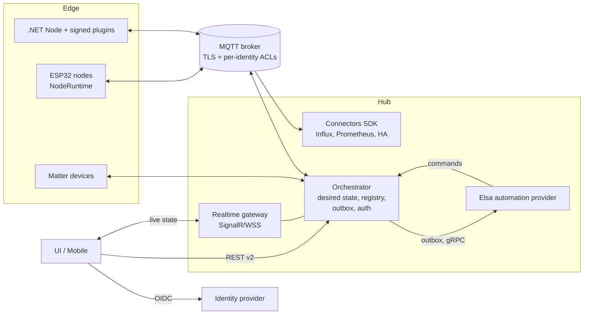

# RIoT2 platform review (September 2026)

This document records a full review of every RIoT2 repository: the bugs found and fixed, the open
issues backlog, and proposals for architecture changes and new features. Each repository's own
README/CLAUDE.md has been updated to match the code as it is now; this file is the cross-repository
summary.

## 1. Scope and verification

All 15 repositories were reviewed: Core, Orchestrator, Node, Devices, RasPi.Devices, Elsa,
Connector.InfluxDB, UI, Mobile, Matter (library, ControlBridge, Controller, OnOffSample),
Ard.Shared, Ard.M5Core2.Node, Ard.M5Dial.Node, Ard.WiegandI2C, and Tests.

Final verification (no `RIOT2_*` environment variables set):

| Component | Command | Result |
|---|---|---|
| RIoT2.Core | `dotnet build` | 0 warnings, 0 errors |
| RIoT2.Tests (Core, Orchestrator, Influx) | `dotnet test` | 212/212 passed (baseline: 8 of 194 failing on timeouts) |
| RIoT2.Net.Orchestrator | `dotnet build` | 0 warnings, 0 errors |
| RIoT2.Net.Node | `dotnet test` | 23/23 passed |
| RIoT2.Net.Devices | `dotnet test` | 31/31 passed (baseline 23) |
| RIoT2.Net.RasPi.Devices | `dotnet test` | 114/114 passed (baseline 111), warnings 1 → 0 |
| RIoT2.Matter | `dotnet test RIoT2.Matter.sln` | 56/56 passed (baseline 52), 0 warnings |
| RIoT2.Elsa | `dotnet test RIoT2.Elsa.sln` | 11/11 passed, NU1903 vulnerable SQLite warning fixed |
| RIoT2.Connector.InfluxDB | `dotnet build` | 0 warnings, 0 errors |
| RIoT2.Mobile | `dotnet test` + Windows build | 14/14 passed; Windows build fixed (it was failing) |
| RIoT2.UI | `npm test`, `npm run typecheck`, `npm run build` | 12/12 passed (baseline 8), type-check clean |
| RIoT2.Ard.M5Core2.Node / M5Dial.Node | `pio run` | Both boards build |
| Core compatibility | Every Core-consuming repo built against a package packed from current Core source | All compile, no source changes needed |

The ESP32 native unit tests (`RIoT2.Ard.Shared/tests`) need a host C++ compiler, and none was
available on the review machine, so they were not run. `RIoT2.Ard.WiegandI2C` has no PlatformIO
project, so it was reviewed but not built.

## 2. Things the maintainer has to do

These can't be done in code. Do them first.

1. **Rotate the leaked credentials and scrub them from git history.** The following were committed
   to public repositories and are still in history:
   - `RIoT2.Net.Orchestrator`: `bin/Debug/net9.0/StoredObjects/**` was tracked and contains a real
     Netatmo `clientId`, `clientSecret`, access token and refresh token (and other node config).
     The files are now untracked (`git rm --cached`) and `bin/` is ignored.
   - `RIoT2.Connector.InfluxDB`: `Properties/launchSettings.json` held a real InfluxDB token.
   - `RIoT2.Elsa`: the Elsa identity JWT signing key was hard-coded in `Program.cs`. It now comes from
     `ELSA_IDENTITY_SIGNING_KEY`.
   - `RIoT2.Mobile`: `Platforms/Android/google-services.json` contains the Firebase client API key.
     This key is not a server secret, but it should be restricted to the Android package and
     signing SHA in Google Cloud.

   Revoke and reissue the Netatmo app secret and tokens, the InfluxDB token and the MQTT passwords,
   then remove the files from history (for example `git filter-repo --path <file> --invert-paths`)
   and force-push.
2. **Cut a Core release and align all consumers.** Consumers currently pin different Core versions:
   Orchestrator, Elsa and Influx use `0.1.41`; Node, Devices and RasPi use `0.1.43`. The security
   fixes in Core (serialization binder, zip-slip guard) only reach them after you tag
   `RIoT2.Core 0.1.44` and bump every `PackageReference` to it. The compatibility build above
   confirms no consumer code changes are needed. Afterwards, release the Node image and the Devices
   plugin zip together.
3. **Plan the .NET runtime upgrade.** .NET 8 (Influx) and .NET 9 (Orchestrator, Node, plugins,
   Matter, Mobile) both reach end of support in November 2026. Elsa already targets .NET 10 LTS.
   Move everything to `net10.0` in one coordinated release: TFMs, Docker base images, CI
   `setup-dotnet`, and the MAUI workloads. Core stays on `netstandard2.0`.
4. **Read the upgrade notes in section 4 before deploying the new images.** Ports, container users
   and required environment variables have changed.

## 3. Fixes applied

### Security

| Area | Fix |
|---|---|
| Core `Utils/Json.cs` | `TypeNameHandling.Auto` deserialization (used on REST-posted and MQTT-advertised configuration, where `ReportTemplate.Model`/`CommandTemplate.Model` are `object`) now goes through a restrictive `RIoT2SerializationBinder`. It allows only RIoT2 assemblies, primitives, arrays and generic collections of allowed types, which closes a remote deserialization-gadget vector. |
| Core `NodeConfigurationServiceBase` | Plugin package file names are sanitized and zip extraction is blocked outside `Plugins/` (zip-slip). |
| Orchestrator `FileObjectStore`, `MatterBridgeService` | Path traversal through stored object ids/type names and Matter credential paths is blocked; bad input returns 400. |
| Node `DownloadController` | Rejects traversal, absolute paths and encoded separators. |
| Devices `WebhookController` | 64 KiB request limit; a null body returns 400 instead of a 500. |
| Devices `NetatmoBase`, sample configs | Tokens are no longer logged; sample secrets were removed from `ApSystems`/`Messaging`. |
| Elsa | The hard-coded JWT signing key was removed (`ELSA_IDENTITY_SIGNING_KEY` is required outside Development). The vulnerable `SQLitePCLRaw` is pinned to 2.1.12. |
| UI | `v-html` XSS in the cron tooltip was removed. `entrypoint.sh` no longer logs secrets, escapes values safely and uses `printenv`. nginx sends security headers. |
| Mobile | Android Auto Backup of preferences is disabled. |
| Firmware | OTA over HTTPS now validates the root CA. Wiegand26 parity is validated. MQTT port input is validated. The configuration download is capped at 32 KiB. |
| Matter | TLV nesting depth is limited, unterminated containers are rejected, and CASE rejects non-uncompressed ECDH keys. |
| All Dockerfiles | Baked-in sample MQTT credentials, IPs and fixed node/orchestrator GUIDs are removed. Previously, two containers started with defaults shared the same id. |

### Correctness and reliability

- **Core:** `ToEpoch()` handled local-time `DateTime` values incorrectly (all current callers pass
  `UtcNow`, so existing data is not affected). `AdvertisementData` parsed beacon payloads as ASCII
  instead of hex. Test timeouts were stabilized.
- **Orchestrator:** storage change events are now raised outside the storage lock, which removes a
  deadlock risk. Startup fails fast on missing or invalid required environment variables. There is
  a `/health` check that includes MQTT connection state.
- **Node / plugins:** the webhook service crashed when a webhook had no subscriber. Electricity
  price refresh had a precision bug. Hue used an `async void` listener. MQTT/Web commands were not
  awaited.   RFID reads failed on the first read and on short payloads, and the I2C interrupt only read 1 byte
    of the 3-byte Wiegand code. GPIO/serial resources in `CoverDisplay`/`UartService` were not
    disposed; the CoverDisplay buttons now stay active when the display auto-off timer fires. Devices/RasPi were aligned to Core `0.1.43` (the
  Node host version). Startup fails fast on missing environment variables, and `/health` was added.
- **Elsa / Influx:** `.Result`/`Task.WaitAll` sync-over-async calls in activities and UI hint
  providers were replaced with `await`. The gRPC trigger returns `InvalidArgument` for bad JSON
  instead of an internal error. `RIoTDataService` uses an injected `HttpClient` and escaped ids.
  Configuration is validated at startup. `/health` and `/healthz` were added.
- **UI:** the variable write called a REST endpoint that doesn't exist
  (`GET /api/variable/{id}/value`). Button state compared the whole report object instead of its
  value. Primitive equality was wrong. Several widgets used non-reactive watcher sources. Arrays
  were detected as entities. MQTT publish/subscribe ran before the client existed. Malformed MQTT
  messages crashed the app.
- **Mobile:** the Windows build failed because stale `obj/` output was being compiled.
- **Firmware:** the provisioning restart timer broke on `millis()` rollover.
- **Matter:** the UDP receive loop died if a datagram handler threw.

### Hygiene

- Build output and device logs that had been committed (`RIoT2.Core/bin`, `RIoT2.Net.Orchestrator/bin`,
  `RIoT2.Ard.M5Core2.Node/logs`) are untracked, and the `.gitignore` files now use generic
  `bin/`/`obj/` rules.
- Broken replacement characters (U+FFFD) were fixed in the Core, Node, Devices, RasPi and Matter
  ControlBridge docs, and stale documentation was corrected across all repositories.

All changes are uncommitted in each repository's working tree, ready for review.

## 4. Upgrade notes (breaking deployment changes)

| Image | Change | Action |
|---|---|---|
| orchestrator | Listens on **8080** and runs as non-root UID **1654** | Map `-p 80:8080` (or set `ASPNETCORE_HTTP_PORTS`). `sudo chown -R 1654:1654` the host directories mounted at `/app/StoredObjects`, `/app/Logs` and `/app/MatterCredentials`. With `--network host`, the non-root process can't bind ports below 1024. |
| orchestrator, node, elsa, influxdb | Required environment variables have no defaults; startup fails with a clear log if they are missing or invalid | Set them explicitly (see the profile README). |
| elsa | Web on **8080**, gRPC still on **5003**, non-root, `ELSA_IDENTITY_SIGNING_KEY` required in Production | Generate a key with `openssl rand -base64 48`, `chown` `/app/Data`, and point `RIOT2_WORKFLOW_URL` at the mapped web port. |
| influxdb | Listens on **8080**, non-root | Update the port mapping. |
| ui | No default MQTT values. Env values are rendered again on every container start (previously only on the first start). | Set the `VITE_MQTT_*` variables. |
| node | Still port 80 and root (GPIO, D-Bus and serial need privileges) | Only the environment variable requirement changes. |

Health endpoints: orchestrator/node/elsa/influx expose `GET /health` (elsa and influx also keep
`/healthz`). The UI image has a `wget` health check on `/`.

## 5. Open issues backlog

These were deliberately not changed in this pass because they need a design decision or a
coordinated contract change.

| # | Severity | Component | Issue | Recommendation |
|---|---|---|---|---|
| 1 | Critical | Orchestrator | REST API is anonymous and CORS allows any origin (`Program.cs`). Anyone on the LAN can rewrite node configs or execute commands. | Add authentication (OIDC or API keys) with roles, and restrict CORS. See architecture item A1. |
| 2 | High | UI | MQTT credentials are delivered to every browser. | Use a BFF or realtime gateway with short-lived tokens, plus broker ACLs (A1/A2). |
| 3 | High | MQTT (all) | No TLS and no per-client ACLs. Any client can publish `riot2/node/{id}/configuration` and make a node download config from any URL. | Use MQTT over TLS, per-identity ACLs, and signed/allowlisted configuration URLs. |
| 4 | High | Orchestrator / Core | SSRF: plugin URL checks and node/workflow URLs advertised over MQTT are fetched without allowlists. | Use an `HttpClientFactory` client with scheme/host allowlists and private-range rules. |
| 5 | High | Node | Plugin zips have no signature or hash check. | Use signed plugin manifests with a Core compatibility range (A4). |
| 6 | High | Node / Devices | Webhook and download endpoints are unauthenticated. | Use per-webhook secrets/HMAC and authenticate downloads. |
| 7 | High | Elsa | `UseAdminUserProvider`, permissive CORS, antiforgery disabled. | Configure real identity, restrict CORS. |
| 8 | High | Core `Utils/Web.cs` | TLS certificate validation is disabled for the generic GET/PUT helpers (needed today for the Hue bridge's self-signed certificate). | Use per-device certificate pinning or trust instead of a global bypass. |
| 9 | High | Firmware | Open provisioning AP accepts secrets over HTTP. Credentials are stored in plaintext NVS. OTA is unsigned with no rollback policy. MQTT/HTTP fall back to insecure TLS if no CA is set. | WPA2 setup AP or BLE provisioning, NVS encryption and secure boot, signed OTA manifests, fail-closed TLS. |
| 10 | High | Matter | Managed P-256 scalar multiplication is not constant-time. | Use platform/hardened crypto for SPAKE2+/CASE. |
| 11 | High | CI/CD | Only Matter runs build and test on push/PR. Every other repo publishes on tag without running tests. The NuGet token goes through `--store-password-in-clear-text` in a build layer. `actions/create-release@v1` is deprecated. The plugin zip uses a hand-maintained DLL list. `docker commit` is used to inject manifests. | Add PR validation workflows everywhere, BuildKit secrets, `softprops/action-gh-release`, zip the whole publish folder, and pass the manifest as a build-arg/label. |
| 12 | Medium | Orchestrator | Mutating `GET` endpoints (`delete`, `reset`, `history/reset`) are CSRF-prone. | Use `POST`/`DELETE` and version the API (`/api/v2`). |
| 13 | Medium | Orchestrator / Influx | No durable delivery. Reports to Elsa and writes to Influx are lost on restart or outage. | Add an outbox/spool with retry and backoff (A3). |
| 14 | Medium | Core | `MqttClient` publishes without checking that the client is started. QoS is not configurable. `DeviceSchedulerService` does sync-over-async. Cancellation support is limited. | Add a guarded async publish API with a QoS parameter and `CancellationToken` everywhere. |
| 15 | Medium | Node / Devices | Tokens (Netatmo, Firebase service account) are stored in plaintext under `Data/`. Some `async void`/blocking code remains in Eufy/Netatmo/Bluetooth. | Protect with the Data Protection API or secret store, and migrate to async. |
| 16 | Medium | Matter | Unsecured peer/session dictionaries grow without bound under spoofed UDP. CASE resumption is disabled. | Add limits and eviction, then fix or remove resumption. |
| 17 | Medium | Mobile | WebView accepts any URL. The beacon key is kept in `Preferences`. The default URL is HTTP. | Host allowlist, `SecureStorage`, HTTPS. |
| 18 | Medium | Docker | Base images are not digest-pinned, there is no SBOM, and the UI nginx runs as root. | Pin digests with Renovate/Dependabot, add an SBOM, use `nginx-unprivileged` in the next major release. |
| 19 | Low | UI | 895 kB main chunk, no ESLint. | Route-level code splitting, add `eslint-plugin-vue`. |
| 20 | Low | Matter | `Random.Shared` is used for session/exchange ids. | Use `RandomNumberGenerator`. |

## 6. Maintainability observations

- **Shared contract is also a runtime grab-bag.** `RIoT2.Core` holds the wire contracts plus MQTT
  client, HTTP helpers, scheduler, plugin installer and device runtime. Any change forces every
  consumer to re-release, which is why versions drifted.
- **Two JSON stacks.** Newtonsoft and System.Text.Json are both used for the same contracts, and
  the `TypeNameHandling` and `dynamic`-based persistence make the contracts implicit.
- **God classes.** Orchestrator `NodesController` and `OrchestratorMqttService`, UI `NodesView.vue`
  (~590 lines) and `DeviceConfigurationComponent.vue` (~560 lines). Template shaping is duplicated
  across the Nodes, Report and Command controllers.
- **Configuration by `Environment.GetEnvironmentVariable`** is scattered across services. Typed
  `IOptions<T>` with `ValidateOnStart()` would centralize it and make it testable.
- **Firmware duplication.** Core2 and Dial duplicate the view logic (button, toggle, slider, scene,
  timer, alert and so on) and the `main.cpp` Wi-Fi/MQTT/config/OTA wiring.
- **Plugin configuration discovery is inconsistent.** FTP, MQTT and Azure Relay devices have hidden
  parameters instead of implementing `IDeviceWithConfiguration`. Netatmo Weather and Security share
  static auth state.
- **No cross-repo integration test.** Contract mismatches (like the UI's nonexistent variable
  endpoint) are only caught at runtime.

## 7. Architecture proposals

### Target shape

**A1. Add a security boundary.** Put authentication on the orchestrator REST API (OIDC, or a local
admin account with API keys for scripts) with roles such as viewer, operator and admin. Add a
realtime gateway (SignalR or authenticated WSS) so browsers never hold MQTT credentials. Give every
service and node its own MQTT identity with ACLs, for example a node may publish only
`riot2/node/{self}/report|online` and subscribe only `riot2/node/{self}/command|configuration`.

**A2. Split Core into packages.** Create `RIoT2.Core.Contracts` (DTOs, topics, JSON schema, System.Text.Json
source-generated context, no dependencies) plus `RIoT2.Core.Mqtt`, `RIoT2.Core.Http`,
`RIoT2.Core.DeviceRuntime` and `RIoT2.Core.PluginHost`. Add an additive `contractVersion` field to
MQTT payloads now, before any breaking change. Publish JSON Schemas and generate the TypeScript
models for the UI and the C++ structs for firmware from them.

**A3. Make delivery reliable.** Add an orchestrator outbox (SQLite) for workflow deliveries and
commands, with retry, backoff, dead-letter handling and a status API. Use MQTT QoS 1 for commands
with a correlation id and an ack/result topic (`riot2/node/{id}/command/result`). Add a retained
state snapshot topic so late subscribers (UI, connectors) get current state immediately.

**A4. Use a desired-state configuration and plugin model.** Replace "publish URL, node downloads"
with versioned desired state: config revision, hash and signature. The node applies it, then
reports its `appliedRevision` or errors on `online`/`status`. Plugins ship a signed manifest with a
Core compatibility range. The node refuses incompatible or unsigned plugins and supports hot reload
where possible.

**A5. Keep automation behind a provider interface.** The orchestrator emits domain events such as
report received, node online and variable changed to an `IAutomationProvider`. Elsa is the
implementation, reached over the existing gRPC contract via the outbox. This keeps the orchestrator
engine-agnostic and testable.

**A6. Build a connector SDK.** Package config validation, MQTT lifecycle, template snapshots,
bounded durable queues, health, metrics and retry in one library. Influx becomes the reference
connector, and new connectors (Prometheus, Home Assistant, Timescale) become small.

**A7. Integrate Matter as a hosted service.** Run a single persisted ControlBridge and aggregator
node inside the orchestrator as a DI hosted service. Map RIoT2 templates to stable bridged endpoint
ids. Add a DNS-SD `IOperationalPeerResolver` for outbound bindings.

**A8. Share a firmware NodeRuntime.** Move Wi-Fi, MQTT, configuration, OTA and peripheral lifecycle
into `RIoT2.Ard.Shared`, with a shared view-model layer and board-specific renderers for Core2 and
Dial. Add a peripheral plugin interface; `WiegandI2CPeripheral` would be the first.

**A9. Make operations first-class.** Ship one `docker-compose.yml` for the whole stack in this repo,
with health checks, named volumes, `.env`-based secrets and a dependency order. Add
OpenTelemetry traces/metrics (report rate, command latency, MQTT reconnects, queue depth) with a
Prometheus endpoint. Add structured JSON logs and backup/restore for `StoredObjects`.

**A10. Unify engineering practices.** One .NET version (10 LTS), central package management
(`Directory.Packages.props`), nullable reference types enabled progressively, analyzers with
warnings-as-errors in CI, a reusable GitHub workflow template shared by all repos, and a
cross-repo "platform" integration test that runs broker, orchestrator, node (Virtual device),
Elsa and UI smoke tests in containers.

## 8. Feature proposals

**Platform and UX**

- User accounts and roles, an audit log of configuration changes, and API tokens.
- A system health page: node online/offline history, MQTT and API state, workflow delivery queue,
  last error per device, plus a connection status banner in the UI.
- Dashboard import/export, preview mode and per-user dashboards. Replace `window.confirm` with an
  unsaved-changes dialog.
- Backup and restore of all orchestrator state from the UI.
- Device capability discovery, so the UI builds forms from plugin-declared schemas.
- Scenes as first-class objects (currently only on firmware), usable from UI, Mobile, Matter and
  Elsa.
- Presence and geofencing from Mobile, plus actionable push notifications that execute commands.
- Mobile on iOS/MacCatalyst, and native (non-WebView) widgets for favourite devices.

**Automation (Elsa activities)**

- Debounce/window, threshold/hysteresis, schedule/sun-based (sunrise and sunset) triggers,
  wait-for-state, command-with-timeout/ack, and notification/webhook output.
- Workflow templates for common scenarios such as a motion light or a price-based heater.

**Integrations**

- Connectors: Home Assistant MQTT discovery (bidirectional), Prometheus exporter, OpenTelemetry,
  PostgreSQL/Timescale, Azure IoT Hub/Event Hubs, Grafana annotations.
- Devices: Zigbee (zigbee2mqtt bridge), Shelly, Tasmota, Modbus TCP/RTU, ESPHome native API,
  camera snapshots with local image classification.
- Matter: Door Lock, Window Covering, Fan Control, Thermostat, Electrical Energy/Power Measurement,
  Air Quality, Valve, Mode Select and Switch device types. Also BLE/NFC/UDC commissioning, OTA
  Provider, and Matter controller mode to pull third-party Matter devices into RIoT2.

**Firmware**

- Integrate `WiegandI2C` as a peripheral: I2C `0x26`, 3-byte UID, published as a string report,
  with an optional IRQ pin.
- QR-code provisioning with a per-device AP password, TLS certificate enrollment, diagnostics
  export, and a signed OTA channel with staged rollout.

## 9. Suggested roadmap

| Phase | Content |
|---|---|
| 0 (now) | Section 2 actions: rotate secrets and scrub history, tag Core 0.1.44 and align consumers, release the images with the upgrade notes. |
| 1 (security baseline) | Backlog items 1–4, 6–8 and 11: API auth, MQTT TLS and ACLs, SSRF guards, PR CI in every repo, BuildKit secrets. |
| 2 (platform) | .NET 10 migration (A10), Core package split and `contractVersion` (A2), outbox and command acks (A3), docker-compose and observability (A9). |
| 3 (extensibility) | Desired-state config and signed plugins (A4), automation provider (A5), connector SDK (A6), firmware NodeRuntime (A8). |
| 4 (features) | Section 8, starting with the health page, the Home Assistant/Prometheus connectors, and the Elsa activity pack. |
