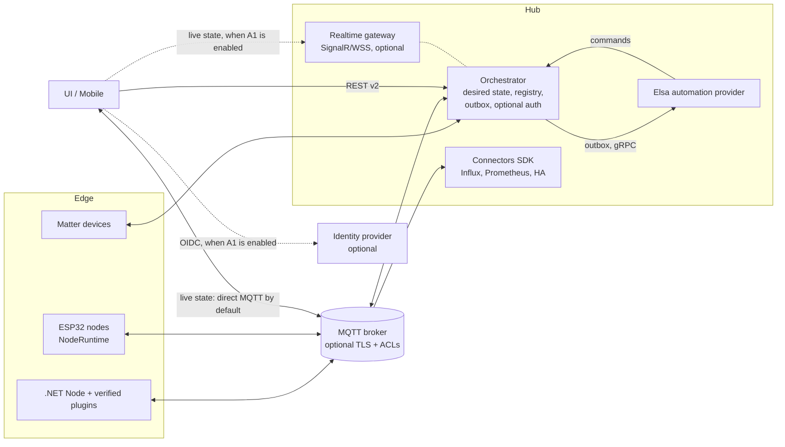

# RIoT2 platform review (September 2026)

This document records a full review of every RIoT2 repository: the bugs found and fixed, the open
issues backlog, implementation plans for the maintainability work, design notes for delivery, configuration, connectors, operations and optional security, and proposals for architecture
changes and new features. Each repository's own
README/CLAUDE.md has been updated to match the code as it is now; this file is the cross-repository
summary.

## 1. Scope and verification

All 15 repositories were reviewed: Core, Orchestrator, Node, Devices, RasPi.Devices, Elsa,
Connector.InfluxDB, UI, Mobile, Matter (library, ControlBridge, Controller, OnOffSample),
Ard.Shared, Ard.M5Core2.Node, Ard.M5Dial.Node, Ard.WiegandI2C, and Tests.

Final verification (no `RIOT2_*` environment variables set):

| Component | Command | Result |
|---|---|---|
| RIoT2.Core | `dotnet build` | 0 warnings, 0 errors |
| RIoT2.Tests (Core, Orchestrator, Influx) | `dotnet test` | 212/212 passed (baseline: 8 of 194 failing on timeouts) |
| RIoT2.Net.Orchestrator | `dotnet build` | 0 warnings, 0 errors |
| RIoT2.Net.Node | `dotnet test` | 23/23 passed |
| RIoT2.Net.Devices | `dotnet test` | 31/31 passed (baseline 23) |
| RIoT2.Net.RasPi.Devices | `dotnet test` | 114/114 passed (baseline 111), warnings 1 → 0 |
| RIoT2.Matter | `dotnet test RIoT2.Matter.sln` | 56/56 passed (baseline 52), 0 warnings |
| RIoT2.Elsa | `dotnet test RIoT2.Elsa.sln` | 11/11 passed, NU1903 vulnerable SQLite warning fixed |
| RIoT2.Connector.InfluxDB | `dotnet build` | 0 warnings, 0 errors |
| RIoT2.Mobile | `dotnet test` + Windows build | 14/14 passed; Windows build fixed (it was failing) |
| RIoT2.UI | `npm test`, `npm run typecheck`, `npm run build` | 12/12 passed (baseline 8), type-check clean |
| RIoT2.Ard.M5Core2.Node / M5Dial.Node | `pio run` | Both boards build |
| Core compatibility | Every Core-consuming repo built against a package packed from current Core source | All compile, no source changes needed |

The ESP32 native unit tests (`RIoT2.Ard.Shared/tests`) need a host C++ compiler, and none was
available on the review machine, so they were not run. `RIoT2.Ard.WiegandI2C` has no PlatformIO
project, so it was reviewed but not built.

## 2. Things the maintainer has to do

These can't be done in code. Do them first.

1. **Rotate the leaked credentials and scrub them from git history.** The following were committed
   to public repositories and are still in history:
   - `RIoT2.Net.Orchestrator`: `bin/Debug/net9.0/StoredObjects/**` was tracked and contains a real
     Netatmo `clientId`, `clientSecret`, access token and refresh token (and other node config).
     The files are now untracked (`git rm --cached`) and `bin/` is ignored.
   - `RIoT2.Connector.InfluxDB`: `Properties/launchSettings.json` held a real InfluxDB token.
   - `RIoT2.Elsa`: the Elsa identity JWT signing key was hard-coded in `Program.cs`. It now comes from
     `ELSA_IDENTITY_SIGNING_KEY`.
   - `RIoT2.Mobile`: `Platforms/Android/google-services.json` contains the Firebase client API key.
     This key is not a server secret, but it should be restricted to the Android package and
     signing SHA in Google Cloud.

   Revoke and reissue the Netatmo app secret and tokens, the InfluxDB token and the MQTT passwords,
   then remove the files from history (for example `git filter-repo --path <file> --invert-paths`)
   and force-push. This is needed even on an isolated network: the repositories are public, so
   anyone can use the cloud credentials (Netatmo, InfluxDB) directly.
2. **Cut a Core release and align all consumers.** Consumers currently pin different Core versions:
   Orchestrator, Elsa and Influx use `0.1.41`; Node, Devices and RasPi use `0.1.43`. The security
   fixes in Core (serialization binder, zip-slip guard) only reach them after you tag
   `RIoT2.Core 0.1.44` and bump every `PackageReference` to it. The compatibility build above
   confirms no consumer code changes are needed. Afterwards, release the Node image and the Devices
   plugin zip together.
3. **Plan the .NET runtime upgrade.** .NET 8 (Influx) and .NET 9 (Orchestrator, Node, plugins,
   Matter, Mobile) both reach end of support in November 2026. Elsa already targets .NET 10 LTS.
   Move everything to `net10.0` in one coordinated release: TFMs, Docker base images, CI
   `setup-dotnet`, and the MAUI workloads. Core stays on `netstandard2.0`. The step-by-step plan, including the release order that keeps plugins loading, is M8. It is in roadmap phase 1 because of the deadline.
4. **Read the upgrade notes in section 4 before deploying the new images.** Ports, container users
   and required environment variables have changed.

## 3. Fixes applied

### Security

| Area | Fix |
|---|---|
| Core `Utils/Json.cs` | `TypeNameHandling.Auto` deserialization (used on REST-posted and MQTT-advertised configuration, where `ReportTemplate.Model`/`CommandTemplate.Model` are `object`) now goes through a restrictive `RIoT2SerializationBinder`. It allows only RIoT2 assemblies, primitives, arrays and generic collections of allowed types, which closes a remote deserialization-gadget vector. |
| Core `NodeConfigurationServiceBase` | Plugin package file names are sanitized and zip extraction is blocked outside `Plugins/` (zip-slip). |
| Orchestrator `FileObjectStore`, `MatterBridgeService` | Path traversal through stored object ids/type names and Matter credential paths is blocked; bad input returns 400. |
| Node `DownloadController` | Rejects traversal, absolute paths and encoded separators. |
| Devices `WebhookController` | 64 KiB request limit; a null body returns 400 instead of a 500. |
| Devices `NetatmoBase`, sample configs | Tokens are no longer logged; sample secrets were removed from `ApSystems`/`Messaging`. |
| Elsa | The hard-coded JWT signing key was removed (`ELSA_IDENTITY_SIGNING_KEY` is required outside Development). The vulnerable `SQLitePCLRaw` is pinned to 2.1.12. |
| UI | `v-html` XSS in the cron tooltip was removed. `entrypoint.sh` no longer logs secrets, escapes values safely and uses `printenv`. nginx sends security headers. |
| Mobile | Android Auto Backup of preferences is disabled. |
| Firmware | OTA over HTTPS now validates the root CA. Wiegand26 parity is validated. MQTT port input is validated. The configuration download is capped at 32 KiB. |
| Matter | TLV nesting depth is limited, unterminated containers are rejected, and CASE rejects non-uncompressed ECDH keys. |
| All Dockerfiles | Baked-in sample MQTT credentials, IPs and fixed node/orchestrator GUIDs are removed. Previously, two containers started with defaults shared the same id. |

### Correctness and reliability

- **Core:** `ToEpoch()` handled local-time `DateTime` values incorrectly (all current callers pass
  `UtcNow`, so existing data is not affected). `AdvertisementData` parsed beacon payloads as ASCII
  instead of hex. Test timeouts were stabilized.
- **Orchestrator:** storage change events are now raised outside the storage lock, which removes a
  deadlock risk. Startup fails fast on missing or invalid required environment variables. There is
  a `/health` check that includes MQTT connection state.
- **Node / plugins:** the webhook service crashed when a webhook had no subscriber. Electricity
  price refresh had a precision bug. Hue used an `async void` listener. MQTT/Web commands were not
  awaited.   RFID reads failed on the first read and on short payloads, and the I2C interrupt only read 1 byte
    of the 3-byte Wiegand code. GPIO/serial resources in `CoverDisplay`/`UartService` were not
    disposed; the CoverDisplay buttons now stay active when the display auto-off timer fires. Devices/RasPi were aligned to Core `0.1.43` (the
  Node host version). Startup fails fast on missing environment variables, and `/health` was added.
- **Elsa / Influx:** `.Result`/`Task.WaitAll` sync-over-async calls in activities and UI hint
  providers were replaced with `await`. The gRPC trigger returns `InvalidArgument` for bad JSON
  instead of an internal error. `RIoTDataService` uses an injected `HttpClient` and escaped ids.
  Configuration is validated at startup. `/health` and `/healthz` were added.
- **UI:** the variable write called a REST endpoint that doesn't exist
  (`GET /api/variable/{id}/value`). Button state compared the whole report object instead of its
  value. Primitive equality was wrong. Several widgets used non-reactive watcher sources. Arrays
  were detected as entities. MQTT publish/subscribe ran before the client existed. Malformed MQTT
  messages crashed the app.
- **Mobile:** the Windows build failed because stale `obj/` output was being compiled.
- **Firmware:** the provisioning restart timer broke on `millis()` rollover.
- **Matter:** the UDP receive loop died if a datagram handler threw.

### Hygiene

- Build output and device logs that had been committed (`RIoT2.Core/bin`, `RIoT2.Net.Orchestrator/bin`,
  `RIoT2.Ard.M5Core2.Node/logs`) are untracked, and the `.gitignore` files now use generic
  `bin/`/`obj/` rules.
- Broken replacement characters (U+FFFD) were fixed in the Core, Node, Devices, RasPi and Matter
  ControlBridge docs, and stale documentation was corrected across all repositories.

All changes are uncommitted in each repository's working tree, ready for review.

## 4. Upgrade notes (breaking deployment changes)

| Image | Change | Action |
|---|---|---|
| orchestrator | Listens on **8080** and runs as non-root UID **1654** | Map `-p 80:8080` (or set `ASPNETCORE_HTTP_PORTS`). `sudo chown -R 1654:1654` the host directories mounted at `/app/StoredObjects`, `/app/Logs` and `/app/MatterCredentials`. With `--network host`, the non-root process can't bind ports below 1024. |
| orchestrator, node, elsa, influxdb | Required environment variables have no defaults; startup fails with a clear log if they are missing or invalid | Set them explicitly (see the profile README). |
| elsa | Web on **8080**, gRPC still on **5003**, non-root, `ELSA_IDENTITY_SIGNING_KEY` required in Production | Generate a key with `openssl rand -base64 48`, `chown` `/app/Data`, and point `RIOT2_WORKFLOW_URL` at the mapped web port. |
| influxdb | Listens on **8080**, non-root | Update the port mapping. |
| ui | No default MQTT values. Env values are rendered again on every container start (previously only on the first start). | Set the `VITE_MQTT_*` variables. |
| node | Still port 80 and root (GPIO, D-Bus and serial need privileges) | Only the environment variable requirement changes. |

Health endpoints: orchestrator/node/elsa/influx expose `GET /health` (elsa and influx also keep
`/healthz`). The UI image has a `wget` health check on `/`.

## 5. Open issues backlog

These were deliberately not changed in this pass because they need a design decision or a
coordinated contract change.

**Deployment context.** Today RIoT2 runs on an isolated network with a single user. Every device
on that network is trusted, and nothing is exposed to the Internet except the platform's own
outbound calls to cloud services (Netatmo, electricity price and so on). The severities below are
rated for that context. Issues that only matter once the system is reachable by untrusted devices
or by more than one user are listed separately in 5.2 as optional hardening, delivered through
architecture item A1. They don't block production use in the current setup.

### 5.1 Applies now

| # | Severity | Component | Issue | Recommendation |
|---|---|---|---|---|
| 1 | High | CI/CD | Only Matter runs build and test on push/PR. Every other repo publishes on tag without running tests. The NuGet token goes through `--store-password-in-clear-text` in a build layer. `actions/create-release@v1` is deprecated. The plugin zip uses a hand-maintained DLL list. `docker commit` is used to inject manifests. | Reusable workflows, `ci.yml`/`release.yml` in every repository, BuildKit secrets, `GITHUB_TOKEN` instead of the shared PAT, a new RasPi plugin release, Renovate. Plan: M9. |
| 2 | Medium | Orchestrator / Influx | No durable delivery. Reports to Elsa are dropped on failure, while no workflow node is online, and on restart; writes to Influx are lost on outage. Commands give no feedback and are lost for offline nodes. | Outbox with TTL, command results (design 7.1). Influx spool as part of A6. |
| 3 | Medium | Core | `MqttClient` publishes without checking that the client is started, subscribes at QoS 0 while publishing at QoS 2, has an unbounded pending queue and runs handlers inline. `DeviceSchedulerService` does sync-over-async. Cancellation support is limited. | Options with port/TLS, QoS 1 end to end, guarded `PublishAsync`, bounded pending queue, isolated handlers, async lifecycle, channel-based scheduler. Plan: M10. |
| 4 | Medium | Core / Node / Devices / RasPi | About 40 blocking waits and 6 `async void` methods remain; `BluetoothService.mainLoop` can crash the node on an exception. | Inventory and migration to `AsyncDeviceBase`, channels for event handlers, threading analyzers. Plan: M11. |
| 5 | Medium | Node | Downloaded plugin zips are not integrity-checked, and installation deletes `Plugins/` before extracting, so a bad package leaves the node without plugins. | Sidecar SHA-256, `coreVersion` check, staged install with rollback (design 7.2, phase 4). Signing the manifest is part of A1. |
| 6 | Medium | Firmware | OTA has no rollback policy, so a bad image can leave a device unbootable until it is reflashed by cable. | Use ESP32 app rollback. The bundled Arduino core (`framework-arduinoespressif32` 2.0.17) is built with `CONFIG_BOOTLOADER_APP_ROLLBACK_ENABLE=1`, but `initArduino()` marks every image valid at boot unless the sketch overrides `verifyRollbackLater()`. Override it to return `true` in both firmwares (or in `NodeRuntime`, M5), call `esp_ota_mark_app_valid_cancel_rollback()` once Wi-Fi, MQTT and the configuration fetch have succeeded, and call `esp_ota_mark_app_invalid_rollback_and_reboot()` if that hasn't happened within 3 minutes of the first boot of a new image. Check that both boards' partition tables have two OTA slots. |
| 7 | Low | Orchestrator | Some mutating endpoints use `GET` (`delete`, `reset`, `history/reset`). | Move them to `POST`/`DELETE` when the API is versioned (`/api/v2`). This also avoids CSRF issues if A1 is enabled later. |
| 8 | Low | Matter | Unsecured peer/session dictionaries grow without bound when many unknown peers contact the node. CASE session resumption is disabled. | Add limits and eviction, then fix or remove resumption. |
| 9 | Low | Docker | Base images are not digest-pinned and there is no SBOM, so builds are not reproducible. | Pin digests with Renovate/Dependabot and add an SBOM. |
| 10 | Low | UI | 895 kB main chunk, no ESLint. | Route-level code splitting, add `eslint-plugin-vue`. |
| 11 | Medium | Core (all consumers) | Core mixes the wire contract with MQTT, HTTP, JSON, plugin SDK, node runtime and orchestrator-only interfaces, which forces coordinated releases and caused version drift. | Split into Contracts/Mqtt/Http/Devices/Node packages behind a type-forwarding facade. Plan: M1. |
| 12 | Medium | Core / Orchestrator | Two JSON stacks (Newtonsoft and System.Text.Json), `TypeNameHandling`, and `dynamic`-based persistence make the wire format implicit. | Golden-file tests, one System.Text.Json setup, typed `IObjectStore<T>`, then drop Newtonsoft. Plan: M2. |
| 13 | Medium | Orchestrator / UI | `NodesController` (19 actions) and large UI components mix responsibilities. Template shaping is copied in three controllers. The UI has dead scaffolding. | `ITemplateCatalog`, split controllers by resource with routes unchanged, Pinia stores, smaller components. Plan: M3. |
| 14 | Low | Orchestrator / Node / Elsa / Influx | Configuration is read from environment variables in four places, each validated differently. Tests mutate process-wide environment variables. | Typed `IOptions<T>` with `ValidateOnStart()` and the same `RIOT2_*` names. Plan: M4. |
| 15 | Medium | Firmware | Twelve views and the `main.cpp` runtime wiring are duplicated between Core2 and Dial. | Shared view models and `NodeRuntime` in `RIoT2.Ard.Shared`, boards keep only rendering. Plan: M5. |
| 16 | Medium | Devices plugin | `AzureRelay`, `EasyPLC`, `FTP` and `Mqtt` hide their parameters from the UI. Netatmo auth state is `static`, so only one Netatmo account is possible. | Configuration templates plus a reflection test, and an injected per-account `NetatmoAuthClient`. Plan: M6. |
| 17 | High | All | No cross-repository contract or integration tests; mismatches such as the UI's non-existent variable endpoint are only found at runtime. | Reusable CI workflow, OpenAPI route test, shared golden messages, in-process end-to-end test. Plan: M7. |
| 18 | High | Node / Orchestrator | Every MQTT reconnect, orchestrator restart or save of a node's configuration stops and restarts **all** devices on the node, even when nothing changed. Devices drop connections and state, and can miss events. | Node-side hash comparison and per-device diff, with no contract change (design 7.2, phase 0), then the full desired-state protocol. |
| 19 | High | All .NET repositories | .NET 8 (Influx) and .NET 9 (Orchestrator, Node, plugins, Matter, Mobile, tests) reach end of support on 10 November 2026. | Coordinated move to `net10.0` in plugin-safe order, build templates, central package management. Plan: M8. |

### 5.2 Optional hardening (A1)

These are all delivered by the optional security mode designed in 7.5. It is off by default, can
be switched on and off, and supports a staged rollout. Until it is on, keep the network isolated.

| # | Component | Issue | Recommendation |
|---|---|---|---|
| S1 | Orchestrator | The REST API is anonymous and CORS allows any origin. | Optional authentication (local admin or OIDC, plus API keys for scripts) with roles, and a configurable CORS allowlist. |
| S2 | UI | Every browser receives the MQTT credentials. | Optional realtime gateway (SignalR/WSS) behind the same login, so browsers never hold broker credentials. |
| S3 | MQTT (all) | No TLS and no per-client ACLs. Any client can publish `riot2/node/{id}/configuration` and make a node download config from any URL. | Optional MQTT over TLS, per-identity broker ACLs, and signed or allowlisted configuration URLs. |
| S4 | Orchestrator / Core | Plugin URLs and node/workflow URLs advertised over MQTT are fetched without allowlists (SSRF). | An `HttpClientFactory` client with configurable scheme/host allowlists. |
| S5 | Node | Plugin manifests are not signed. | Signature verification in addition to the hash check in 5.1 item 5. |
| S6 | Node / Devices | Webhook and download endpoints are unauthenticated. Tokens (Netatmo, Firebase service account) are stored in plaintext under `Data/`. | Per-webhook secrets/HMAC, authenticated downloads, and encryption at rest via the Data Protection API or a secret store. |
| S7 | Elsa | Uses `UseAdminUserProvider`; CORS is permissive and antiforgery is disabled. | Real identity (shared with S1), a CORS allowlist, antiforgery on. |
| S8 | Core `Utils/Web.cs` | The headers-based GET/PUT overloads skip TLS certificate validation. Only the Hue bridge (self-signed certificate) uses them; cloud integrations use the validating client. | Per-device certificate pinning instead of a blanket bypass. |
| S9 | Firmware | The provisioning AP is open and receives secrets over HTTP. Credentials are stored in plaintext NVS. OTA images are unsigned. MQTT/HTTP fall back to insecure TLS when no CA is set. | WPA2 setup AP or BLE provisioning, NVS encryption and secure boot, signed OTA manifests, fail-closed TLS. |
| S10 | Matter | The managed P-256 scalar multiplication is not constant-time. `Random.Shared` generates session/exchange ids. | Platform/hardened crypto for SPAKE2+/CASE, `RandomNumberGenerator` for ids. |
| S11 | Mobile | The WebView accepts any URL, the beacon key lives in `Preferences`, and the default URL is HTTP. | Host allowlist, `SecureStorage`, HTTPS. |
| S12 | Docker | The UI's nginx runs as root. | Switch to `nginx-unprivileged`. |

## 6. Maintainability implementation plans

Each maintainability observation from the review has an implementation plan below and a backlog
entry (5.1 items 11–17). M8–M11 are the plans for the platform and quality items that only had a
one-line recommendation: A10, and backlog items 1, 3 and 4. The plans are split into steps that
can each ship on their own and keep existing deployments working. Effort: S = up to a few days,
M = one to two weeks, L = several weeks of part-time work.

| Plan | Observation | Backlog | Effort | Depends on |
|---|---|---|---|---|
| M1 | Core is both the wire contract and a runtime grab-bag | 11 | L | M2 (contracts package is STJ-only), M7 as safety net |
| M2 | Two JSON stacks, `TypeNameHandling` and `dynamic` persistence | 12 | M | M7 |
| M3 | Oversized, mixed-responsibility classes | 13 | M | – |
| M4 | Configuration read from environment variables all over the code | 14 | S | – |
| M5 | Firmware view and wiring duplication between Core2 and Dial | 15 | M | – |
| M6 | Inconsistent plugin configuration discovery, Netatmo static state | 16 | S | – |
| M7 | No cross-repository integration or contract test | 17 | M | M2 step 1 (golden files, done alongside) |
| M8 | .NET 10 migration and shared engineering practices (A10) | 19 | M | M9 (CI catches regressions) |
| M9 | CI/CD for every repository | 1 | M | – |
| M10 | MQTT client robustness | 3 | S | – |
| M11 | Remaining blocking and `async void` code | 4 | M | M10 (async publish), M7 |

Recommended order: M9 and M7 first, as the safety net for the rest, together with M2 step 1 (the
golden message files M7 relies on). Then M10, M4 and M6 (small and independent), M11, M8, M3,
the rest of M2 and finally M1. M5 is firmware-only and can run in parallel with any of them.

### M1. Split RIoT2.Core into contract and runtime packages

**Problem.** `RIoT2.Core` (85 files) contains the wire contract (`Models`, `Enums`, `Constants`,
message interfaces) together with an MQTT client (`Utils/MqttClient`), HTTP helpers (`Utils/Web`),
a JSON toolbox (`Utils/Json`, 1,100 lines), the device/plugin SDK (`Abstracts/DeviceBase`,
`IDevice*`), the node runtime (`NodeMqttService`, `NodeConfigurationServiceBase`,
`DeviceSchedulerService`) and orchestrator-only service interfaces (`IOrchestrator*Service`,
`IStoredObjectService`, `IMessageStateService`). Every consumer pulls in MQTTnet, Quartz, Hosting,
Newtonsoft and System.Text.Json, and any change forces a coordinated release. That is why the
versions drifted (0.1.41 vs 0.1.43). Elsa and the Influx connector only need `Report`, `Command`,
`ValueModel`, `NodeOnlineMessage`, `Constants`, `Json` and `MqttClient`. `CodeProviderService`/
`ICodeProviderService` are not used by any repository.

**Target packages** (all `netstandard2.0`, namespaces unchanged):

| Package | Contents | Dependencies |
|---|---|---|
| `RIoT2.Core.Contracts` | `Models` (incl. Matter models), `Enums`, `Constants`, `IMessage`/`IReport`/`ICommand`/`ITemplate`, `ValueModel` | System.Text.Json only |
| `RIoT2.Core.Mqtt` | `MqttClient`, `MqttEventArgs` | Contracts, MQTTnet |
| `RIoT2.Core.Http` | `Web` | Contracts |
| `RIoT2.Core.Devices` (plugin SDK) | `DeviceBase`, `AsyncDeviceBase`, `DeviceServiceBase`, `IDevice*`, `IDevicePlugin`, `ICommandService`/`IReportService` | Contracts, Logging.Abstractions, DI.Abstractions |
| `RIoT2.Core.Node` (node host runtime) | `NodeMqttService`, `NodeConfigurationServiceBase`, `ConfigurationBase`, `DeviceSchedulerService`, `CommandService`, `ReportService`, `DeviceOperationAdapter` | Devices, Mqtt, Http, Quartz, Hosting |
| `RIoT2.Core` (compatibility facade) | `[TypeForwardedTo]` for every moved type | all of the above |

**Steps.**

1. Delete the unused `CodeProviderService`/`ICodeProviderService` and move the orchestrator-only
   interfaces and `MessageStateService` into the Orchestrator repository. They are only
   referenced there. Keep them forwarded from the facade for one release.
2. Create the new projects in the RIoT2.Core repository and move files without changing
   namespaces. Make `RIoT2.Core` a facade that references all of them and forwards the moved
   types, so existing source and existing plugin binaries keep working unchanged. Pack and publish
   all packages from the same tag, with the same version.
3. Update `RIoT2.Net.Node/PluginLoadContext.cs`. Its `SharedContracts` list contains only
   `typeof(IDevice).Assembly`; it must share every assembly whose name starts with `RIoT2.Core`.
   Otherwise a plugin would load its own copy of Contracts, and `Report`/`IDevice` type identity
   would break. Add a test that loads a plugin compiled against the facade.
4. Move consumers to the narrowest packages: Elsa and Influx to `Contracts` + `Mqtt`, plugins to
   `Devices`, Node to `Node`, Orchestrator to `Contracts` + `Mqtt` + `Http`.
5. With A2, add the `contractVersion` field and export JSON Schemas from `Contracts`
   (`System.Text.Json.Schema.JsonSchemaExporter`). Generate the UI's TypeScript models from those
   schemas in the UI build, replacing the hand-written files in `RIoT2.UI/src/models`.
6. Remove the facade after one release in which every consumer builds without it.

**Risk.** Binary compatibility of already-downloaded plugins; covered by the forwarding facade and
the plugin-loading test from step 3.

**Done when.** Elsa and Influx no longer reference Quartz or Hosting through Core, plugins reference
only `RIoT2.Core.Devices`, and all consumers use one Core version from a single release tag.

### M2. Standardize on System.Text.Json and type the persistence layer

**Problem.** `Utils/Json.cs` serializes with Newtonsoft (`Serialize` ×26 call sites,
`SerializeIgnoreNulls` ×10, `Deserialize` ×7, `ToDictionary` ×6, plus `GetValue`/`FindValue`/
`SetValue` path helpers on `JToken`). `ValueModel` and ASP.NET Core use System.Text.Json, the
Orchestrator needs a `JObjectConverter` shim to bridge the two, and it registers three naming-policy
variants (default, `pascal`, `lower`). Persistence stores `dynamic` objects
(`StoredObjectService._objects: Dictionary<string, List<dynamic>>`, `(obj as dynamic).Id`), and
`StoredObjectEventHandler` passes `dynamic`. `TypeNameHandling.Auto` is still used for stored
configuration (now restricted by `RIoT2SerializationBinder`), but current stored files carry no
`$type` metadata.

**Steps.**

1. **Golden-file tests first.** Serialize every contract type (`Report`, `Command`,
   `NodeDeviceConfiguration`, `DashboardConfiguration`, `Variable`, `NodeOnlineMessage`,
   `ConfigurationCommand`, `ValueModel` of each `ValueType`) with the current code and commit the
   JSON. Also commit real `StoredObjects` samples with secrets scrubbed. These golden files become
   the definition of the wire format.
2. **One System.Text.Json setup.** Add a single `RIoT2JsonOptions` (camelCase, ignore nulls,
   `ValueModelConverter`, enum handling matching today's numbers) and a source-generated
   `JsonSerializerContext` for the contract types in `Contracts`.
3. Re-implement `Json.Serialize`/`Deserialize`/`SerializeIgnoreNulls`/`ToDictionary`/path helpers
   on System.Text.Json (`JsonNode` replaces `JToken`) behind the same method signatures. Switch
   callers repo by repo until the golden tests pass, and mark the Newtonsoft-only entry points
   (`DeserializeAutoTypeNameHandling`, `DeserializePascal`, `ToDictionary(JObject)`) `[Obsolete]`.
4. **Typed persistence.** Replace `dynamic` in `StoredObjectService` with an `IStoredObject`
   interface (`string Id { get; set; }`) implemented by the stored model types, a generic
   `IObjectStore<T> where T : IStoredObject`, and a typed `StoredObjectChanged<T>` event. Drop
   `TypeNameHandling`, which works because current stored configurations carry no `$type`. Add a
   one-time loader that ignores or archives the legacy `Rule` files that still contain
   `ExpandoObject`.
5. Remove the `JObjectConverter` shim and the `pascal`/`lower` naming variants
   (`CustomJsonSettings/Formatters.cs`, selected by a `json-naming-policy` request header). None of
   the UI, Elsa, Mobile or firmware sends that header, so the only possible users are external
   scripts. Log a deprecation warning when the header is seen for one release, then delete it.
6. Remove the Newtonsoft dependency from Core. Plugins that need it reference it themselves.

**Risk.** Subtle format differences: number and enum formats, null handling, dictionary key casing.
The golden files from step 1 catch them.

**Done when.** `RIoT2.Core.Contracts` has no Newtonsoft reference, there's no `dynamic` in
persistence, and the golden-file tests pass in Core, the Orchestrator and Elsa.

### M3. Break up oversized, mixed-responsibility classes

**Problem.**

- `NodesController` (342 lines, 19 actions) mixes node CRUD, online status, cron validation,
  plugin URL checks, report/command state, report/command/variable template listing and variable
  CRUD. Variable CRUD also exists partly in `VariableController`.
- The template-shaping loops that build `NodeReportTemplate`/`NodeCommandTemplate` from device
  configurations are copied in `NodesController` (report/command templates), `ReportController`
  and `CommandController`.
- `MatterBridgeService` is 624 lines.
- In the UI, `NodesView.vue` (~530 lines) and `DeviceConfigurationComponent.vue` (~500 lines)
  combine data loading, dialogs, validation and rendering. `DashboardView.vue` is ~460 lines.
- The UI still has dead scaffolding: `src/stores/counter.ts` is unused and `src/models/rules/` is
  empty (left over from the retired rule engine).

**Steps (Orchestrator).**

1. Extract an `ITemplateCatalog` service with `GetReportTemplates()`, `GetCommandTemplates()`,
   `GetVariableTemplates()` and `FindReportTemplate(id)`. Replace the four copied loops with it and
   unit-test it against the golden configuration files from M2.
2. Split `NodesController` by resource, keeping every current route unchanged (use explicit
   `[Route]` attributes so URLs don't move):
   - `NodesController`: node CRUD and online status.
   - `TemplatesController`: template listing.
   - `StateController`: report and command state.
   - `VariablesController`: merged with the existing `VariableController`.
   - `PluginsController`: plugin check.
   - `CronController`: cron validation.

   M7's route contract test proves the routes are unchanged.
3. Split `MatterBridgeService` along its existing seams (credential management, commissioning
   state, endpoint composition and report routing) into collaborators behind the
   `IMatterBridgeService` interface.

**Steps (UI).**

1. Delete `stores/counter.ts` and the empty `models/rules/` folder.
2. Move data access and state into Pinia stores: `useNodesStore`, `useTemplatesStore`,
   `useVariablesStore` and `useDashboardStore`. Convert the callback-style API modules in
   `composables/api` to return promises, with loading and error state kept in the stores.
3. Split `NodesView.vue` into a node list, a node editor dialog and a device list, and split
   `DeviceConfigurationComponent.vue` into a parameters form, a report-template editor and a
   command-template editor. Target under ~250 lines per component.
4. Replace `any` (44 occurrences) in the touched files with the generated contract types from M1
   step 5.

**Done when.** No orchestrator controller exceeds ~150 lines, template shaping exists in one
place, no UI component exceeds ~250 lines, all REST routes are unchanged, and the UI tests pass.

### M4. Typed, validated configuration

**Problem.** Configuration is read with `Environment.GetEnvironmentVariable` in
`OrchestratorConfigurationService`, `Node/ConfigurationService`, Elsa `RIoTConfigurationService` and
Influx `ConnectorConfigurationService`. Each has its own required/URL validation code: this review
added fail-fast checks in four slightly different styles. Tests have to mutate process-wide
environment variables, which forced `[DoNotParallelize]`.

**Steps.**

1. Add an options model per service (`OrchestratorOptions`, `NodeOptions`, `WorkflowOptions`,
   `InfluxConnectorOptions`, plus shared `MqttOptions`) with `[Required]`/`[Url]` data annotations
   or an `IValidateOptions<T>` implementation.
2. Map the existing `RIOT2_*` names in one place per service with
   `builder.Configuration.AddEnvironmentVariables()` and an explicit key mapping, so the variable
   names users set don't change. Bind with
   `services.AddOptions<T>().Bind(...).ValidateDataAnnotations().ValidateOnStart()`.
3. Have the configuration services receive `IOptions<T>` instead of reading the environment. Delete
   the per-service `Require*` helpers and `NodeEnvironmentValidator`; the startup validation
   replaces them.
4. Put the shared pieces (`MqttOptions`, URL validation attribute, env-name mapping helper) into
   `RIoT2.Core.Mqtt`/`RIoT2.Core.Contracts` (M1), or into a small shared source file until M1 lands.
5. Rewrite the configuration tests to build options from an in-memory configuration. Remove
   `[DoNotParallelize]` and the environment mutation.
6. This is also where the A1 `RIOT2_SECURITY_MODE` switch will live.

**Done when.** No `GetEnvironmentVariable` remains outside the options registration, all four
services fail fast with the same message format, and the configuration tests run in parallel.

### M5. Shared firmware view logic and node runtime

**Problem.** Core2 (LVGL, touch) and Dial (M5Canvas, rotary encoder) each implement the same
twelve views: Alert, BLE, Button, Clock, ColorScheme, Notification, Percentage, SceneSelector,
Slider, Timer, Toggle and Value. The rendering differs, but the logic around it is the same:

- pairing report and command templates by `address` into slots,
- parsing command values (`is<bool>()` or `as<int>() != 0`),
- building the `Report` to publish,
- the `build*ViewTemplate()` default configurations, which differ only in `classFullName`.

Both `main.cpp` files (474 and 632 lines) repeat the Wi-Fi, provisioning, MQTT, configuration fetch,
OTA and `system.ota` wiring. `RIoT2.Ard.Shared` already provides the building blocks
(`MqttConnection`, `OrchestratorClient`, `OtaUpdater`, `ProvisioningPortal`, `PeripheralManager`,
`IPeripheral`) but no runtime that ties them together.

**Steps.**

1. **Shared view models.** Add `riot2/views/` to `RIoT2.Ard.Shared` with one view-model class per
   view type, for example `ToggleModel`, `SliderModel` and `TimerModel`. Each holds the slot state,
   `begin(const DeviceConfiguration&)`, `onCommand(const Command&)` returning "state changed", and
   `makeReport(...)`, plus a `buildTemplate(const char* classPrefix)` for the default configuration.
   These have no display dependencies, so they can be unit-tested in the existing native test
   harness under `RIoT2.Ard.Shared/tests`.
2. **Board views become renderers.** Change the Core2 and Dial views to thin renderers that own a
   model and draw it. Migrate one view type at a time, starting with Toggle, Slider and Value, and
   run `pio run` for both boards after each.
3. **Shared `NodeRuntime`.** Add `riot2::NodeRuntime` in Shared. It owns the Wi-Fi, provisioning,
   MQTT, configuration fetch/retry, OTA and peripheral lifecycle, exposes `begin(NodeRuntimeConfig)`
   and `loop()`, and delivers configuration, command and system-command callbacks. Each `main.cpp`
   shrinks to board setup, `ViewManager` creation and runtime callbacks.
4. **Wiegand peripheral.** Add a `WiegandI2CPeripheral : IPeripheral` to Shared (I2C `0x26`, 3-byte
   code, optional IRQ pin) using the existing `PeripheralManager`. Core2's `Rfid2Peripheral` is the
   pattern to follow.
5. Make a host C++ toolchain available in CI so the native tests (including the new view-model
   tests) run on every push.

**Done when.** No duplicated view logic between the two boards, both `main.cpp` files are under
~200 lines, and the view models have native tests running in CI.

### M6. Consistent plugin configuration discovery and no static device state

**Problem.** Four devices read configuration parameters but don't implement
`IDeviceWithConfiguration`, so the UI can't show which parameters they need:

- `AzureRelay`: `relayNamespace`, `connectionName`, `keyName`, `key`
- `EasyPLC`: `ipAddress`, `port`
- `FTP`: `ftpUsers`, `StorageIp`, `StorageUser`, `StoragePassword`, `StorageFolder`
- `Mqtt`: `clientId`, `serverUrl`, `userName`, `password`, `subscribeTopics`

`NetatmoBase` keeps the access token, refresh token, client id/secret, the configured flag and the
logger in `static` fields. `NetatmoWeather` and `NetatmoSecurity` therefore share one account
implicitly: configuring one overwrites the other, and two Netatmo accounts can't coexist.

**Steps.**

1. Implement `IDeviceWithConfiguration.GetConfigurationTemplate()` for the four devices, listing
   every parameter they read, with the same key spelling (`FTP` keeps its PascalCase `Storage*`
   keys so existing configurations still load).
2. Add a reflection test to both plugin test projects. For every catalog device, parse the keys it
   reads via `GetConfiguration<T>("...")` (or record them through a test helper) and assert that
   they all appear in its configuration template.
3. Replace the Netatmo statics with an injected `NetatmoAuthClient` keyed by `clientId`, registered
   as a singleton factory in `Plugin.cs`. Devices sharing a `clientId` share a token; different
   accounts get separate token files under `Data/`. Keep the current token file name for the first
   account so existing installations don't need to log in again.
4. Document the parameters of all four devices in `RIoT2.Net.Devices/README.md`.

**Done when.** Every catalog device returns a configuration template that covers its parameters,
the reflection test passes, and `NetatmoBase` has no static mutable state.

### M7. Cross-repository contract and integration tests

**Problem.** Each repository tests itself in isolation. The UI calling a non-existent
`GET /api/variable/{id}/value` endpoint was only found by reading code. Topic and payload
compatibility between Core, the Orchestrator, the Node, Elsa, firmware and the UI is only checked
by hand, and only Matter runs tests in CI.

**Steps.**

1. **Reusable CI workflow.** Add a reusable `build-test.yml` to this `.github` repository (restore,
   build, test, upload results) and call it on push/PR from every repository (backlog item 1).
2. **REST route contract.** Add `Microsoft.AspNetCore.OpenApi` to the Orchestrator, and
   `Microsoft.Extensions.ApiDescription.Server` to write `openapi.json` at build time. Add a UI test
   that checks every route in `RIoT2.UI/src/models/constants.ts` against that document, with the
   file copied into the UI repo or fetched from the Orchestrator release.
3. **Message contract.** Publish the golden JSON files from M2 (and later the M1 schemas) as a test
   asset. Core, Orchestrator, Elsa, Influx and UI tests deserialize them. The firmware native tests
   parse the `Report`/`Command`/`NodeOnlineMessage`/`ConfigurationCommand` samples with the
   ArduinoJson code in `MqttJson`/`DeviceConfigurationJson`.
4. **In-process end-to-end test.** Add a `RIoT2.Tests.Integration` project that starts an in-process
   MQTTnet broker (MQTTnet 4 `MqttServer`), the Orchestrator through `WebApplicationFactory`, and
   the Node host with the `Virtual` device, plus a fake gRPC workflow endpoint. It asserts that:
   - the node comes online and receives its configuration,
   - a Virtual report reaches orchestrator state and the workflow endpoint,
   - a command sent through `POST /api/command/execute` reaches the device.

   No Docker is needed, so it runs in normal CI.
5. **Container smoke test (optional, later).** When the A9 `docker-compose.yml` exists, add a
   nightly workflow that starts the stack and polls every `/health` endpoint.

**Done when.** Every repository runs tests on PR, the UI route test and the shared golden files are
used by at least Core, Orchestrator, UI and firmware, and the end-to-end test runs in CI.

### M8. .NET 10 migration and shared engineering practices (A10)

**Problem.** .NET 8 and .NET 9 both reach end of support on **10 November 2026**, about six weeks
from this review. After that date there are no security fixes for the runtime in any container
image. Current state:

| Repository | Projects | Today | Target | Notes |
|---|---|---|---|---|
| RIoT2.Core | library | `netstandard2.0`, Microsoft.Extensions 9.0.0, System.Text.Json 9.0.0 | stays `netstandard2.0`, packages 10.0.x | Microsoft.Extensions 10 packages still ship `netstandard2.0` assets |
| RIoT2.Connector.InfluxDB | app | `net8.0`, image `aspnet:8.0-alpine` | `net10.0`, `aspnet:10.0-alpine` | Remove the unused `Microsoft.VisualStudio.Azure.Containers.Tools.Targets` reference |
| RIoT2.Net.Orchestrator | app | `net9.0`, `aspnet:9.0-alpine` / `sdk:9.0` | `net10.0`, `aspnet:10.0-alpine` / `sdk:10.0` | Keep the glibc SDK image for `protoc`. Update Grpc.Net.Client/Grpc.Tools/Google.Protobuf together. |
| RIoT2.Net.Node | app | `net9.0`, `aspnet:9.0-alpine` and `aspnet:9.0-bookworm-slim-arm64v8` | `net10.0` | .NET 10 images use Ubuntu 24.04 as the default Linux distribution, so pick the matching arm64 tag from the current tag list. Serilog.AspNetCore 9 → 10, Microsoft.Extensions.Logging 9.0.18 → 10. |
| RIoT2.Net.Devices, RIoT2.Net.RasPi.Devices | plugins | `net9.0` | `net10.0` | **After** the node: a `net10.0` plugin can't load into a `net9.0` node, but a `net9.0` plugin loads into a `net10.0` node. |
| RIoT2.Matter (+ ControlBridge, Controller, OnOffSample, Tests) | libraries, apps | `net9.0` | `net10.0` | **After** the orchestrator, which consumes the packages. The Controller UI (Vite) is unaffected. |
| RIoT2.Elsa | apps | `net10.0`, Elsa 3.7.1 | unchanged | Already done |
| RIoT2.Mobile | MAUI app | `net9.0-android;net9.0-windows10.0.19041.0`, `global.json` 9.0.100 | `net10.0-*`, `global.json` 10.0.100, MAUI 10 workload | Check that CommunityToolkit.Maui (11.0.0) and Plugin.Firebase.CloudMessaging (4.0.0) have `net10.0` versions **before** starting; they are the main risk. Raise the Android target API level to the current Play Store requirement. |
| RIoT2.Tests and the per-repo test projects | tests | `net9.0`, MSTest.Sdk 3.6.1; Matter uses xUnit 2.9 | `net10.0`, current MSTest.Sdk | xUnit stays on 2.x for now |
| RIoT2.UI | Node build image | `node:22` | `node:24` (active LTS) | Not a .NET change, but done in the same pass |

A separate portability bug is fixed in the same pass: `RIoT2.Mobile/Directory.Build.props` hard-codes
`BaseIntermediateOutputPath=C:\o\…` and `BaseOutputPath=C:\b\…`, which breaks the build on any
other machine and in Linux CI. Replace them with paths relative to `$(MSBuildThisFileDirectory)`,
and keep the `DefaultItemExcludes` fix.

**Steps (TFM migration, roadmap phase 1 because of the deadline).**

1. **Build templates.** Add `build/Directory.Build.props`, `build/Directory.Packages.props.template` and
   `build/.editorconfig` to this `.github` repository, and copy them into each .NET repository. Every
   repository is its own solution, so an MSBuild SDK package isn't worth the overhead. The props file
   sets:
   - `LangVersion=latest`, `ImplicitUsings`, `Deterministic` and `ContinuousIntegrationBuild` in CI;
   - `EnableNETAnalyzers` with `AnalysisLevel=latest-recommended`;
   - `TreatWarningsAsErrors` only when `CI=true`, so local builds aren't blocked.

   All repositories build with 0 warnings today (section 1), so this is safe with the default rule
   set. Any new analyzer findings are either fixed or suppressed in `.editorconfig` with a reason.
2. **Central package management.** Add `Directory.Packages.props` to each repository with the
   versions from the inventory above. Align the duplicates found in the review: Serilog.AspNetCore 9/10,
   Serilog.Sinks.File 6/7, Microsoft.Extensions.Logging 9.0.0/9.0.18, and the three RIoT2.Core versions
   (done in section 2 action 2).
3. Bump Core's Microsoft.Extensions and System.Text.Json packages to 10.0.x and release Core.
4. Move Influx and the Orchestrator to `net10.0` and the 10.0 images, and release them.
5. Move the Node (both Dockerfiles) to `net10.0` and release it. Then move Devices and RasPi.Devices
   and release them. The profile README and the upgrade notes say "update the node image before
   installing the new plugin zip".
6. Move Matter to `net10.0` and release the packages. Then bump them in the Orchestrator.
7. Move Mobile to MAUI 10, if the dependency check in the table passed. Otherwise keep Mobile on
   `net9.0` temporarily: it is a client app, not a server, so the end-of-support risk is lower. Record
   that as an exception.
8. Point CI `setup-dotnet` at `10.0.x` everywhere (M9) and update the test projects.

**Steps (practices, roadmap phase 2).**

9. **Nullable reference types**, one project at a time:
   - Matter, Mobile and Elsa already have them enabled.
   - For Core (`netstandard2.0`), add the `Nullable` attributes polyfill package, annotate
     `Contracts` first (M1), and turn on `<Nullable>enable</Nullable>` once the warnings are fixed.
   - Orchestrator, Node, the plugins, Influx and Tests start with `<Nullable>annotations</Nullable>`,
     then move to `enable` per project.
   - Changed files get `#nullable enable` from now on.
10. **Threading analyzers** (`Microsoft.VisualStudio.Threading.Analyzers`) as warnings: VSTHRD002
    (synchronous wait), VSTHRD100 (`async void`) and VSTHRD110 (unobserved task). These keep M11 from
    regressing.
11. SourceLink and symbol packages for the NuGet packages (Core, Matter, SDK).

**Risk.**

- Plugin load order (step 5) is the main operational risk. It is covered by the release order and
  a plugin-loading test in the Node test project, which loads a plugin built against the old TFM.
- MAUI dependencies (step 7) may force the temporary exception for Mobile.

**Done when.**

- No `net8.0`/`net9.0` targets remain (Mobile only by recorded exception), and all images use 10.0 tags.
- CI builds with `TreatWarningsAsErrors`.
- Every repository uses central package management with no duplicate versions for shared packages.

### M9. CI/CD for every repository (backlog item 1)

**Problem (verified in the workflow files).**

- **Coverage.** Only `RIoT2.Matter` validates on push and PR (`validate.yml`). Seven other
  repositories only publish, triggered by a `*.*.*` tag, without running tests. Seven have no workflow at all:
  Ard.Shared, Ard.M5Core2.Node, Ard.M5Dial.Node, Ard.WiegandI2C, Net.RasPi.Devices, Mobile and
  Tests. **RasPi.Devices has no release pipeline**, so its plugin zip is built by hand.
- **Cross-repository references.** `RIoT2.Tests` references `../RIoT2.Core`,
  `../RIoT2.Net.Orchestrator` and `../RIoT2.Connector.InfluxDB`. `RIoT2.Net.Node/Tests` references
  `../../RIoT2.Net.Devices`. CI therefore has to check out sibling repositories side by side.
- **Secrets.** One personal access token, `NUGET_PACKAGE_TOKEN`, is used for GHCR login, NuGet push
  and GitHub releases. It is also passed to `docker build` as a build argument. Dockerfiles write it
  into `nuget.config` with `--store-password-in-clear-text`, so it ends up in an image layer. The UI
  workflow passes it even though the UI build doesn't use NuGet.
- **Fragile steps:**
  - Core builds with `setup-dotnet 8.0.x`.
  - The Devices release hard-codes `/home/runner/work/...` paths and a list of 22 DLL names, and
    uses the deprecated `actions/create-release@v1` and `upload-release-asset@v1`.
  - Node and Orchestrator inject `Manifest.json` with `docker create`/`docker cp`/`docker commit`
    after the build.

**Design.**

1. **Reusable workflows** in this repository under `.github/workflows/`. Callers use
   `Revolutionized-IoT2/.github/.github/workflows/<name>.yml@main`.

   | Workflow | Inputs | Does |
   |---|---|---|
   | `dotnet-validate.yml` | `projects`, `dotnet-version` (default `10.0.x`), `siblings` (repositories to check out next to this one), `test-filter` | restore, build with `CI=true`, test, upload TRX results |
   | `node-validate.yml` | `working-directory` | `npm ci`, `typecheck`, `test`, `build` |
   | `firmware-validate.yml` | `envs` | `pio run` for each environment. Runs the `RIoT2.Ard.Shared/tests` native tests with `g++` on `ubuntu-latest`, which fixes "native tests can't run" from section 1. Uploads the `.bin` files. |
   | `docker-publish.yml` | `image`, `dockerfile`, `platforms`, `version` | Buildx with BuildKit secret `nuget_token`, OCI labels, tags `<version>` and `latest` (`-arm64v8` variants for the node), SBOM and provenance attestations (backlog item 9) |
   | `nuget-publish.yml` | `projects`, `version` | pack with `-p:Version`, push to GitHub Packages |
   | `plugin-release.yml` | `project`, `version` | `dotnet publish`; zip the **whole** publish folder minus host-provided assemblies (`RIoT2.Core*.dll`, `Microsoft.Extensions.*` and the shared framework, matching `PluginLoadContext`'s shared list); write `PluginManifest.json` (with `coreVersion`), `<zip>.sha256` (7.2) and, later, `.sig` (7.5); create the release with `softprops/action-gh-release` |
   | `firmware-release.yml` | `envs`, `version` | builds, attaches `firmware-<env>-<version>.bin` and an OTA manifest to the release |

2. **Per-repository callers.** `ci.yml` runs on `push` and `pull_request`. `release.yml` runs on a
   `*.*.*` tag or `workflow_dispatch`, and calls validate **before** publish. Sibling checkouts
   (`actions/checkout` with `repository:` and `path: ../<repo>`) use `main`, or the same tag name if
   it exists.

   | Repository | ci.yml | release.yml |
   |---|---|---|
   | Core | dotnet-validate | nuget-publish |
   | Matter | dotnet-validate (replaces `validate.yml`), node-validate (Controller UI) | nuget-publish (Matter, then ControlBridge) |
   | Orchestrator, Node, Influx, Elsa | dotnet-validate (Node with sibling Devices) | docker-publish (Node: amd64 and arm64) |
   | Devices, RasPi.Devices | dotnet-validate | plugin-release (**new** for RasPi) |
   | Tests | dotnet-validate with siblings Core, Orchestrator, Influx; also nightly | – |
   | UI | node-validate | docker-publish |
   | Mobile | dotnet-validate for `Tests/` on Linux; Android build on `windows-latest` weekly | Android artifact (APK/AAB) on tag |
   | Ard.Shared, M5Core2, M5Dial | firmware-validate | firmware-release (both boards) |
   | Ard.WiegandI2C | Arduino CLI compile for ATtiny85 (add a minimal `platformio.ini` or `arduino-cli` step) | release `.hex` |
   | .github | `docker compose config` for `deploy/` (7.4), markdownlint | – |

3. **Secrets.**
   - Use `GITHUB_TOKEN` with job-level `permissions` (`packages: write`, `contents: write`,
     `id-token: write` for attestations) for GHCR, GitHub Packages and releases.
   - Give each consuming repository read access to the `RIoT2.Core`/`RIoT2.Matter` packages in the
     package settings ("Manage Actions access"), so restores work with `GITHUB_TOKEN`.
   - Keep one read-only `PACKAGES_READ_TOKEN` only as a fallback if a cross-repository restore can't
     use `GITHUB_TOKEN`. Retire `NUGET_PACKAGE_TOKEN`.
4. **Dockerfiles** take the feed token through `RUN --mount=type=secret,id=nuget_token` and write
   `nuget.config` inside that single `RUN`, so it never persists in a layer. `ARG NUGET_AUTH_TOKEN`
   is removed. The version comes from a build argument: the final stage writes `Manifest.json` and
   sets `org.opencontainers.image.version`, replacing the `docker commit` steps.
5. **Dependency updates.** Add a Renovate configuration (`renovate.json` in each repository,
   presets in this repository) covering NuGet, npm, Dockerfile, GitHub Actions and PlatformIO.
   Renovate supports all five; Dependabot doesn't support PlatformIO. It also pins base-image
   digests (backlog item 9).
6. **Branch protection** on `main`: require `ci.yml` to pass.

**Phases.**

| Phase | Content |
|---|---|
| C1 | `dotnet-validate`, `node-validate`, `firmware-validate` and the `ci.yml` callers in every repository |
| C2 | `docker-publish` with BuildKit secrets and version build argument; replace the five Docker workflows and remove `docker commit` |
| C3 | `plugin-release` for Devices and the new RasPi pipeline, with the `.sha256` sidecar |
| C4 | `nuget-publish` for Core and Matter, then `firmware-release` and Mobile artifacts |
| C5 | Renovate, branch protection, retire `NUGET_PACKAGE_TOKEN` |

**Done when.**

- Every repository runs CI on PR.
- `docker history` of each published image shows no token.
- Every release asset is produced by a reusable workflow.
- RasPi.Devices has a published plugin zip.

### M10. MQTT client robustness (backlog item 3)

**Problem (verified in `Core/Utils/MqttClient.cs`).**

- `Publish` calls `_client.EnqueueAsync` without a null check, so publishing before `Start` throws
  a `NullReferenceException`.
- Every publish is QoS 2, but subscriptions use `MqttTopicFilterBuilder` defaults (QoS 0), so
  delivery is effectively QoS 0 (see 7.1).
- The port is fixed at 1883 unless the second constructor is used, and no configuration variable
  sets it. There is no TLS.
- The managed client's pending queue is unbounded (`MaxPendingMessages` not set), so a long broker
  outage grows memory without limit while reports keep coming.
- Application handlers are awaited inline in `handleMqttMessageReceived`, so one slow or throwing
  handler delays or breaks every later message.
- `Dispose()` blocks with `Stop().GetAwaiter().GetResult()`, and there is no `CancellationToken`
  anywhere.
- The Node `/health` endpoint is liveness-only because `INodeMqttService` doesn't expose connection
  state.

In `DeviceSchedulerService`, `_deviceService_DevicesUpdated` blocks the event thread with
`_lifecycle.Wait()` and `GetAwaiter().GetResult()` while reconfiguring Quartz. That can deadlock if a
running refresh job is waiting on the device service's lifecycle lock during
`ReconfigureDevicesAsync`. `SchedulerEvent` is also a `static` event.

**Steps.**

1. **Options.** `MqttOptions` (M4): `Host` (`RIOT2_MQTT_IP`, unchanged), `Port`
   (`RIOT2_MQTT_PORT`, new, default 1883), `UseTls`/`CaFile` (the 7.5 seam), `ClientId`, credentials,
   `KeepAlive`, `MaxPendingMessages` (default 10,000). `MqttClient` gets a constructor that takes the
   options, and the existing constructors stay.
2. **QoS.** Add a RIoT2-owned `MqttQos` enum (`AtMostOnce`, `AtLeastOnce`, `ExactlyOnce`) so callers
   never see MQTTnet types. The default is **QoS 1** for publishing and subscribing (decision in
   7.1). Add `Start(params MqttSubscription[])` with a QoS per topic; `Start(params string[])` uses
   QoS 1.
3. **Guarded async publish.** Add `PublishAsync(topic, payload, qos = AtLeastOnce, retain = false,
   CancellationToken)`. It throws `InvalidOperationException("MQTT client not started")` before
   `Start`. The existing `Publish` becomes an `[Obsolete]` wrapper.
4. **Bounded pending queue.** Set `MaxPendingMessages` and
   `PendingMessagesOverflowStrategy.DropOldestQueuedMessage`. Log dropped messages with a
   rate-limited warning and count them (`riot2.mqtt.dropped`, 7.4).
5. **Handler isolation.** Received messages go into a bounded channel with one worker loop per
   client. Each handler is invoked in its own `try/catch` with logging, so a failing handler no
   longer affects the others or MQTTnet's receive loop. When the channel is full the worker applies
   backpressure: MQTTnet's receive waits, and QoS 1 redelivers.
6. **Lifecycle and state.** Add `StopAsync(CancellationToken)` and `IAsyncDisposable`, and make
   `Dispose()` a bounded best effort (5 s). Add a `ConnectionStateChanged` event and
   `IsConnected`. `INodeMqttService` gets `bool IsConnected { get; }`, so the Node `/health` can
   report MQTT like the orchestrator's does.
7. **Scheduler.** `DevicesUpdated` only writes the event into a channel. A background loop owned by
   `DeviceSchedulerService` reconfigures Quartz asynchronously, with no `Wait()` or
   `GetAwaiter().GetResult()`. `SchedulerEvent` becomes an instance event; the static event stays as
   an `[Obsolete]` forwarder for one release.
8. **MQTTnet version.** Stay on MQTTnet 4.3.x. Version 5 removes `ManagedMqttClient`. After this plan
   all MQTTnet types are internal to `MqttClient`, so a later v5 migration only touches this one
   class.

**Tests** (in-process MQTTnet server):

- Publishing before start throws the clear exception.
- A QoS 1 message published during a broker restart arrives after reconnect.
- Queue overflow drops the oldest message and counts it.
- A throwing handler doesn't stop the next message.
- TLS connects with a test CA.
- Reconfiguring the scheduler while a refresh job runs doesn't deadlock (regression test).

**Done when.** No MQTTnet type appears in the public API, all clients use QoS 1, pending messages are
bounded, and the Node health check reports MQTT state.

### M11. Remaining blocking and `async void` code (backlog item 4)

**Inventory (verified by search).** The hits fall into four groups:

| Group | Locations | Action |
|---|---|---|
| **A. Intentional sync shims** for the synchronous device contract | `AsyncDeviceBase` lines 19–21; `DeviceServiceBase` 56, 58, 62, 70, 191; `CommandService` 28; `NodeConfigurationServiceBase` 70; the sync `ExecuteCommand` of `EasyPLC` 32, `Mqtt` 21, `Web` 15 | Keep, so existing plugins stay binary-compatible. Mark them `[Obsolete]` in the M1 `RIoT2.Core.Devices` package. Make sure the host never calls them: `RIoT2.Net.Node/Program.cs:167` still calls the synchronous `DownloadPluginPackage`, so switch it to `DownloadPluginPackageAsync` now. |
| **B. Device code blocking on I/O** | **Devices:**<br>- `ApSystems` 195<br>- `ElectricityPrice` 172, 185<br>- `EufySecurity` 107, 117 (`Task.Delay(2000).Wait()`)<br>- `Hue` 46, 64, 159<br>- `Messaging` 42, 65<br>- `NetatmoSecurity` 106, 121, 129, 251, 258<br>- `NetatmoWeather` 28, 40, 65<br>- `WaterConsumption` 35, 87<br><br>**RasPi:**<br>- `FGBS222` 68, 138, 140<br>- `FGWPF102` 55–57, 179, 181<br>- `Models/ZWaveNode` 15, 24 (a constructor doing Z-Wave I/O) | Migrate each device to `AsyncDeviceBase` + `IAsyncCommandDevice` / `IAsyncRefreshableReportDevice`, which the host already supports (`EasyPLC` is the reference). Replace the `ZWaveNode` constructor with `static Task<ZWaveNode> CreateAsync(...)`. One device per PR, each with a lifecycle test following `EasyPlcLifecycleTests`/`AsyncDeviceLifecycleTests`. Do NetatmoWeather/Security together with M6 (the per-account auth client). |
| **C. `async void`** | **Core:** `NodeMqttService` 168 `_reportService_ReportUpdated`.<br><br>**Devices:** `EufySecurityService` 74 `client_MessageReceived`, and `.Wait()` on connect/disconnect at 205 and 222.<br><br>**RasPi:**<br>- `BluetoothService` 45 `mainLoop`: a long-running loop started as `async void`, with no cancellation; an exception crashes the node.<br>- `BluetoothService` 86 `onDeviceAdded`<br>- `RuuviTagListener` 76 `OnPropertiesChanged` | **Core:** report publishing goes through a bounded channel with one publisher loop (order kept, errors logged, backpressure).<br><br>**EufySecurityService:** incoming messages go into a channel; add async `StartAsync`/`StopAsync`.<br><br>**RasPi:**<br>- `mainLoop` becomes `Task RunAsync(CancellationToken)`, owned and awaited by the service's stop.<br>- The two Tmds.DBus callbacks stay `void` (the library has no `Task`-based signal API) but call a shared `FireAndForget(task, logger)` helper that observes and logs exceptions. |
| **D. Hosts** | Orchestrator `OrchestratorMqttService` 105 (deliberate backpressure behind a synchronous event) and 139 (`Dispose`); Elsa `RIoTLAppLifetimeExtension` 14 (`.Wait()` in `ApplicationStopping`); `MqttClient` 160 (M10) | Orchestrator 105 goes away with M2 step 4 (typed async storage events). Elsa: move the MQTT stop into an `IHostedService.StopAsync`. `MqttClient`: M10. |

Not counted as problems:

- `RasPi AI418ML` `Thread.Sleep(5)`: a deliberate ADC conversion wait.
- `CoverDisplay` 379: waiting for the blink task inside stop.
- `OnlineNodeService` 126: `.Result` after `Task.WhenAll`.
- `FTP/CustomLocalDataConnection` 56: the `Zhaobang.FtpServer` interface is synchronous. Documented and left as is.

**Steps.**

1. Group A host call site, and the Core `NodeMqttService` channel (group C). Small, and in Core/Node
   only.
2. Group C for the RasPi Bluetooth and Ruuvi code and `EufySecurityService`, plus the Elsa shutdown.
3. Group B device by device, starting with the ones on timers or refresh schedules, where blocking
   ties up Quartz threads: ElectricityPrice, WaterConsumption, ApSystems, Netatmo. Then the command
   paths: Hue, Messaging, EufySecurity, then the Z-Wave devices.
4. Turn on the threading analyzers from M8 step 10 as warnings, with justified suppressions only in
   group A. With `TreatWarningsAsErrors` in CI this prevents regressions.

**Done when.**

- There is no `async void` left except the two DBus callbacks, which use the helper.
- VSTHRD002/VSTHRD100 are clean in Core, Node, Devices and RasPi apart from the suppressed group A
  shims.
- Every migrated device has a lifecycle test.

## 7. Architecture proposals

### Target shape

Dashed parts belong to the optional security track (A1) and are off by default.



**A1. Optional security mode.** RIoT2 runs on an isolated single-user network today, so the
default stays as it is: no login, anonymous REST, and the UI talking to MQTT directly. A1 adds a
security mode that can be turned on and off with one setting (`RIOT2_SECURITY_MODE=off|audit|on`,
default `off`). While it's off, the system behaves exactly as it does now. The seams it needs are
added early and are inert while it's off. Turning it on, or back off, needs no data migration. It
covers everything in backlog 5.2 and can be rolled out one feature at a time. The detailed design
is in 7.5.

The changes already made in this review fit that model and don't get in the way of single-user
use: images without baked-in secrets, non-root containers, restricted JSON type binding, and path
traversal guards. Elsa Studio still needs its login and `ELSA_IDENTITY_SIGNING_KEY`, because that
is how Elsa itself works.

**A2. Split Core into packages.** Separate the wire contract (`RIoT2.Core.Contracts`: DTOs, topics,
JSON schema and a source-generated System.Text.Json context, with no other dependencies) from the
runtime packages `RIoT2.Core.Mqtt`, `RIoT2.Core.Http`, `RIoT2.Core.Devices` (plugin SDK) and
`RIoT2.Core.Node`. Add an additive `contractVersion` field to MQTT payloads now, before any
breaking change. Publish JSON Schemas and generate the TypeScript models for the UI and the C++
structs for firmware from them. Implementation plan: M1 (with M2 for the JSON part).

**A3. Make delivery reliable.** Add a durable outbox for workflow deliveries and commands, plus
command correlation and result reporting, so failures are visible and retried within a
time-to-live. The detailed design is in 7.1.

**A4. Use a desired-state configuration and plugin model.** Give configurations a revision and a
hash. Nodes apply only real changes, cache the last good configuration, and report what they
applied. Plugins are verified and installed with rollback. The detailed design is in 7.2.

**A5. Keep automation behind a provider interface.** The orchestrator emits domain events such as
report received, node online and variable changed to an `IAutomationProvider`. Elsa is the
implementation, reached over the existing gRPC contract via the outbox. This keeps the orchestrator
engine-agnostic and testable. Delivered together with phase 1 of 7.1.

**A6. Build a connector SDK.** Package the generic parts of a connector in one library: configuration
validation, MQTT lifecycle, orchestrator handshake, template catalog, bounded queue with an
optional disk spool, batching, retry, health and metrics. Influx becomes the reference connector,
and new connectors (Prometheus, Home Assistant, Timescale) only implement a sink. The detailed
design is in 7.3.

**A7. Finish the Matter integration.** Most of this is already in place:

- `MatterBridgeService` runs as a hosted service (`MatterBackgroundService`).
- Its state persists through `MatterConfigurationStore`.
- RIoT2 templates map to bridged endpoints through `MatterEndpointComposer`/`RiotBridgedDeviceAdapter`.

Remaining: a DNS-SD `IOperationalPeerResolver` for outbound bindings, a check that bridged
endpoint ids stay stable when node configuration changes, and splitting `MatterBridgeService`
(M3).

**A8. Share a firmware NodeRuntime.** Move Wi-Fi, MQTT, configuration, OTA and peripheral lifecycle
into `RIoT2.Ard.Shared`, with a shared view-model layer and board-specific renderers for Core2 and
Dial. Build new peripherals on the existing `IPeripheral`/`PeripheralManager` interface;
`WiegandI2CPeripheral` would be the next one. Implementation plan: M5.

**A9. Make operations first-class.** One `docker-compose.yml` for the whole stack, consistent
logging with retention, built-in metrics with an optional observability profile, and backup/restore
at two levels (configuration from the UI, full system from a script). The detailed design is in
7.4.

**A10. Unify engineering practices.** One .NET version (10 LTS), central package management
(`Directory.Packages.props`), typed `IOptions<T>` configuration with startup validation shared by
all services (plan M4), nullable reference types enabled progressively, analyzers with
warnings-as-errors in CI (plan M8), reusable GitHub workflows shared by all repos (plan M9), and a
cross-repo "platform" integration test that runs broker, orchestrator, node (Virtual device) and a
workflow stub in-process, with container smoke tests added later (plan M7).

### 7.1 Design: reliable delivery (A3, with A5)

**Current behaviour (verified in code).**

| Path | What happens today | Consequence |
|---|---|---|
| Node report → Elsa | `OrchestratorMqttService` puts a gRPC `TriggerRequest{id,data}` into an in-memory channel (capacity 1000). A delivery that fails is logged and dropped ("not retried automatically"). When no workflow node is online the report is dropped with a warning. The queue is discarded on shutdown. | Automation silently misses events during Elsa restarts, upgrades and network blips. |
| Command (UI/Elsa → device) | `POST /api/command/execute` publishes to `riot2/node/{id}/command` and sets the command state immediately (`SetState(command)`), then returns `200`. The node runs it asynchronously; failures, and rejections once more than 64 commands are pending, only appear in the node log. | The UI/Elsa can't tell whether anything happened, and the stored "state" of a command may be wrong. |
| Offline node | .NET clients connect with a clean session, so the broker doesn't queue messages for an offline node. The orchestrator's managed client queues outgoing messages only in memory, and only while the orchestrator itself is disconnected. | Commands to a node that is offline or restarting are lost. |
| Delivery level | `Core/Utils/MqttClient` publishes at QoS 2, but subscribes with `MqttTopicFilterBuilder` defaults, which means **QoS 0**. The broker delivers at the lower of the two levels, so every .NET subscriber effectively receives at QoS 0. `PubSubClient` (firmware) subscribes at QoS 0 and can only publish at QoS 0. | Any message can be silently lost when a connection drops. QoS 2 publishing costs a four-way handshake and buys nothing. |
| Firmware | Views update the display on a command but don't publish a report back. | Lost commands to firmware leave no trace. |
| Late subscribers | The UI loads current state over REST (`/api/dashboard/reports`, `/api/nodes/{type}/{id}/state`), and Elsa's `GetData` activity does too. | No gap here, so the retained state snapshot topic considered earlier is not needed. |

**Decisions.**

1. **Scope.** The outbox covers orchestrator → Elsa (workflow triggers) and orchestrator → node
   (commands). Node → orchestrator reports stay fire-and-forget: they are periodic or repeated by
   nature, and the orchestrator keeps the last value.
2. **Store.** One SQLite file, `/app/StoredObjects/outbox.db`, on the volume that already exists,
   accessed through `Microsoft.Data.Sqlite` with plain SQL (no EF Core). It has one table:

   ```sql
   CREATE TABLE outbox (
     id TEXT PRIMARY KEY,            -- message id (GUID), also the idempotency key
     kind TEXT NOT NULL,             -- 'workflow' | 'command'
     target TEXT NOT NULL,           -- node id, or 'workflow'
     payload TEXT NOT NULL,          -- serialized TriggerRequest / Command
     created_utc INTEGER NOT NULL,
     expires_utc INTEGER NOT NULL,
     next_attempt_utc INTEGER NOT NULL,
     attempts INTEGER NOT NULL DEFAULT 0,
     status TEXT NOT NULL,           -- pending | sent | done | failed | expired
     result TEXT, last_error TEXT);
   CREATE INDEX outbox_due ON outbox(status, next_attempt_utc);
   ```

   Rows in a final state are removed after 24 hours by a cleanup timer.
3. **Semantics.** At-least-once delivery with an idempotency key; receivers deduplicate.
   Deliveries are FIFO per target (one dispatcher loop per target), so commands to one node keep
   their order.
4. **Time-to-live instead of unlimited retry.** Stale automation is worse than none: a light that
   turns on 20 minutes late is a bug. Defaults are 300 s for workflow triggers and 30 s for
   commands. They are configurable through M4 options (`RIOT2_OUTBOX_WORKFLOW_TTL`,
   `RIOT2_OUTBOX_COMMAND_TTL`), and a request can override the command TTL (below). Retry backoff
   is 1 s, 2 s, 4 s … capped at 30 s. When the TTL passes, the row becomes `expired` and a
   warning is logged.
5. **No workflow node online.** Keep the trigger as `pending` and deliver it when Elsa announces
   itself, subject to the TTL. This replaces today's drop.
6. **QoS 1 end to end, clean sessions kept.**
   - QoS is set by M10: QoS 1 for publishing and subscribing everywhere. Duplicates are handled by
     the idempotency keys above and the configuration hash in 7.2. Firmware subscribes at QoS 1,
     which `PubSubClient` supports.
   - Clean sessions stay. Persistent MQTT sessions would let the broker queue commands, but MQTT
     3.1.1 has no message expiry and gives no status, so the outbox remains the single place for
     retry and expiry.
7. **The command result says "executed", not "physically confirmed".** "Executed" means the
   device's `ExecuteCommand`/`ExecuteCommandAsync` returned without an exception. Physical
   confirmation comes, as today, from the device's next report.

**Contract changes (all additive).**

| Item | Change |
|---|---|
| `Command` | Optional `correlationId` (string). Old nodes and firmware ignore unknown fields (ArduinoJson and the .NET deserializers both do). |
| New `CommandResult` model | `{ "correlationId": "…", "commandId": "…", "status": "executed" \| "failed" \| "rejected" \| "unknownCommand" \| "duplicate", "error": "…", "timeStamp": 1790000000 }` |
| New topic | `riot2/node/{id}/command/result` (`MqttTopic.CommandResult`). The node publishes and the orchestrator subscribes to `riot2/node/+/command/result`. Nodes subscribe to their exact command topic, so this one doesn't overlap. |
| `NodeOnlineMessage` | Optional `capabilities` string array, e.g. `["command-result/1","desired-state/1"]` (the second is from 7.2). The orchestrator waits for results only from nodes that advertise `command-result/1`. Commands to other nodes are marked `sent` and treated as done, which is today's behaviour. |
| gRPC `TriggerRequest` | Add `string message_id = 3;` (wire-compatible). Elsa deduplicates on it: it keeps the ids seen in the last 10 minutes and answers `success=true` without re-running the workflow. |
| REST | `POST /api/command/execute` is unchanged: it still returns `200` once the command is queued. New `POST /api/v2/commands` accepts `{ "id", "value", "ttlSeconds"?, "wait"? }` and returns `{ "correlationId", "status" }`. With `"wait": true` it blocks until a final status or the TTL. New `GET /api/v2/commands/{correlationId}` and `GET /api/v2/outbox/summary` (counts per status, oldest pending, last errors). |
| Health | `/health` reports `Degraded` when the oldest pending row is older than half its TTL or more than 500 rows are pending. |

**Node and firmware behaviour.**

- The .NET `NodeMqttService` passes `correlationId` through `ICommandService`. After execution it
  publishes a `CommandResult`. Today's silent rejection when more than 64 commands are pending
  becomes `rejected`. It keeps a deduplication cache of the last 256 correlation ids (10 minutes)
  and answers repeats with `duplicate` without running the command again.
- Firmware (`RIoT2.Ard.Shared/MqttConnection`) gets the same logic: a result after
  `onCommand`, a ring buffer of the last 16 ids, command subscription at QoS 1, and the capability
  in its online message.
- Command state: for nodes with `command-result/1`, the orchestrator sets the command state when
  the result is `executed`. For legacy nodes it keeps setting it on send.

**Implementation phases.**

| Phase | Repos | Content |
|---|---|---|
| 1 | Orchestrator, Elsa | `IAutomationProvider` (A5) wrapping `WorkflowTriggerClient`; SQLite outbox and dispatcher for workflow triggers; `message_id` and Elsa deduplication; outbox summary endpoint and health. No node changes. |
| 2 | Core, Orchestrator, Node | `correlationId`, `CommandResult`, topic and capability in Core (one Core release shared with 7.2 phase 1); orchestrator command outbox and v2 endpoints; node result publishing and deduplication. |
| 3 | Ard.Shared, both firmwares | Result publishing, deduplication, QoS 1 command subscription, capability flag. |
| 4 | Elsa, UI | "Command with confirmation" Elsa activity using `wait:true` (feature list); command status indicator in the UI; outbox view on the health page. |

**Tests** (on the M7 in-process harness, plus unit tests for the store and backoff):

- A trigger is redelivered after the workflow stub fails twice.
- A trigger created while no workflow node is online is delivered when one appears.
- A trigger past its TTL expires.
- A duplicate `message_id` doesn't re-run the workflow.
- A command to an offline node expires with status `expired`.
- A command to a capable node ends as `executed`; a throwing device ends as `failed`.
- A repeated `correlationId` returns `duplicate`.
- Pending rows survive an orchestrator restart.

**Open points (defaults chosen; revisit if they don't fit).**

- The TTL defaults (300 s / 30 s).
- Whether `wait:true` should be the default for Elsa.

### 7.2 Design: desired-state configuration and plugin updates (A4)

**Current behaviour (verified in code).**

- The orchestrator publishes `ConfigurationCommand{apiBaseUrl}` on `riot2/node/{id}/configuration`
  in three cases: whenever a node announces itself online, whenever its `NodeDeviceConfiguration`
  is saved, and indirectly whenever the orchestrator starts. On start the orchestrator publishes
  the retained `riot2/orchestrator/online` message, which makes every node re-announce itself.
- The node fetches `GET {apiBaseUrl}/api/nodes/{id}/configuration` and calls
  `ReconfigureDevicesAsync`, which **stops and restarts every device on the node** even when
  nothing changed.

  As a result, every MQTT reconnect, every orchestrator restart and every save of any field
  restarts all devices on the affected nodes. Devices drop connections, lose in-memory state and
  can miss events (5.1 item 18).
- There is no revision, and the node doesn't report what it applied. Errors are visible only in
  the node log and in the per-device status, which the orchestrator fetches over REST.
- The .NET node doesn't cache configuration. If the orchestrator is unreachable when the node
  starts, the node runs with no devices. Firmware already caches its configuration in flash
  (`ConfigCache`).
- **Plugin updates:**
  - The node sends `HEAD` to `pluginPackageUrl` and compares the `Content-Disposition` file name
    with `PluginManifest.installedPackageFilename`. This is fragile behind redirects such as
    GitHub release downloads.
  - It downloads the zip to `Data/`, calls `StopApplication()` and relies on the container
    restart policy.
  - On the next start `InstallPluginPackage` deletes `Plugins/` before extracting. A bad zip
    leaves the node without plugins, and there is no hash check or rollback.
- Devices are matched to configuration by `ClassFullName` (one instance per class per node).

**Goals.**

1. Apply only real changes, and restart only the devices whose configuration changed.
2. Nodes report their applied revision and result, so the UI can show "in sync / applying / failed".
3. Nodes start from their last good configuration when the orchestrator is down.
4. Plugins are integrity-checked, compatibility-checked and installed with rollback.
5. Old and new nodes and orchestrators work in any combination.

Non-goals: pushing the full configuration over MQTT (firmware caps the configuration at 32 KiB, and
HTTP fetch works fine), and signing (A1).

**Decisions.**

1. **Revision and hash.** The orchestrator stores `revision` (an integer per node, incremented on
   every save that changes content) and `hash` (lowercase hex SHA-256 of the configuration exactly
   as served by the GET endpoint) with each `NodeDeviceConfiguration`. Nodes compare **hashes**:
   they stay correct even if revisions reset after a backup restore. Revisions are for people and
   the UI.
2. **Per-device hash.** Each `DeviceConfiguration` in the served document also carries a `hash`, so
   a node can work out which devices to restart without re-serializing anything itself.
3. **Status topic.** A new retained topic, `riot2/node/{id}/status`, holds the node's view of its
   configuration. It is separate from `online`, which stays a presence signal. Being retained, it
   lets a restarted orchestrator see the state of every node immediately.
4. **Cache.** The .NET node writes the last successfully applied document to
   `Data/configuration.applied.json`, and applies it at startup before MQTT connects. This mirrors
   the firmware's `ConfigCache`.
5. **Failure policy.**
   - If fetching or parsing fails, the node keeps running the previous configuration and reports
     `failed`.
   - If individual devices fail to start, the node reports `applied` and lists the failing devices.
     The configuration itself was applied; the device errors are already reported per device.
6. **Plugins.**
   - CI publishes a sidecar `<package>.zip.sha256` next to each release zip, and adds
     `coreVersion` (the Core version the plugin was built against) and `sha256` to
     `PluginManifest.json`.
   - The node downloads the zip and the sidecar, and verifies the hash. A missing sidecar logs a
     warning and continues, for legacy packages; strict mode comes with A1.
   - The node then extracts into `Plugins.new/` and checks that `coreVersion` matches its own Core
     major.minor. It renames `Plugins/` to `Plugins.previous/` and `Plugins.new/` to `Plugins/`,
     publishes status `pendingRestart`, and calls `StopApplication()`.
   - If loading plugins fails at startup and `Plugins.previous/` exists, the node swaps back and
     restarts once. A marker file prevents a restart loop. The node then reports `failed` with the
     reason.
   - Change detection compares the sidecar hash with the installed manifest's `sha256`, falling back
     to today's file-name comparison when there is no sidecar.

**Contract changes (all additive).**

| Item | Change |
|---|---|
| `ConfigurationCommand` | `{ "apiBaseUrl": "…", "revision": 42, "hash": "9f2c…" }`. Old nodes ignore the new fields and keep fetching every time. |
| `NodeDeviceConfiguration` (GET response) | Adds `revision`, `hash`, and `hash` on each `deviceConfigurations[]` entry. The response also sends `ETag: "<hash>"` and honours `If-None-Match` with `304`. |
| New `NodeStatusMessage` on `riot2/node/{id}/status` (retained) | `{ "appliedRevision": 42, "appliedHash": "9f2c…", "state": "applied" \| "applying" \| "failed" \| "pendingRestart", "error": "…", "failedDevices": [{ "id": "…", "message": "…" }], "pluginManifest": { … }, "timeStamp": 1790000000 }` |
| `NodeOnlineMessage` | `capabilities` includes `desired-state/1` (the same field as in 7.1). |
| `PluginManifest.json` | Adds `coreVersion` and `sha256`. |
| REST | `GET /api/nodes` adds `desiredRevision`, `appliedRevision`, `syncState` (`inSync`, `pending`, `failed`, `legacy`) and `lastError` for each node. |

**Behaviour on each side.**

- **Orchestrator.**
  - Computes the revision and hash on save.
  - Subscribes to `riot2/node/+/status`.
  - For nodes with `desired-state/1`, sends the configuration command only when the reported
    `appliedHash` differs from the desired hash (on online, on save, and on a status mismatch).
  - For legacy nodes it keeps today's behaviour.
- **.NET node.**
  1. When a configuration command arrives, if its `hash` equals the applied hash, republish the
     status and stop.
  2. Otherwise fetch (with `If-None-Match`) and publish `applying`.
  3. Diff devices by `ClassFullName` and per-device `hash`. Stop and reinitialize only the added,
     removed or changed devices; this needs a `ReconfigureChangedDevicesAsync` in
     `DeviceServiceBase`.
  4. Save the cache and publish `applied`.

  A command without a `hash` (old orchestrator) is always treated as changed, but the per-device
  diff still prevents unnecessary restarts.
- **Firmware.**
  - Skip the refetch when the command's `hash` equals the cached one.
  - Publish a compact status (no `failedDevices` list beyond 4 entries, to stay well under
    `MQTT_MAX_PACKET_SIZE`).
  - Advertise the capability.

  Firmware has no plugins; OTA rollback is 5.1 item 6.

**Compatibility matrix.**

| Orchestrator | Node | Result |
|---|---|---|
| new | old (.NET or firmware) | Works as today. The node shows as `legacy` in the UI. |
| old | new | The node fetches on every command (no hash), but only changed devices restart, it caches, and plugin installs are safe. Its retained status message is ignored harmlessly. |
| new | new | Full behaviour. |

**Implementation phases.**

| Phase | Repos | Content |
|---|---|---|
| 0 (quick fix, no contract change) | Core, Node | The node hashes the fetched document itself and skips `ReconfigureDevicesAsync` when it is identical to the applied one. Add a per-device diff by `ClassFullName` and serialized `DeviceConfiguration`. This fixes 5.1 item 18 on its own and can ship right away. |
| 1 | Core | `revision`/`hash` fields, `NodeStatusMessage`, `MqttTopic.NodeStatus`, `capabilities`. Released together with 7.1 phase 2. |
| 2 | Orchestrator | Revision and hash on save, ETag/304, status subscription, conditional configuration commands, sync fields in `GET /api/nodes`. |
| 3 | Node | Hash short-circuit, cache at startup, status publishing, `If-None-Match`. |
| 4 | Devices/RasPi CI, Node | Sidecar hash and `coreVersion` in CI (also fixes the hand-maintained DLL list in backlog item 1); staged install, compatibility check and rollback in the node. |
| 5 | Ard.Shared, both firmwares | Hash short-circuit, status and capability. |
| 6 | UI | Sync badge, applied/desired revision, last error and plugin version per node; a "re-apply" action that forces a configuration command. |

**Tests** (M7 harness):

- An MQTT reconnect and an orchestrator restart cause **zero** device restarts (count
  `StartDevice` calls on the Virtual device).
- Changing one device restarts only that device.
- A failed fetch keeps the previous configuration and reports `failed`.
- A node started with the orchestrator down runs from its cache.
- A hash mismatch and an incompatible `coreVersion` are both rejected without touching `Plugins/`.
- A plugin that fails to load is rolled back once, with no restart loop.
- All three rows of the compatibility matrix are covered, using the legacy code paths.

**Open points (defaults chosen).**

- Hash over the served bytes rather than a canonical JSON form. This is simpler, and correct
  because the orchestrator is the only producer.
- `coreVersion` compatibility is checked on major.minor. That is strict, and matches how Core
  versions are used today.
- A retained status per node. The retained message has to be cleared when a node is deleted: the
  orchestrator publishes an empty retained payload.

### 7.3 Design: connector SDK (A6)

**Current state (verified in code).** `RIoT2.Connector.InfluxDB` is the only connector. About
three quarters of its code is generic:

- **MQTT lifecycle** (`ConnectorMqttService`): announces itself on `riot2/node/{id}/online` with
  `NodeType` left at `Unknown` and a hard-coded name `InfluxDBConnector`, re-announces when the
  orchestrator comes online, receives `ConfigurationCommand` and subscribes to
  `riot2/node/+/report` and, optionally, `riot2/node/+/command`.
- **Template catalog** (`TemplateService`): loads report, command and variable templates from
  three orchestrator endpoints.
- **Queue** (`InfluxDBService`): an in-memory bounded channel of 1000 items, batches of 100, and no
  retry. A failed batch is logged and dropped, and a batch in flight at shutdown is lost.

Only the point mapping (`MqttMessageHandlerService`, `EntityFlattener`) and the InfluxDB write are
Influx-specific. Commands are stamped with `DateTime.UtcNow` when they are mapped, so a replayed
command would get the wrong time.

**Decisions.**

1. **Location and target.** `RIoT2.Connector.Sdk` is a package in the RIoT2.Core repository, released
   from the same tag and targeting `net10.0` (A10), because it needs ASP.NET Core hosting. It
   depends on `RIoT2.Core.Contracts` and `RIoT2.Core.Mqtt` (M1). Until M1 lands it references the
   `RIoT2.Core` facade.
2. **Spool raw envelopes, not mapped items.** The SDK queues and spools a `ConnectorMessage` and the
   sink maps it at write time. Spooling therefore works for any sink without a serializer per sink,
   and a replay after an outage uses the original timestamps.

   ```csharp
   public sealed record ConnectorMessage(
       ConnectorMessageKind Kind,   // Report | Command
       string NodeId,               // from the topic
       string Json,                 // original payload
       DateTimeOffset ReceivedUtc); // stamped on receipt, used for commands

   public interface IConnectorSink
   {
       // Throw TransientSinkException to retry the batch, SinkRejectedException to dead-letter it.
       Task WriteAsync(IReadOnlyList<ConnectorMessage> batch, ITemplateCatalog templates, CancellationToken ct);
       Task<bool> CheckHealthAsync(CancellationToken ct) => Task.FromResult(true);
   }

   // Program.cs of a connector
   builder.AddRIoT2Connector<InfluxSink>(options => options.Name = "InfluxDB");
   ```

3. **Optional disk spool.**
   - Messages go to memory first. When the sink fails or the in-memory queue is more than 80 %
     full, they are appended to JSON-lines segment files under `/app/Data/spool`, with a checkpoint
     file, and replayed in order once the sink is healthy.
   - Limits are 100 MB and 7 days by default. When a limit is reached, the oldest segment is
     dropped and counted in a metric.
   - The spool is on by default for Influx, because gaps in history are permanent. It can be
     switched off (`RIOT2_CONNECTOR_SPOOL=false`) for connectors where only live data matters.
   - JSON-lines files are used instead of SQLite because the workload is append-only and
     sequential.
4. **Retries and dead letters.**
   - Batches are flushed at `BatchSize` (default 100) or `BatchInterval` (default 1 s).
   - A transient failure is retried with backoff (1 s … 60 s) while new messages go to the spool.
   - A permanent rejection writes the batch to `/app/Data/spool/dead-letter.jsonl` with the error,
     so one bad message doesn't block the queue.
   - Shutdown drains memory to the spool within a 10 s timeout, so nothing in flight is lost.
5. **Identity.** Add `NodeType.Connector = 4` (additive). The orchestrator only acts on `Device` and
   `Workflow`, so older orchestrators ignore connectors as they do today. The UI can list
   connectors separately. The name and id come from configuration.
6. **Writing back into RIoT2.** For bidirectional connectors (Home Assistant, feature list), the
   SDK provides an `IRiot2CommandClient` that calls `POST /api/v2/commands` (7.1). Connectors
   never publish command topics directly, so the outbox, TTL and results apply to them too.
7. **Built-in cross-cutting features.**
   - M4 options (`RIOT2_MQTT_*`, `RIOT2_CONNECTOR_ID`, `RIOT2_HANDLE_COMMANDS`, `RIOT2_CONNECTOR_SPOOL*`).
   - `/health`, combining MQTT connection, sink health and spool usage.
   - Metrics under `riot2.connector.*` (7.4).
   - The API key header when security mode is on (7.5).

**Phases.**

| Phase | Content |
|---|---|
| 1 | Create the SDK by extracting the generic Influx code. Add `ReceivedUtc` stamping, batching and retry. The Influx connector becomes the first consumer, with identical output (M7 golden messages compare the resulting line protocol before and after). |
| 2 | Disk spool, dead-letter file, shutdown drain, health and metrics. This fixes the Influx part of backlog item 2. |
| 3 | `NodeType.Connector` and a UI connector list. |
| 4 | Second connector to validate the abstraction: a Prometheus exporter (pull-based, so it exercises the sink without the spool), followed by Home Assistant MQTT discovery with `IRiot2CommandClient`. |

**Tests.**

- Sink failures are retried, then spooled.
- The spool replays in order and resumes after a restart.
- A full spool drops the oldest segment and counts it.
- A permanent rejection is dead-lettered and the queue keeps moving.
- Shutdown loses nothing.
- Influx output is byte-identical to today's for the golden messages, except that commands now use
  their receive time.

**Open points (defaults chosen).**

- Spool limits (100 MB / 7 days).
- Whether commands should be exported by default. They stay off, as today
  (`RIOT2_HANDLE_COMMANDS=false`).

### 7.4 Design: operations (A9)

**Current state (verified in code and deployment docs).**

- Every service is started with a separate `docker run` command copied from READMEs; there is no
  compose file.
- **Health:** orchestrator, node, Elsa and Influx now expose `/health` (the orchestrator check
  includes MQTT), and the UI image has a `wget` health check. The node image has no Docker
  `HEALTHCHECK` yet.
- **Logs:**
  - The orchestrator and node use Serilog, writing to the console and to
    `Logs/RIoT2.log` rolled daily with no size limit.
  - Elsa and Influx use plain console logging.
  - All output is human-readable text; none of it is structured.
- There are no metrics.
- **No backup exists. The data to protect is:**
  - Orchestrator `StoredObjects` (node configurations, dashboards and variables) and
    `MatterCredentials`. If the credentials are lost, every Matter device has to be recommissioned.
  - Elsa `Data/elsa.sqlite.db` (workflow definitions).
  - Node `Data/` (Netatmo and Firebase tokens, and after 7.2 the configuration cache).
  - The Mosquitto password and ACL files.

**Decisions.**

1. **Compose layout** in this `.github` repository under `deploy/`:
   - `docker-compose.yml`: `mosquitto`, `orchestrator`, `elsa`, `ui`, plus `node` under a `node`
     profile, for a single-host setup.
   - `compose.influx.yml`: InfluxDB, Grafana and the connector.
   - `compose.observability.yml`: OpenTelemetry Collector, Prometheus and Grafana.
   - `compose.matter.yml`: an override putting the orchestrator on `network_mode: host`, which
     mDNS and IPv6 need.
   - `compose.node-raspi.yml`: runs on the Raspberry Pi itself, privileged, with D-Bus mounted.

   Configuration comes from a single `.env` built from a committed `.env.example` with every
   variable documented. Services use named volumes, and `depends_on: condition: service_healthy`
   gives the start order mosquitto → orchestrator → elsa, node and ui. `RIOT2_SECURITY_MODE` is set
   once in `.env` (7.5). Images are pinned to release tags, with a comment on how to pin digests.
2. **Logging.**
   - Serilog in all four .NET services through a shared `AddRIoT2Logging()` extension (M4 options).
   - Console output stays human-readable by default; `RIOT2_LOG_FORMAT=json` switches to compact
     JSON (`Serilog.Formatting.Compact`) for log collectors.
   - The file sink keeps `rollingInterval: Day`, adds `fileSizeLimitBytes: 50 MB` and
     `rollOnFileSizeLimit`, and retains 14 files.
   - The message and correlation ids from 7.1 are added as log scope properties, so one command can
     be followed from UI to device.
3. **Metrics.**
   - Instrument with `System.Diagnostics.Metrics` (one `Meter` per service: `RIoT2.Orchestrator`,
     `RIoT2.Node`, `RIoT2.Elsa`, `RIoT2.Connector`). This is built in, so there is no cost while
     nothing listens.
   - Export over OTLP through the OpenTelemetry SDK only when the standard `OTEL_EXPORTER_OTLP_ENDPOINT`
     is set.
   - The observability profile runs a Collector that exposes a Prometheus scrape endpoint, with
     Prometheus and Grafana and a provisioned "RIoT2 system" dashboard. Grafana is already part of
     the Influx setup, so it is familiar.
   - Traces are opt-in (`RIOT2_TRACING=true`) over the same pipeline. No trace backend is bundled
     by default.
4. **First metrics.**

   | Service | Metrics |
   |---|---|
   | Orchestrator | `riot2.reports.received` (by node), `riot2.reports.unknown_template`, `riot2.workflow.deliveries` (by outcome), `riot2.outbox.pending`, `riot2.outbox.oldest_age_seconds`, `riot2.commands` (by outcome), `riot2.command.latency` (histogram, needs 7.1), `riot2.mqtt.connected`, `riot2.mqtt.reconnects`, `riot2.nodes.online`, `riot2.nodes.out_of_sync` (7.2) |
   | Node | `riot2.node.devices` (by state), `riot2.node.device_restarts` (proves backlog item 18 is fixed), `riot2.node.commands` (by outcome), `riot2.node.reports.published`, `riot2.node.config_applies` (by result) |
   | Elsa | `riot2.workflow.triggers` (received, duplicate), `riot2.workflow.faults` |
   | Connector | `riot2.connector.messages`, `riot2.connector.writes` (by outcome), `riot2.connector.queue_depth`, `riot2.connector.spool_bytes`, `riot2.connector.spool_dropped` |
   | Firmware | Heap, RSSI and uptime as an optional `diag` object in the 7.2 status message. The orchestrator turns these into `riot2.firmware.*` gauges. |

5. **Backup and restore, at two levels.**
   - **Configuration backup (no downtime):**
     - `POST /api/v2/backup` on the orchestrator returns a zip of `StoredObjects` (without
       `outbox.db`) and `MatterCredentials`, plus a `backup-manifest.json` with versions, date and
       file hashes.
     - `POST /api/v2/restore` validates an uploaded zip, briefly pauses writes, replaces the files
       and reloads the caches.
     - An optional nightly job (`RIOT2_BACKUP_SCHEDULE`, a cron expression evaluated with
       Quartz, which is already a Core dependency) writes to `/app/Backups` and keeps
       `RIOT2_BACKUP_RETENTION=7`.
     - Backup and restore are also available as UI buttons (feature list).
   - **Full system backup (short downtime):**
     - `deploy/backup.sh` and `deploy/backup.ps1` stop Elsa and the orchestrator for a few seconds
       and archive every named volume with `docker run --rm -v <volume>:/data alpine tar`. SQLite
       files are copied with `sqlite3 .backup` or `VACUUM INTO` so the copies are consistent.
     - They then restart the services. `restore.sh` and `restore.ps1` do the reverse.
     - InfluxDB data is excluded; the script calls `influx backup` when the Influx profile is
       active.
   - Backups contain secrets (device parameters, Matter keys, tokens). The docs say so. When
     security mode is on, backups are encrypted with a passphrase (AES-GCM, key derived with
     PBKDF2), set via `RIOT2_BACKUP_PASSPHRASE`.

**Phases.**

| Phase | Content |
|---|---|
| 1 | Compose files, `.env.example`, a node `HEALTHCHECK`, and a compose quick start in the profile README replacing the individual `docker run` commands. This is a quick win. |
| 2 | Shared logging extension in all services: Serilog everywhere, retention, JSON option, correlation scope. |
| 3 | Configuration backup/restore API, nightly job, host scripts and UI buttons. |
| 4 | Meters in code, OTLP export, observability profile with Grafana dashboard. |
| 5 | Nightly container smoke test (M7 step 5) using the compose stack. |

**Tests.**

- `docker compose config` validation in CI.
- Compose smoke test: all `/health` endpoints report healthy within 2 minutes.
- A backup → wipe → restore round trip in the M7 harness brings back identical `GET /api/nodes`
  and dashboard output.
- Unit tests for the backup manifest validation, rejecting corrupted or foreign zips.
- Metric names are asserted in unit tests, so the dashboards don't break silently.

**Open points (defaults chosen).**

- Metrics stay off unless an OTLP endpoint is configured.
- Backups are kept for 7 days.
- Compose lives in this `.github` repository. If it grows, it can move to a dedicated
  `RIoT2.Deploy` repository.

### 7.5 Design: optional security mode (A1)

**Principles.**

1. **Off by default, and off is today's behaviour exactly.** No login, anonymous REST, CORS open,
   the UI talking to MQTT directly, plain MQTT and plaintext storage.
2. **One switch per deployment.** `RIOT2_SECURITY_MODE=off|audit|on` is set once in the compose
   `.env` (7.4) and read by every service through M4 options.
   - `audit` authenticates wherever credentials are presented and logs every request that `on`
     would reject, **but never rejects**. It is the safe step between `off` and `on`.
3. **Reversible without migration.** Users, API keys, key rings and signatures are kept when the
   mode goes back to `off`; they are just not enforced. Encrypted values stay readable because the
   key ring is kept. Switching `on` again restores the previous state.
4. **Clients always send credentials when they have them; servers enforce only in `on`.** Every
   component can be given its key first, while the mode is still `off`, and the switch flipped
   afterwards.
5. **Staged rollout inside `on`.** `RIOT2_SECURITY_FEATURES` (default `all`) accepts a
   comma-separated subset: `api`, `realtime`, `mqtt`, `endpoints`, `signing`, `secrets`,
   `outbound`. With `off`, the list is ignored.
6. **Discoverable.** Anonymous `GET /api/security/info` returns
   `{ "mode": "off", "features": [], "loginRequired": false, "realtime": "mqtt" }`, so the UI and
   Mobile adapt without separate configuration.

**Seams, added while the mode is off (no behaviour change; roadmap phase 2).**

| Seam | Where | While `off` |
|---|---|---|
| Authorization policies `Viewer`, `Operator`, `Admin` on every controller action: `GET` = Viewer, command execution = Operator, configuration/node/variable/dashboard/Matter writes and backup = Admin. `/health` and `/api/security/info` are anonymous. | Orchestrator, Node, Elsa RIoT endpoints | A `LocalTrust` authentication handler signs every request in as `local-admin`, so all policies pass. The audit log (feature list) still gets a user name. |
| State-changing `GET` endpoints moved to `POST`/`DELETE` (backlog item 7) | Orchestrator, UI | Old routes kept as aliases for one release |
| CORS policy from configuration (`RIOT2_CORS_ORIGINS`) | Orchestrator, Elsa | Any origin, as today |
| One outbound `HttpClient` from `IHttpClientFactory` with an `IOutboundUrlPolicy` hook | Orchestrator, Node, Core `Web` callers | Allow everything |
| `isSecret` flag on configuration-template parameters (M6 adds the templates) | Core contracts, plugins, UI | The UI masks secret values; storage stays plaintext |
| MQTT TLS options (`RIOT2_MQTT_TLS`, `RIOT2_MQTT_CA_FILE`) in `MqttClient` | Core | Plain TCP unless set. TLS is usable even with the mode off. |
| `RealtimeTransport` interface in the UI with `mqtt` and `gateway` implementations | UI | `mqtt` |
| `X-RIoT2-Key` header sent by every service-to-service HTTP and gRPC client when `RIOT2_API_KEY` is set | Node, Elsa, Influx and SDK, Orchestrator → Node | Sent if configured, never checked |

**What each feature enables when `on`.**

| Feature | Behaviour | Backlog |
|---|---|---|
| `api` | **Orchestrator authentication:**<br>- Users log in with local accounts: passwords hashed with ASP.NET Core `PasswordHasher`, stored in `StoredObjects/Users`, roles Viewer, Operator or Admin.<br>- Browsers get an HttpOnly cookie with `SameSite=Strict` and send an antiforgery header on state changes.<br>- Services and scripts use API keys: `X-RIoT2-Key`, stored as SHA-256 hashes in `StoredObjects/ApiKeys`, each with a name, role and optional expiry.<br>- The first admin comes from `RIOT2_BOOTSTRAP_ADMIN_PASSWORD`; startup fails fast in `on` mode if there are no users and no bootstrap password.<br>- OIDC (`RIOT2_OIDC_AUTHORITY`, `RIOT2_OIDC_CLIENT_ID`) is an optional later addition.<br>- CORS switches to the configured origins.<br>- **Deployment change:** the UI's nginx reverse-proxies `/api` and `/realtime` to the orchestrator (`ORCHESTRATOR_UPSTREAM`), so the UI and API share an origin and cookies work in browsers and in the Mobile WebView. The proxy is harmless in `off` mode and becomes the default compose setup. | S1 |
| `realtime` | The UI uses a SignalR hub `/realtime` on the orchestrator, behind the same login, instead of MQTT. The hub relays report and state updates the orchestrator already receives, and dashboard configuration changes. The browser gets no MQTT credentials; the UI image no longer needs `VITE_MQTT_*`. | S2 |
| `mqtt` | **MQTT:**<br>- TLS required. Clients refuse plain connections.<br>- Per-identity broker accounts with ACLs. Client id = node id, so Mosquitto `pattern` rules with `%c` fit.<br>- `GET /api/security/mosquitto-acl` (Admin) generates the ACL file from the registered nodes. Templates: the orchestrator gets `readwrite riot2/#`; a node writes `riot2/node/%c/report\|online\|status\|command/result` and reads `riot2/node/%c/command\|configuration` and `riot2/orchestrator/online`; Elsa and connectors write their own `online` and read `riot2/node/+/report` (connectors also `+/command` when enabled).<br>- Nodes accept a `ConfigurationCommand.apiBaseUrl` only if it matches their `RIOT2_ORCHESTRATOR_URL`, so no one else can redirect a node's configuration download. | S3 |
| `endpoints` | **Node and Elsa endpoints:**<br>- The node REST API and download endpoint require the orchestrator's API key.<br>- Webhooks require a per-webhook secret, set as a device parameter and sent either in `X-RIoT2-Signature` (HMAC-SHA256 of the body) or as `?key=` for simple senders.<br>- Elsa replaces `UseAdminUserProvider` with its store-backed users, bootstrapped from `ELSA_BOOTSTRAP_ADMIN_PASSWORD`. Antiforgery is re-enabled, CORS is restricted, and the gRPC trigger requires the orchestrator's key in metadata. | S6, S7 |
| `signing` | **Plugin signing:**<br>- CI signs the plugin `.sha256` sidecar from 7.2 with ECDSA P-256 (`System.Security.Cryptography`, key in a GitHub secret) and publishes a `.sig` file.<br>- Nodes trust the keys in `RIOT2_PLUGIN_TRUSTED_KEYS` and reject unsigned or wrongly signed packages.<br>- Firmware OTA images are verified the same way (the signed OTA manifest). | S5, S9 (OTA part) |
| `secrets` | **Secrets at rest:**<br>- Parameters flagged `isSecret` are encrypted with ASP.NET Core Data Protection before they are stored in orchestrator `StoredObjects`, using a key ring in `/app/StoredObjects/keys` and the value prefix `enc:v1:`.<br>- Node token files (Netatmo, Firebase) are encrypted the same way under `/app/Data/keys`.<br>- Reading always accepts both plaintext and `enc:v1:`, so switching off never breaks.<br>- Backups are encrypted (7.4). | S6 (storage part) |
| `outbound` | **Outbound URL policy:**<br>- The orchestrator only fetches node URLs whose host belongs to a registered online node.<br>- Plugin URLs must match `RIOT2_PLUGIN_SOURCES`, which defaults to `https://github.com/Revolutionized-IoT2/`.<br>- Hue keeps its certificate exception only for the bridge IP configured on the device, pinned to the certificate thumbprint seen on first use. | S4, S8 |

**Items that can't be switched at runtime.**

- **Firmware:**
  - NVS encryption and secure boot are decided when the device is flashed, via a
    `RIOT2_SECURE_BUILD` PlatformIO environment.
  - The provisioning AP password and "fail closed without CA" are settings in the provisioning
    portal, enabled automatically once the node sees `mode=on` in `/api/security/info` after its
    first connection.
- **Mobile:** the host allowlist, HTTPS requirement and `SecureStorage` apply when
  `/api/security/info` reports `on`. Moving the beacon key to `SecureStorage` is harmless in `off`
  mode as well and can be done at any time (S11).
- **Matter** constant-time crypto and random ids (S10) are code-quality fixes that don't depend on
  the mode. Do them whenever Matter is worked on.
- **UI** nginx non-root (S12): the image can switch to `nginx-unprivileged` whenever the port
  mapping changes. It doesn't depend on the mode either.

**Runbook.**

- **Turning it on:**
  1. Upgrade every component to a version with the seams.
  2. While `off`, open the Admin page (everyone is admin in `off`). Create the admin user and one
     API key per node, Elsa and connector, then put the keys in `.env`.
  3. Generate the Mosquitto ACL and TLS configuration from `deploy/mosquitto/secure/` and restart
     the broker.
  4. Set `RIOT2_SECURITY_MODE=audit` and restart. Watch the "would reject" log lines and
     `GET /api/security/readiness`, which lists nodes and services seen without a valid key, until
     both are empty.
  5. Set `RIOT2_SECURITY_MODE=on` and restart.
- **Turning it off:** set `RIOT2_SECURITY_MODE=off` and restart. Nothing else changes: keys, users
  and the TLS broker configuration can stay in place. To return to plain MQTT, switch the broker
  back to `deploy/mosquitto/default/`.

**Phases.**

| Phase | Content |
|---|---|
| S0 | All seams (table above), `/api/security/info`, the mode switch with `off` only, and the nginx `/api` proxy in the default compose setup. Roadmap phase 2. |
| S1 | `api` feature: users, API keys, cookie login, UI login page and Admin page, `audit` mode and `/api/security/readiness`. Clients send keys. |
| S2 | `realtime`: SignalR hub, UI gateway transport, UI image without MQTT variables in `gateway` mode. |
| S3 | `mqtt`: TLS options everywhere (.NET and firmware), ACL generator, broker templates, `apiBaseUrl` pinning. |
| S4 | `endpoints` and `outbound`: node and Elsa enforcement, webhook HMAC, URL policy. |
| S5 | `signing` and `secrets`: CI signing, node verification, Data Protection, encrypted backups. |
| S6 | Firmware secure build and provisioning, Mobile hardening. |

S1–S6 are only scheduled when security is actually needed (roadmap "Optional" row). Only S0 is
planned now.

**Tests.**

- The M7 end-to-end suite runs in CI in a matrix of `off`, `audit` and `on`, with the same
  scenarios and credentials supplied.
- **Per-endpoint authorization tests:**
  - Every controller action has a policy, enforced by a reflection test that fails on an action
    without `[Authorize(Policy=…)]` or `[AllowAnonymous]`.
  - `audit` never returns 401/403.
  - `off` accepts requests without credentials.
- A toggle round trip `off → on → off → on` keeps users, keys and encrypted values working.
- Mosquitto integration test with the generated ACL: a node can't publish another node's topics.
- Tampered or unsigned plugins are rejected in `on` and accepted, with a warning, in `off`.

**Open points (defaults chosen).**

- Local accounts first, OIDC later.
- The UI moves behind the nginx `/api` proxy in every mode, to avoid cross-origin cookies.
- `audit` is a required step in the runbook, but not enforced by software.

## 8. Feature proposals

**Platform and UX**

- Optional (with A1): user accounts and roles, API tokens, and per-user dashboards.
- An audit log of configuration changes. Useful even for one user, to see what changed and to
  roll back.
- A system health page: node online/offline history, MQTT and API state, workflow delivery queue,
  last error per device, plus a connection status banner in the UI.
- Dashboard import/export and a preview mode. Replace `window.confirm` with an unsaved-changes
  dialog.
- Backup and restore of all orchestrator state from the UI.
- Device capability discovery, so the UI builds forms from plugin-declared schemas.
- Scenes as first-class objects (currently only on firmware), usable from UI, Mobile, Matter and
  Elsa.
- Presence and geofencing from Mobile, plus actionable push notifications that execute commands.
- Mobile on iOS/MacCatalyst, and native (non-WebView) widgets for favourite devices.

**Automation (Elsa activities)**

- Debounce/window, threshold/hysteresis, schedule/sun-based (sunrise and sunset) triggers,
  wait-for-state, command-with-timeout/ack, and notification/webhook output.
- Workflow templates for common scenarios such as a motion light or a price-based heater.

**Integrations**

- Connectors: Home Assistant MQTT discovery (bidirectional), Prometheus exporter, OpenTelemetry,
  PostgreSQL/Timescale, Azure IoT Hub/Event Hubs, Grafana annotations.
- Devices: Zigbee (zigbee2mqtt bridge), Shelly, Tasmota, Modbus TCP/RTU, ESPHome native API,
  camera snapshots with local image classification.
- Matter: Door Lock, Window Covering, Fan Control, Thermostat, Electrical Energy/Power Measurement,
  Air Quality, Valve, Mode Select and Switch device types. Also BLE/NFC/UDC commissioning, OTA
  Provider, and Matter controller mode to pull third-party Matter devices into RIoT2.

**Firmware**

- Integrate `WiegandI2C` as a peripheral: I2C `0x26`, 3-byte UID, published as a string report,
  with an optional IRQ pin.
- QR-code provisioning, diagnostics export, and an OTA channel with staged rollout. Optional with
  A1: a per-device AP password, TLS certificate enrollment and signed OTA.

## 9. Suggested roadmap

| Phase | Content |
|---|---|
| 0 (now) | Section 2 actions: rotate secrets and scrub history, tag Core 0.1.44 and align consumers, release the images with the upgrade notes. |
| 1 (quality baseline) | **.NET 10 migration before 10 November 2026** (M8 steps 1–8, backlog item 19). Backlog 5.1 items 1, 3, 4, 6 and 17: CI/CD for every repository (M9), MQTT client robustness (M10), the remaining async fixes (M11 steps 1–2; step 3 continues into phase 2), OTA rollback, and the contract/integration tests (M7) that make later changes safe, together with the golden message files they use (M2 step 1). Item 18 via design 7.2 phase 0 (no contract change). Durable workflow delivery with the automation provider: design 7.1 phase 1 (Orchestrator and Elsa only). Quick wins: M4 typed configuration, M6 plugin configuration templates, and the compose stack with `.env.example` (7.4 phase 1). |
| 2 (platform) | One additive Core contract release covering 7.1 phase 2 and 7.2 phase 1, shipped before M1 starts so the package split doesn't block it. Then command results (7.1 phases 2–3) and desired-state configuration (7.2 phases 2, 3 and 5). In parallel: the remaining A10 practices (M8 steps 9–11: nullable, threading analyzers, SourceLink), M11 steps 3–4, the M3 controller/UI split, M2 System.Text.Json with typed persistence, then the M1 Core package split with `contractVersion` (A2), plus logging, backup/restore and metrics (7.4 phases 2–4). M5 firmware view models and `NodeRuntime` also run in parallel. Backlog items 9 (image pinning, SBOM) and 10 (UI bundle, ESLint) go with A10 and M3. Security mode phase S0 (7.5): all seams, `/api/security/info` and the nginx `/api` proxy, with the mode fixed at `off`. |
| 3 (extensibility) | Verified plugin updates with rollback (7.2 phase 4, backlog item 5), UI sync and command status (7.1 phase 4, 7.2 phase 6), connector SDK with the Influx spool and a second connector (7.3 phases 1–4), nightly compose smoke test (7.4 phase 5), firmware Wiegand peripheral (M5 step 4, part of A8). Matter: the remaining A7 work together with backlog item 8 and the mode-independent S10 fixes. Mode-independent hardening that is cheap anytime: S11 (`SecureStorage` for the beacon key) and S12 (`nginx-unprivileged`). |
| 4 (features) | Section 8, starting with the health page, the Home Assistant/Prometheus connectors, and the Elsa activity pack. |
| Optional (when needed) | Security mode phases S1–S6 (7.5) and backlog 5.2, once the system gets more users, untrusted devices or remote access. Switch it on through `audit` first, feature by feature (`api`, `realtime`, `mqtt`, `endpoints`, `signing`, `secrets`, `outbound`); it can be switched back to `off` at any time. |
