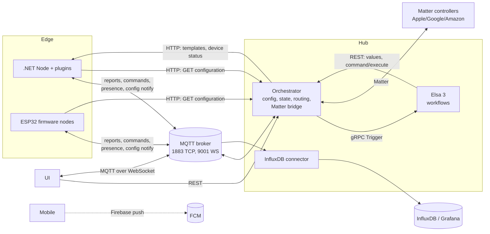

# Architecture overview

Applies to: the whole RIoT2 platform. Start here, then follow the links for details.
Source of truth for versions and frameworks: each repository's `*.csproj`, `package.json` or
`platformio.ini`. The values below are a snapshot (2026-10).

## Concepts

| Term | Meaning |
|---|---|
| **Node** | A participant on the MQTT bus with an id. It hosts devices (.NET Node, ESP32 firmware) or provides a service (Elsa = workflow node, connectors). |
| **Device** | A sensor, actuator or integration inside a node, implemented by a class named in `classFullName`. |
| **Report** | A value a device publishes (`riot2/node/{id}/report`), defined by a report template. |
| **Command** | A value sent to a device (`riot2/node/{id}/command`), defined by a command template. |
| **Template** | The declaration of a report or command: id, type, address, default model. Template ids are globally unique. |
| **Variable** | A value stored in the orchestrator that workflows can set and read. |
| **Orchestrator** | The hub. It owns configuration, tracks online nodes and state/history, routes commands, feeds automation, and bridges to Matter. |
| **Workflow node** | Elsa 3. It receives every report as a trigger and sends commands back through the orchestrator. |
| **Connector** | Bridges the bus to an external system (InfluxDB today). |

## Components

| Repository | Role | Tech (snapshot) | Delivered as |
|---|---|---|---|
| RIoT2.Core | Shared contract and runtime: models, topics, MQTT client, device base classes, `NodeMqttService` | .NET Standard 2.0 library | NuGet `RIoT2.Core` (GitHub Packages) |
| RIoT2.Net.Orchestrator | Hub: REST API, configuration store, state, gRPC client to Elsa, Matter bridge host | ASP.NET Core, .NET 10 | Image `riot2-orchestrator` |
| RIoT2.Net.Node | Device host: loads plugins, runs devices, MQTT and HTTP endpoints | ASP.NET Core, .NET 10 (x64 and ARM64) | Image `riot2-node` |
| RIoT2.Net.Devices | Default device plugin catalog (Web/webhooks, MQTT, Hue, Netatmo, Firebase messaging, electricity price, …) | .NET 10 class library | GitHub release (plugin zip) |
| RIoT2.Net.RasPi.Devices | Raspberry Pi device plugins (GPIO, I2C, Bluetooth, serial, Z-Wave) | .NET 10 class library | Plugin zip (no CI) |
| RIoT2.Elsa | Automation: Elsa 3 server and Studio, plus RIoT activities (`RIoTTrigger`, `RIoTData`, `RIoTOutput`) | .NET 10, Blazor WASM Studio, SQLite | Image `riot2-elsa` |
| RIoT2.Connector.InfluxDB | Writes reports (and optionally commands) to InfluxDB for Grafana | ASP.NET Core, .NET 10 | Image `riot2-influxdb` |
| RIoT2.UI | Web dashboard and configuration UI; live state over browser MQTT | Vue 3, Vuetify, Vite, MQTT.js, nginx | Image `riot2-ui` |
| RIoT2.Mobile | Dashboard host and Firebase push receiver | .NET 10 MAUI (Android, Windows) | App (no CI) |
| RIoT2.Matter | Managed Matter protocol stack; `ControlBridge` exposes RIoT2 devices to Matter controllers | .NET 10 libraries, standalone Controller with Vue UI | NuGet `RIoT2.Matter`, `RIoT2.Matter.ControlBridge` |
| RIoT2.Ard.Shared | Shared firmware library: Wi-Fi, provisioning, MQTT, configuration, OTA, BLE, peripherals | C++ (Arduino, PlatformIO) | Source library, used by path |
| RIoT2.Ard.M5Core2.Node | Touchscreen node firmware for M5Stack Core2 | ESP32, PlatformIO, LVGL | Firmware `.bin` |
| RIoT2.Ard.M5Dial.Node | Rotary-dial node firmware for M5Stack M5Dial | ESP32-S3, PlatformIO | Firmware `.bin` |
| RIoT2.Ard.WiegandI2C | Wiegand reader to I2C bridge, standalone (not yet integrated) | ATtiny85 sketch | Firmware |
| RIoT2.Tests | Cross-repository tests for Core, Orchestrator and InfluxDB connector (project references) | MSTest, .NET 10 | — |
| .github | Organization profile and platform documentation hub (this folder) | Markdown | — |

## Runtime topology

## Main flows

Payloads and topics are in [mqtt-topics.md](../contracts/mqtt-topics.md), and endpoints are in
[http-api.md](../contracts/http-api.md).

1. **Presence and configuration.**
   - The orchestrator publishes retained `riot2/orchestrator/online`.
   - Every node announces itself on `riot2/node/{id}/online`.
   - The orchestrator answers with `riot2/node/{id}/configuration` `{apiBaseUrl}`.
   - The node downloads its configuration over HTTP and (re)starts its devices
     ([configuration.md](../contracts/configuration.md)).
2. **Report.** A device publishes a report. The orchestrator then:
   - checks that a report template exists, and drops the report otherwise;
   - updates the state, and the history if the template has `maintainHistory`;
   - mirrors the value to bound Matter endpoints;
   - queues a gRPC `Trigger(id, reportJson)` to the online workflow node.

   The UI receives the same report directly from the broker. The connector writes it to InfluxDB.
3. **Command.** The UI or Elsa's `RIoTOutput` calls `POST /api/command/execute`.
   - The orchestrator finds the node that owns the command template id and publishes to its
     command topic.
   - The node executes the command asynchronously: at most 64 pending, no result reported back.
   - Matter controllers issue commands through the bridge, which maps them to RIoT2 commands.
4. **Automation.**
   - `RIoTTrigger` starts or resumes workflows for a report id.
   - `RIoTData` reads report, command and variable values over REST.
   - `RIoTOutput` sends commands or sets variables.

   If Elsa is offline, triggers are dropped. There is no outbox yet.
5. **Initial UI state.** The UI loads current state over REST (`/api/dashboard/reports`), then
   follows MQTT for live updates.

## Versioning and releases

- Every repository releases by **pushing a git tag**. The tag is the version:
  - CI builds and pushes `ghcr.io/revolutionized-iot2/<image>:<tag>` and `:latest`, or packs and
    pushes NuGet packages to GitHub Packages.
  - Docker builds need `NUGET_AUTH_TOKEN` for GitHub Packages.
- `RIoT2.Core` is consumed as a **package**, not a project reference, except in RIoT2.Tests.
  - Local, unpublished Core builds go to `C:\Src\RIoT2\.localfeed` (a local NuGet source).
  - A local pack is not a release.
- Rules:
  - All Core consumers must use the same `RIoT2.Core` version, set in each repository's
    `Directory.Packages.props`. Today that is 0.1.45 everywhere (not yet tagged, see
    [MA2](../backlog/README.md#ma2-cut-a-core-release-and-align-all-consumers)).
  - Plugins run inside the Node's Core version. **Release the Node image and the device plugin
    package together**, node first: a plugin built for a newer target framework than the node's
    can't load, but an older plugin loads into a newer node.
  - Core API changes must be additive. Core targets .NET Standard 2.0 so that every consumer can
    use it.
  - MQTT and HTTP contract changes follow the rules in
    [mqtt-topics.md](../contracts/mqtt-topics.md#rules-for-changing-this-contract), because
    firmware updates lag behind.

## Design constraints

| Constraint | Record |
|---|---|
| Anonymous APIs, isolated single-user network, optional security mode later | [ADR 0002](../adr/0002-isolated-network-security-model.md) |
| Elsa 3 is the only automation engine; the rule engine must not come back | [ADR 0003](../adr/0003-elsa-sole-automation-engine.md) |
| Runtime configuration through environment variables; images contain no secrets; non-root containers | [env-vars.md](../contracts/env-vars.md) |
| Firmware shares logic through `RIoT2.Ard.Shared`; fix reusable code there and build both firmwares | `RIoT2.Ard.Shared` README |

## Where this is going

The proposed target architecture is in [target.md](target.md), with detailed designs in [design/](../design/README.md).
It covers:

- splitting Core into contract and runtime packages;
- reliable delivery with an outbox and command results;
- desired-state configuration;
- a connector SDK;
- a shared firmware runtime;
- an optional security mode;
- .NET 10 everywhere.

Proposals become ADRs when accepted.
