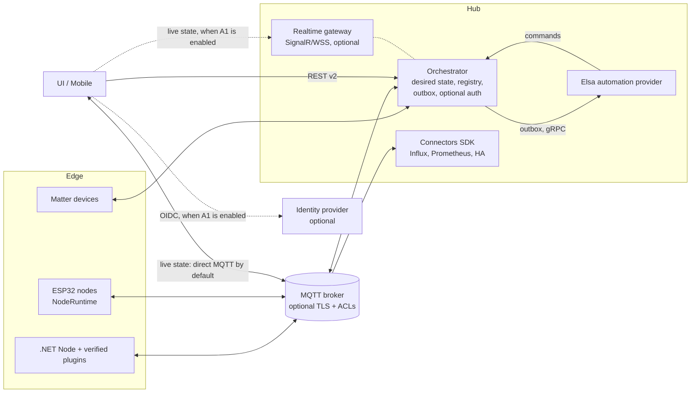

# Target architecture (proposals A1–A10)

Applies to: the whole platform. These are **proposals**, not current behaviour; current behaviour
is in [overview.md](overview.md). A proposal becomes an [ADR](../adr/README.md) when accepted.
IDs `A1`–`A10` are stable. Status: snapshot from the September 2026 platform review. Verify against the code before starting work.

## Target shape

Dashed parts belong to the optional security track (A1) and are off by default.

## A1. Optional security mode

RIoT2 runs on an isolated single-user network today, so the
default stays as it is: no login, anonymous REST, and the UI talking to MQTT directly. A1 adds a
security mode that can be turned on and off with one setting (`RIOT2_SECURITY_MODE=off|audit|on`,
default `off`). While it's off, the system behaves exactly as it does now. The seams it needs are
added early and are inert while it's off. Turning it on, or back off, needs no data migration. It
covers everything in [backlog 5.2](../backlog/optional-hardening.md) and can be rolled out one feature at a time. The detailed design
is in [7.5](../design/security-mode.md).

The changes already made in this review fit that model and don't get in the way of single-user
use: images without baked-in secrets, non-root containers, restricted JSON type binding, and path
traversal guards. Elsa Studio still needs its login and `ELSA_IDENTITY_SIGNING_KEY`, because that
is how Elsa itself works.

## A2. Split Core into packages

Separate the wire contract (`RIoT2.Core.Contracts`: DTOs, topics,
JSON schema and a source-generated System.Text.Json context, with no other dependencies) from the
runtime packages `RIoT2.Core.Mqtt`, `RIoT2.Core.Http`, `RIoT2.Core.Devices` (plugin SDK) and
`RIoT2.Core.Node`. Add an additive `contractVersion` field to MQTT payloads now, before any
breaking change. Publish JSON Schemas and generate the TypeScript models for the UI and the C++
structs for firmware from them. Implementation plan: [M1](../plans/m01-split-core-packages.md) (with [M2](../plans/m02-system-text-json-persistence.md) for the JSON part).

## A3. Make delivery reliable

Add a durable outbox for workflow deliveries and commands, plus
command correlation and result reporting, so failures are visible and retried within a
time-to-live. The detailed design is in [7.1](../design/reliable-delivery.md).

## A4. Use a desired-state configuration and plugin model

Give configurations a revision and a
hash. Nodes apply only real changes, cache the last good configuration, and report what they
applied. Plugins are verified and installed with rollback. The detailed design is in [7.2](../design/desired-state-configuration.md).

## A5. Keep automation behind a provider interface

The orchestrator emits domain events such as
report received, node online and variable changed to an `IAutomationProvider`. Elsa is the
implementation, reached over the existing gRPC contract via the outbox. This keeps the orchestrator
engine-agnostic and testable. Delivered together with phase 1 of 7.1.

## A6. Build a connector SDK

Package the generic parts of a connector in one library: configuration
validation, MQTT lifecycle, orchestrator handshake, template catalog, bounded queue with an
optional disk spool, batching, retry, health and metrics. Influx becomes the reference connector,
and new connectors (Prometheus, Home Assistant, Timescale) only implement a sink. The detailed
design is in [7.3](../design/connector-sdk.md).

## A7. Finish the Matter integration

Most of this is already in place:

- `MatterBridgeService` runs as a hosted service (`MatterBackgroundService`).
- Its state persists through `MatterConfigurationStore`.
- RIoT2 templates map to bridged endpoints through `MatterEndpointComposer`/`RiotBridgedDeviceAdapter`.

Remaining: a DNS-SD `IOperationalPeerResolver` for outbound bindings, a check that bridged
endpoint ids stay stable when node configuration changes, and splitting `MatterBridgeService`
([M3](../plans/m03-split-oversized-classes.md)).

## A8. Share a firmware NodeRuntime

Move Wi-Fi, MQTT, configuration, OTA and peripheral lifecycle
into `RIoT2.Ard.Shared`, with a shared view-model layer and board-specific renderers for Core2 and
Dial. Build new peripherals on the existing `IPeripheral`/`PeripheralManager` interface;
`WiegandI2CPeripheral` would be the next one. Implementation plan: [M5](../plans/m05-firmware-node-runtime.md).

## A9. Make operations first-class

One `docker-compose.yml` for the whole stack, consistent
logging with retention, built-in metrics with an optional observability profile, and backup/restore
at two levels (configuration from the UI, full system from a script). The detailed design is in
[7.4](../design/operations.md).

## A10. Unify engineering practices

One .NET version (10 LTS), central package management
(`Directory.Packages.props`), typed `IOptions<T>` configuration with startup validation shared by
all services (plan [M4](../plans/m04-typed-configuration.md)), nullable reference types enabled progressively, analyzers with
warnings-as-errors in CI (plan [M8](../plans/m08-dotnet10-migration.md)), reusable GitHub workflows shared by all repos (plan [M9](../plans/m09-ci-cd.md)), and a
cross-repo "platform" integration test that runs broker, orchestrator, node (Virtual device) and a
workflow stub in-process, with container smoke tests added later (plan [M7](../plans/m07-contract-integration-tests.md)).
