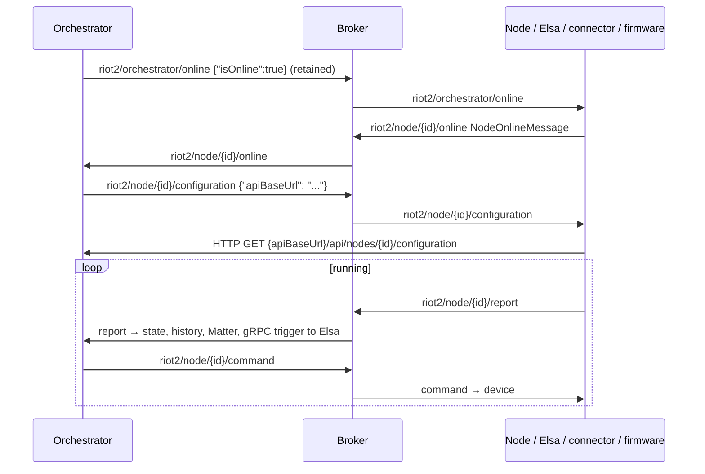

# MQTT topics and payloads

Applies to: every component that connects to the MQTT broker (Orchestrator, Node, Elsa,
connectors, ESP32 firmware, UI).
Source of truth: `RIoT2.Core/Constants.cs` (topics), `RIoT2.Core/Models/*.cs` (payloads),
`RIoT2.Ard.Shared/RIoT2Shared/include/riot2/Topics.h` (firmware copy of the topics).
If this document and the code disagree, the code wins. Fix this document.

## Topics

| Enum (`MqttTopic`) | Template | Payload | Retained |
|---|---|---|---|
| `NodeOnline` (1) | `riot2/node/{id}/online` | `NodeOnlineMessage` | Firmware: yes. .NET: no (see [Known divergences](#known-divergences)) |
| `Configuration` (2) | `riot2/node/{id}/configuration` | `ConfigurationCommand` | No |
| `Command` (3) | `riot2/node/{id}/command` | `Command` | No |
| `Report` (4) | `riot2/node/{id}/report` | `Report` | No |
| `OrchestratorOnline` (5) | `riot2/orchestrator/online` | `{"isOnline":true}` | Yes |

`{id}` is the MQTT client id of the participant, which is also its RIoT2 id:

| Participant | Id source |
|---|---|
| Orchestrator | `RIOT2_ORCHESTRATOR_ID` |
| .NET Node | `RIOT2_NODE_ID` |
| Elsa | `RIOT2_WORKFLOW_ID` |
| InfluxDB connector | `RIOT2_CONNECTOR_ID` |
| Firmware | Provisioned node id (stored in NVS) |

Build and parse topics with `Constants.Get(id, MqttTopic.X)` and `Constants.GetTopicId(topic, MqttTopic.X)`.
Don't hard-code topic strings in .NET code.

## Who publishes and subscribes

| Topic | Publishers | Subscribers (exact filter) |
|---|---|---|
| `riot2/orchestrator/online` | Orchestrator, on every (re)connect | Node, Elsa, InfluxDB connector, firmware |
| `riot2/node/{id}/online` | Node, Elsa, connector, firmware (on connect and after seeing orchestrator online). UI (once, at page load). Every client's last will. | Orchestrator: `riot2/node/+/online` |
| `riot2/node/{id}/configuration` | Orchestrator, after it receives an online message with `isOnline:true` | The node with that id (Node, Elsa, connector, firmware, UI) |
| `riot2/node/{id}/command` | Orchestrator (from `POST /api/command/execute` and Elsa workflows) | The node with that id. InfluxDB connector: `riot2/node/+/command` (only when `RIOT2_HANDLE_COMMANDS=true`) |
| `riot2/node/{id}/report` | Node, firmware, Orchestrator (its own reports, under its own id) | Orchestrator, InfluxDB connector, UI: `riot2/node/+/report` |

- The UI is a **Dashboard node** (`nodeType` 2) with a new random id on every page load. It
  connects to the broker over WebSockets (`ws://<VITE_MQTT_SERVER>:9001/`) and announces itself on
  `riot2/node/{id}/online`. It learns the orchestrator URL from its `configuration` message and
  follows reports live. It announces itself only once (backlog item 21).
- RIoT2.Mobile does not use MQTT. Push notifications use Firebase Cloud Messaging topics `alerts`
  and `notifications`.

## Payloads

All payloads are UTF-8 JSON with camelCase property names. .NET publishers use
`Json.SerializeIgnoreNulls`, so `null` properties are omitted. Readers must ignore unknown
properties, because new fields are added without a version bump.

### `Report` (`RIoT2.Core/Models/Report.cs`)

```json
{ "id": "livingroom-temperature", "timeStamp": 1790253852, "filter": "room", "value": 21.5 }
```

- `id` is the report template id. The orchestrator drops reports whose id doesn't match a
  configured report template.
- `timeStamp` is Unix epoch seconds, UTC (`ToEpoch()` / `FromEpoch()`).
- `filter` is optional. Firmware never sends it.
- `value` is any JSON value (see [`ValueModel`](#valuemodel)).

### `Command` (`RIoT2.Core/Models/Command.cs`)

```json
{ "id": "livingroom-lamp", "value": { "on": true, "brightness": 80 } }
```

`id` is the command template id. The orchestrator finds the owning node with
`FindNodeId(command.Id)` and publishes to that node's command topic.

Reserved command id: `system.ota` (firmware only). `value` is a firmware `.bin` URL, and it is
handled before view dispatch. Don't assign it to a command template.

### `ConfigurationCommand` (`RIoT2.Core/Models/ConfigurationCommand.cs`)

```json
{ "apiBaseUrl": "http://192.168.0.32" }
```

`apiBaseUrl` is the orchestrator's `RIOT2_ORCHESTRATOR_URL`. Receivers use it as follows:

- Node and firmware: fetch `{apiBaseUrl}/api/nodes/{id}/configuration`
  ([http-api.md](http-api.md), [configuration.md](configuration.md)).
- Elsa: stores it as the orchestrator base URL.
- Connector: loads the template catalogs from it.

### `NodeOnlineMessage` (`RIoT2.Core/Models/NodeOnlineMessage.cs`)

```json
{
  "name": "Garage node",
  "isOnline": true,
  "nodeBaseUrl": "http://192.168.0.33",
  "grpcBaseUrl": "http://192.168.0.32:5003",
  "nodeType": 1,
  "manifest":       { "name": "RIoT2 Node", "version": "1.2.0", "date": "…", "installedPackageFilename": "…" },
  "pluginManifest": { "name": "…", "version": "…", "date": "…", "installedPackageFilename": "…" }
}
```

| Field | Notes |
|---|---|
| `isOnline` | `false` in last-will and graceful-stop messages. The orchestrator then removes the node from its online list. |
| `nodeBaseUrl` | The base URL that the orchestrator uses to call the node's HTTP API (`RIOT2_NODE_URL`, `RIOT2_WORKFLOW_URL`, or `http://<ip>` for firmware). |
| `grpcBaseUrl` | Workflow nodes only (`RIOT2_WORKFLOW_GRPC_URL`). The orchestrator prefers it over `nodeBaseUrl` for gRPC triggers. |
| `nodeType` | `0` Unknown, `1` Device (Node, firmware), `2` Dashboard (UI), `3` Workflow (Elsa). The connector sends no type (0). |
| `manifest`, `pluginManifest` | `PackageManifest` of the node image and of the installed plugin package (.NET Node). |

### `ValueModel`

`Report.value` and `Command.value` are `ValueModel` instances. They store the raw JSON value, not
a `{type, value}` envelope. The type is inferred from the JSON kind:

| JSON kind | `ValueType` |
|---|---|
| boolean | `Boolean` (0) |
| string, null | `Text` (1) |
| number | `Number` (2) |
| object | `Entity` (3) |
| array | `TextArray` (4) |

Large integers and JSON-looking strings are preserved as-is (since Core 0.1.40).

## Lifecycle



- The node also announces itself on every (re)connect, so the steps after the first one repeat
  whenever either side reconnects.
- Firmware reconnects with backoff, resubscribes, and publishes online again.
- .NET clients use the MQTTnet managed client, which reconnects after 5 s.

## Delivery semantics

| Aspect | .NET (`RIoT2.Core/Utils/MqttClient.cs`) | Firmware (`PubSubClient`) | UI (MQTT.js) |
|---|---|---|---|
| Publish QoS | 2 | 0 | Library default (0) |
| Subscribe QoS | 0 (filter builder default) | 0 | Library default (0) |
| Effective delivery | **QoS 0**: the broker delivers at the lower of the two levels | QoS 0 | QoS 0 |
| Session | Clean session | Clean session | `clean: true` |
| Last will | `riot2/node/{clientId}/online`, `{"name":"","isOnline":false,"nodeBaseUrl":""}`, not retained | Same topic, `{"isOnline":false}`, retained | Same topic, `{ "IsOnline": false }`, QoS 1, not retained |
| Transport | TCP 1883, no TLS | TCP 1883, or TLS 8883 (`mqttUseTls`, root CA) | `ws://…:9001/` |

Consequences:

- Any message can be lost on a dropped connection.
- Commands sent to an offline node are lost. The broker does not queue them.
- Orchestrator → Elsa triggers go through an in-memory queue (capacity 1000). They are dropped
  if no workflow node is online, if delivery fails, or on shutdown.
- `NodeMqttService` allows at most **64** outstanding commands. Extra commands are rejected with a
  log warning and are not retried. An MQTT acknowledgement does not mean that the device executed
  the command.

## Known divergences

These differences exist in the code today. Fix them in the code, or document them here as
intentional. Don't copy them into new code.

| # | Divergence | Where |
|---|---|---|
| D1 | The .NET online message and last will are not retained, but the firmware ones are. A late subscriber sees firmware presence but not .NET presence. | `MqttClient.cs`, `NodeMqttService.cs`, `MqttConnection.cpp` |
| D2 | The orchestrator's last will goes to `riot2/node/{orchestratorId}/online`, not `riot2/orchestrator/online`. After a crash, the retained orchestrator presence still says `true`. | `MqttClient.cs`, `OrchestratorMqttService.cs` |
| D3 | The UI's presence and last-will payloads are PascalCase (`{"IsOnline":true,"Name":…,"NodeType":2}`). .NET readers are case-insensitive, but other readers may not be. | `RIoT2.UI/src/App.vue`, `RIoT2.UI/src/composables/mqttService.ts` |
| D4 | .NET publishes at QoS 2 but subscribes at QoS 0, so QoS 2 costs extra round-trips for nothing. | `MqttClient.cs` |
| D5 | Firmware builds `api/Nodes/{id}/configuration` (capital `N`). It works because ASP.NET routing is case-insensitive. | `OrchestratorClient.cpp` |

## Planned changes (not implemented)

Planned in [design 7.1](../design/reliable-delivery.md) and [design 7.2](../design/desired-state-configuration.md). All of them are
additive:

- New topics `riot2/node/{id}/command/result` and `riot2/node/{id}/status` (retained).
- New fields `Command.correlationId` and `NodeOnlineMessage.capabilities`.
- QoS 1 end to end.
- An outbox in the orchestrator.

None of these exist yet. Check `Constants.cs` before relying on them.

## Rules for changing this contract

- Changes must be additive: new optional fields, new topics. Never rename or remove a field or
  topic without an ADR and a migration plan for firmware, which updates more slowly.
- A change touches, in order:
  1. `RIoT2.Core` (and a Core release)
  2. `RIoT2.Ard.Shared` (`Topics.h`, `MqttJson`)
  3. the consumers
  4. this document
- Keep payloads camelCase, and serialize with `Json.SerializeIgnoreNulls`.
