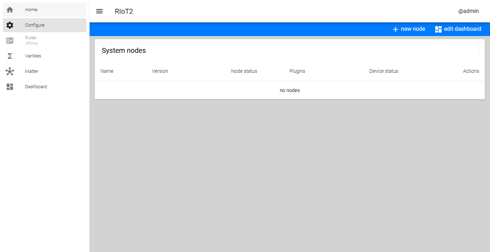
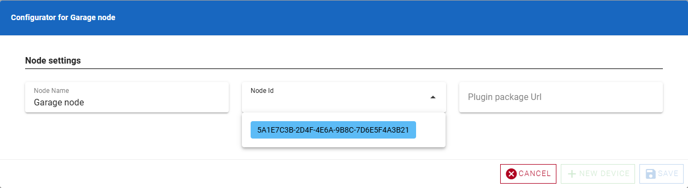
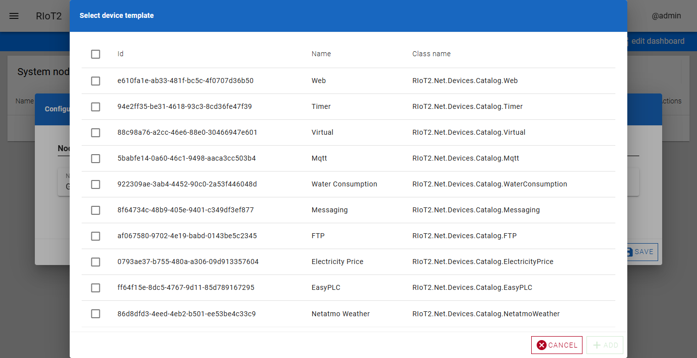
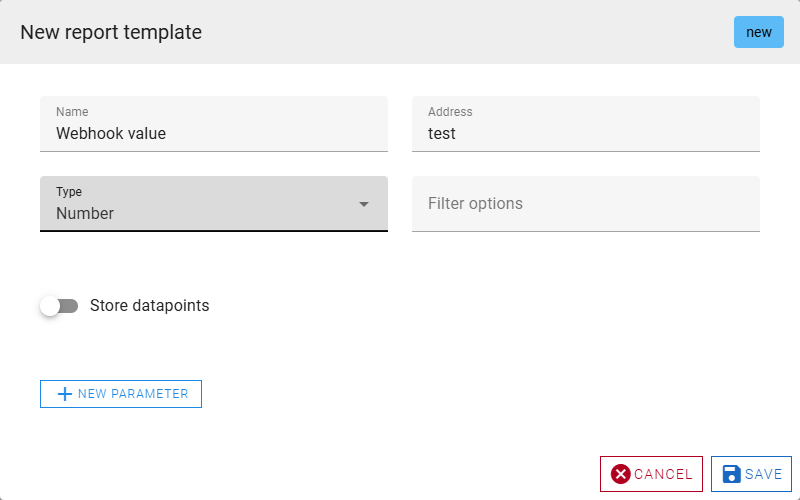
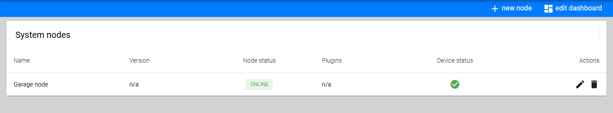
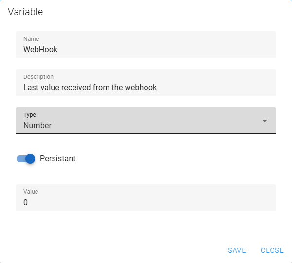

# Configure your first node

Applies to: the RIoT2 UI, after [getting-started.md](getting-started.md). The screenshots come from
the current UI and are regenerated with
[tools/ui-screenshots](../../tools/ui-screenshots/README.md).

This walkthrough creates a node in the UI, adds a webhook device, tests it, and creates a
variable. Data flows like this: the node reports, the orchestrator stores state and forwards to
Elsa, and the UI shows it live. See the [architecture overview](../architecture/overview.md#main-flows).

## 1. Open the configuration view

Open the UI (`http://<host>/`), open the menu (☰) and select **Configure**. While no nodes are
configured, the list is empty:



> [!NOTE]
> The **Rules** menu entry opens Elsa Studio. It shows *offline* until Elsa is running.

## 2. Create the node

Click **new node** in the toolbar, give the node a name, and pick its **Node Id** from the list.
The list shows nodes that are online but not configured yet, so it contains the `RIOT2_NODE_ID`
you gave the node container.

**Plugin package Url** is optional. When it is set, the node downloads that plugin package and
installs it on its next restart.



## 3. Add a device

Click **new device**. The dialog lists the device templates that the node's plugins provide:



> [!NOTE]
> If the list is empty, check that the node is online and has loaded its plugins:
> `docker logs riot2-node` shows `Found N devices from plugins`.

Select the **Web** device and click **add**. The Web device is a generic device that receives
webhooks over HTTP and turns them into reports.

## 4. Add a report template

Expand the new device, give it a name, and click **new report template**:



- **Name**: the display name.
- **Address**: the webhook path segment. With `test`, the node accepts
  `POST http://<node>/api/webhook/test`.
- **Type**: the value type of the report (Boolean, Text, Number, Entity or TextArray).
- **Store datapoints**: keeps history for charts.

Save the template, then save the node. The orchestrator tells the node to reload; the node
downloads the new configuration and restarts its devices. The node list now shows the node and
its device status:



Device parameters (the **Additional parameters** of a device) are stored by the orchestrator and
can contain third-party credentials. Treat `/app/StoredObjects` as secret.

## 5. Test the webhook

Send a value to the webhook. With the port layout from getting-started, the node is on port 8081:

```bash
curl -X POST http://<host>:8081/api/webhook/test -H "Content-Type: application/json" -d 42
```

The value becomes the report's current state. Check it in the dashboard, or ask the orchestrator.
`/api/nodes/report/templates` lists template ids and names:

```bash
curl http://<host>:8080/api/nodes/report/templates
curl http://<host>:8080/api/report/<report-template-id>/value
```

## 6. Create a variable

Variables hold values in the orchestrator that workflows can read and write. Open **Varibles**
from the menu, click **new**, and create a variable:



## 7. Connect them with a workflow

The internal rule engine is retired, so automation is built in Elsa Studio. To store each webhook
value in the variable:

1. Start the workflow with a `RIoTTrigger` activity on the webhook report.
2. Add a `RIoTOutput` activity that sends the value to the variable. Variables are exposed as
   command targets.

Elsa receives every report from the orchestrator over gRPC. If Elsa is offline, reports are not
queued: automation simply doesn't run until Elsa is back
([design 7.1](../design/reliable-delivery.md) plans durable delivery).

## Next

- Build a dashboard: **edit dashboard** on the Configure view.
- More device types: the catalogs in
  [RIoT2.Net.Devices](https://github.com/Revolutionized-IoT2/RIoT2.Net.Devices) and
  [RIoT2.Net.RasPi.Devices](https://github.com/Revolutionized-IoT2/RIoT2.Net.RasPi.Devices).
- How configuration is stored and delivered: [configuration.md](../contracts/configuration.md).
