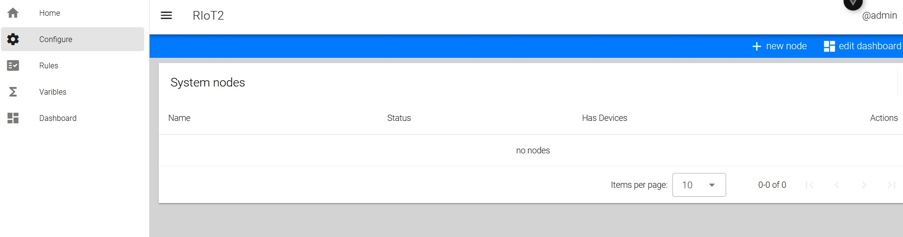
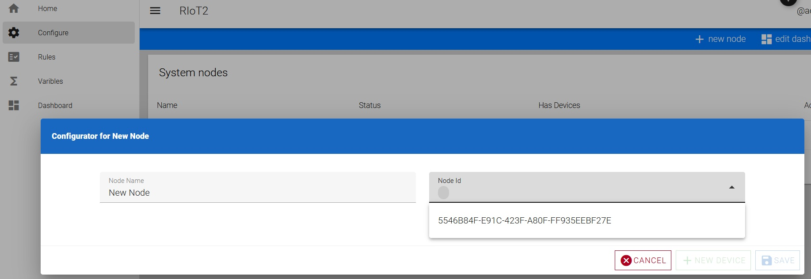

# Revolutionized-IoT2
Yet another HomeAssistant? Definitely no, thou using *RIoT2* for controlling one’s smart home is obviously one of the use scenarios. The *RIoT2* is designed to be a **generic and scalable** platform for running virtually any Internet of Things scenario.


## Basic concepts
The bare minimum set of components to get started is: mqtt server, orchestrator, and a node. A node is a *thing* connected to mqtt network, which contains one or more *devices*. A *device* represents for instance a sensor or an actuator within a node. Device can send *reports* on its state, for instance when temperature is changed. Some devices can also receive *commands* in order to perform some operation, like switching on the lights. 

The role of the *orchestrator* is to function as central point in a system. It listens all reports and keeps track on the state of the system. The orchestrator can also have *rules*, which dictates that if certain type of report is received, the orchestrator will issue a command. The orchestrator also acts as a central point for managing configurations for each node. 

## Getting started
The system is designed to be run in Docker containers. 

### 1. Installing MQTT
First step is to setup MQTT. The recommended mqtt server is eclipse/mosquitto. Example configuration file for Mosquitto:

```
##Authentication #  
allow_anonymous false  
password_file /mosquitto/config/password.txt  
  
##Listeners #  
listener 1883 192.168.0.30  
listener 9001 192.168.0.30  
protocol websockets  
```
> [!NOTE]  
> note that websocket -protocol is needed for UI

Setting up Mosquitto broker with Docker => https://github.com/sukesh-ak/setup-mosquitto-with-docker/blob/main/README.md

### 2. Setting up Orchestrator
Build (or pull) orchestrator container and set it up:
```
docker pull ghcr.io/revolutionized-iot2/riot2-orchestrator:latest
```

Container environment parameters:  
- RIOT2_MQTT_IP - IP address for MQTT server  
- RIOT2_MQTT_PASSWORD - MQTT password set in password.txt  
- RIOT2_MQTT_USERNAME - MQTT username set in password.txt  
- RIOT2_ORCHESTRATOR_ID - Unique ID for Orchestrator across the whole system. GUID is recommended 
- RIOT2_ORCHESTRATOR_URL - Orchestrator endpoint URL. E.g. http://192.168.0.32
- TZ - Timezone for Orchestrator. E.g. Europe/Helsinki  
  
Mount volume: /app/StoredObjects - This is the location where Orchestrator holds persistent data like node configurations and rules.

### 3. Setting up Node
Build (or pull) NET -node container and set it up:  
```
docker pull ghcr.io/revolutionized-iot2/riot2-node:latest
```

Container environment parameters:  
- RIOT2_MQTT_IP - IP address for MQTT server  
- RIOT2_MQTT_PASSWORD - MQTT password set in password.txt  
- RIOT2_MQTT_USERNAME - MQTT username set in password.txt  
- RIOT2_NODE_ID - Unique ID for Node across the whole system. GUID is recommended  
- RIOT2_NODE_URL - Node endpoint URL. E.g. http://192.168.0.33  
- TZ - Timezone for the Node. E.g. Europe/Helsinki  

Mount following container volumes:
- /app/Data - Contains all persistent data for Node, like authentication objects 
- /app/Logs - Log files
- /app/Plugins - Device plugin location

Create your own device plugin or download default from: https://github.com/Revolutionized-IoT2/RIoT2.Net.Devices/releases

Upload all device plugins to container.
> [!NOTE]  
> Plugins are loaded when container is started, so rebooting container is needed.

### 4. Setting up UI
UI is not required to run the system, but it can assist on creating rules and node configurations instead of manually creating them. The UI also provides a dashboard that can be used to monitor the system.  

Build (or pull) UI container and set it up:  
```
docker pull ghcr.io/revolutionized-iot2/riot2-ui:latest
```

Container environment parameters:  
- VITE_MQTT_SERVER - IP address for MQTT server  
- VITE_MQTT_USER - MQTT username set in password.txt  
- VITE_MQTT_PASSWORD - MQTT password set in password.txt  

Start the UI

### Getting started

Once _Mqtt-server_, _Orchestrator_, _Node_ (with some devices) and _UI_ are running, the next step is to configure the Node. First, launch your browser, navigate to UI address, and select option "Configure". You hould be able to see the following view:



Start by adding a new Node by pressing the button _New Node_ in toolbar. This will open a dialog where you can give your node a name and define its Id. The Id should be the one you assigned in step three as RIOT2_NODE_ID. You can now save the Configuration.



Next Step is to Configure Devices. Start the process by clicking the _New Device_ -button. This opens a dialog displaying all devices from the node.


> [!NOTE]  
> If you don't see any devices, ensure _node_ is online by navigating to first screen, which should display configurations for all _nodes_

Select _Web_ device and click _Add_ -button. This will open Device configuration dialog.

Web -device is generic web device, that can receive updates (webhooks) from network and generate _reports_ from them.

**TODO**

Configure Node
> [!NOTE]  
> Once the configuration is saved, the Node will automatically reload the configuration and restart itself


** todo step by step instructions on configuring the node and creating first rule **


## Next Steps

At this stage, the code probably has some bugs so extensive testing is needed. Also, some unit tests need to be created to prevent regression. Furthermore, currently the emphasis has been on getting everything moving, so tons of code refactoring is needed at some point. 

Next steps would probably be creating nodes for: 
- Raspberry (UWP / Net Core)
- ESP32
- M5Core2
- M5Dial
- Arduino

Also, a simple phone app to receive firebase messages and to show the dashboard would be quite nice.
