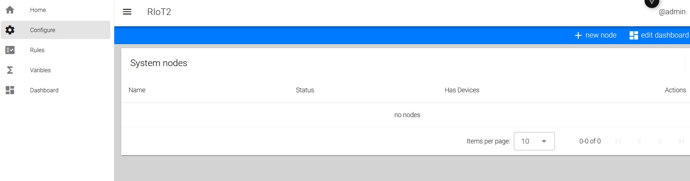
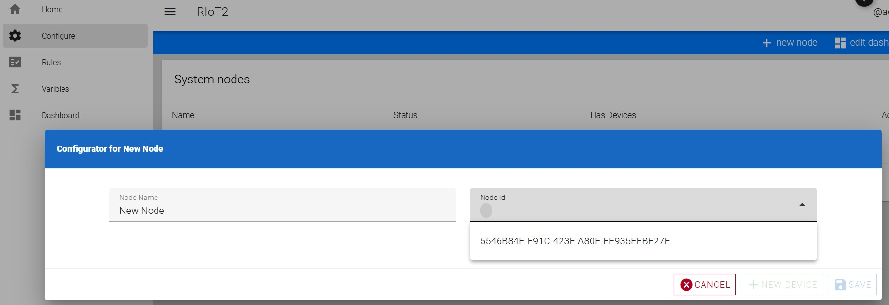
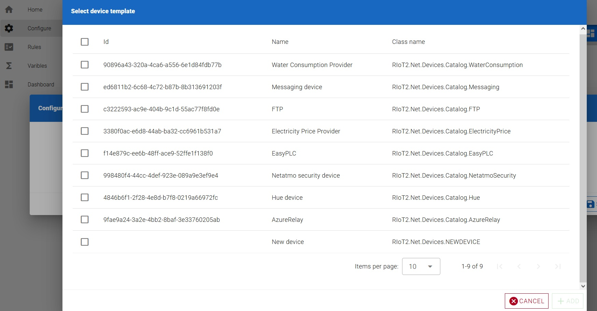
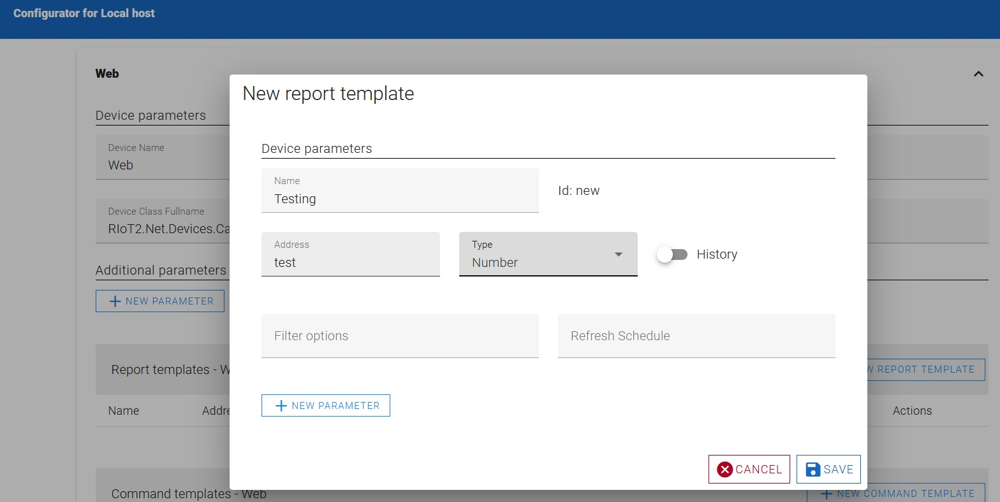
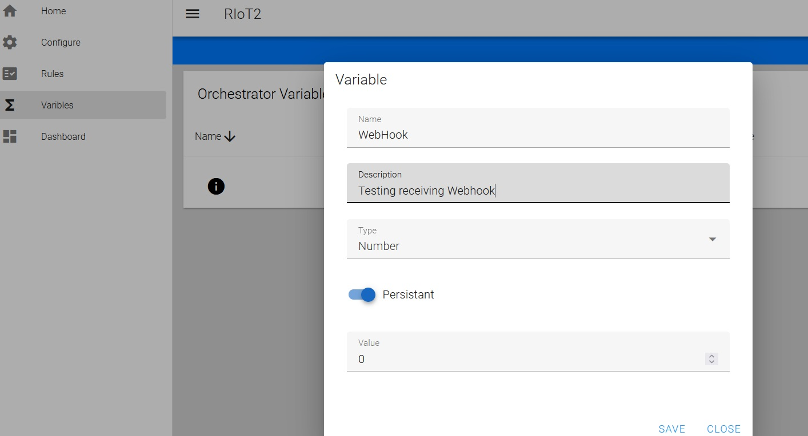

# Revolutionized-IoT2
Welcome to Revolutionized-IoT2 (RIoT2), a generic and scalable platform designed to run virtually any Internet of Things (IoT) scenario. It's not merely another HomeAssistant, but a versatile tool that can help control your smart home among many other applications.

Beyond the core MQTT/orchestrator/node model, RIoT2 now also includes native [Matter](https://csa-iot.org/all-solutions/matter/) smart-home protocol support, Elsa 3 workflow automation, a time-series connector for Grafana/InfluxDB, and a mobile companion app.

## Basic concepts
To get started with RIoT2, it's important to understand its basic components: the MQTT server, a device, the orchestrator, and a node.

- A node is a thing connected to the MQTT network, hosting one or more devices.

- A device could be a sensor or an actuator within a node. Devices can send reports about their state (e.g., when the temperature changes). Some devices can receive commands to perform operations (e.g., turning on lights).

- The orchestrator serves as the central hub of the system. It listens to reports, tracks state, and forwards reports to Elsa 3 for automation. Workflows can send commands back through the orchestrator. It also manages configurations for each node.

- A connector bridges the RIoT2 MQTT bus to an external system rather than a physical device — for example, forwarding sensor reports into a time-series database for visualization.

- Automation is handled by Elsa 3, with visually authored workflows in Elsa Studio. The internal rule engine has been retired.

## Platform components
RIoT2 is split across several repositories. This is a quick map of what each one does:

| Repository | Description |
|---|---|
| [RIoT2.Core](https://github.com/Revolutionized-IoT2/RIoT2.Core) | Shared library with the common data model, MQTT conventions, and services used by every other component. |
| [RIoT2.Net.Orchestrator](https://github.com/Revolutionized-IoT2/RIoT2.Net.Orchestrator) | The central hub: tracks nodes, forwards reports to Elsa, and coordinates the system over MQTT. |
| [RIoT2.Net.Node](https://github.com/Revolutionized-IoT2/RIoT2.Net.Node) | The agent that runs on IoT hardware/hubs and dynamically loads device plugins. |
| [RIoT2.Net.Devices](https://github.com/Revolutionized-IoT2/RIoT2.Net.Devices) | The default device plugin catalog for the Node (webhooks, MQTT, Netatmo, Philips Hue, Firebase messaging, electricity price, and more). |
| [RIoT2.Net.RasPi.Devices](https://github.com/Revolutionized-IoT2/RIoT2.Net.RasPi.Devices) | A device plugin catalog for Raspberry Pi hardware, covering GPIO, I2C, Bluetooth, serial, and Z-Wave devices. |
| [RIoT2.Ard.M5Core2.Node](https://github.com/Revolutionized-IoT2/RIoT2.Ard.M5Core2.Node) | ESP32 firmware turning an M5Stack Core2 into a touchscreen RIoT2 node (lights, scenes, sensors). |
| [RIoT2.Ard.M5Dial.Node](https://github.com/Revolutionized-IoT2/RIoT2.Ard.M5Dial.Node) | ESP32 firmware turning an M5Stack M5Dial into a rotary-dial RIoT2 node. |
| [RIoT2.Ard.Shared](https://github.com/Revolutionized-IoT2/RIoT2.Ard.Shared) | Shared Wi-Fi/MQTT/provisioning/OTA firmware library used by both M5 node firmwares. |
| [RIoT2.Ard.WiegandI2C](https://github.com/Revolutionized-IoT2/RIoT2.Ard.WiegandI2C) | An ATtiny85 sketch that decodes Wiegand RFID/badge readers and exposes the code over I2C. |
| [RIoT2.UI](https://github.com/Revolutionized-IoT2/RIoT2.UI) | The web dashboard for monitoring devices, configuring nodes, and opening Elsa Studio. |
| [RIoT2.Mobile](https://github.com/Revolutionized-IoT2/RIoT2.Mobile) | A .NET MAUI mobile app that displays the dashboard and receives Firebase push notifications. |
| [RIoT2.Matter](https://github.com/Revolutionized-IoT2/RIoT2.Matter) | A managed .NET implementation of the Matter smart-home protocol, for interop with controllers like Apple Home and Google Home. |
| [RIoT2.Elsa](https://github.com/Revolutionized-IoT2/RIoT2.Elsa) | Elsa 3 workflow engine and Studio, providing automation for RIoT2. |
| [RIoT2.Connector.InfluxDB](https://github.com/Revolutionized-IoT2/RIoT2.Connector.InfluxDB) | Bridges the MQTT bus into InfluxDB for Grafana visualization. |
| [RIoT2.Tests](https://github.com/Revolutionized-IoT2/RIoT2.Tests) | Unit test suite for RIoT2.Core. |

## Getting started
RIoT2 is designed to run in Docker containers. Here are the steps to set it up:

### 1. Installing MQTT
The first step is setting up MQTT. We recommend using the eclipse/mosquitto server. Here's an example configuration file for Mosquitto:

```
##Authentication #  
allow_anonymous false  
password_file /mosquitto/config/password.txt  
  
##Listeners #  
listener 1883 192.168.0.30  
listener 9001 192.168.0.30  
protocol websockets  
```

> [!NOTE]  
> The websocket protocol is required for the UI.

A good guide for setting up Mosquitto broker with Docker => https://github.com/sukesh-ak/setup-mosquitto-with-docker/blob/main/README.md

### 2. Setting up the Orchestrator
Build (or pull) the orchestrator container and set it up:
```
docker pull ghcr.io/revolutionized-iot2/riot2-orchestrator:latest
```

Set the following container environment parameters: 
- RIOT2_MQTT_IP - IP address for MQTT server  
- RIOT2_MQTT_PASSWORD - MQTT password set in password.txt  
- RIOT2_MQTT_USERNAME - MQTT username set in password.txt  
- RIOT2_ORCHESTRATOR_ID - Unique ID for Orchestrator across the whole system. GUID is recommended 
- RIOT2_ORCHESTRATOR_URL - Orchestrator endpoint URL. E.g. http://192.168.0.32
- TZ - Timezone for Orchestrator. E.g. Europe/Helsinki  
  
Mount the volume at: 
- /app/StoredObjects - This location is where the Orchestrator stores persistent data, such as node configurations, dashboards, and variables

### 3. Setting up the Node
Build (or pull) the NET-node container and set it up:
```
docker pull ghcr.io/revolutionized-iot2/riot2-node:latest
```

Set the following container environment parameters:

- RIOT2_MQTT_IP - IP address for MQTT server  
- RIOT2_MQTT_PASSWORD - MQTT password set in password.txt  
- RIOT2_MQTT_USERNAME - MQTT username set in password.txt  
- RIOT2_NODE_ID - Unique ID for Node across the whole system. GUID is recommended  
- RIOT2_NODE_URL - Node endpoint URL. E.g. http://192.168.0.33  
- TZ - Timezone for the Node. E.g. Europe/Helsinki  

Mount the following container volumes:
- /app/Data - Contains all persistent data for the Node, like authentication objects 
- /app/Logs - Log files
- /app/Plugins - Device plugin location

You have the option to create your own device plugin or download the default one from the following link: https://github.com/Revolutionized-IoT2/RIoT2.Net.Devices/releases

If you are using custom plugins, upload all of them to your container's plugin folder. Remember also to upload all the dependencies they might have. If you are using the default device package, just unzip it to plugins folder.

> [!NOTE]  
> The plugins will be loaded when the container starts. Therefore, a reboot of the container is necessary for the plugins to take effect.

#### 3.1 Setting up the Raspberry Pi Node

Install Raspberry Pi OS 64 to your Raspberry Pi Device: https://www.raspberrypi.com/software/

Install docker to your Raspberry device by following debian instructions: https://docs.docker.com/engine/install/debian/

Create local directories for node data and plugins
```
mkdir /app/Data
mkdir /app/Logs
mkdir /app/Plugins
```

Upload plugins to plugins folder. For Raspberry Pi hardware (GPIO, I2C, Bluetooth, serial, Z-Wave sensors and actuators), use the device plugins from [RIoT2.Net.RasPi.Devices](https://github.com/Revolutionized-IoT2/RIoT2.Net.RasPi.Devices) instead of (or alongside) the default package.

> [!NOTE]  
> If you don't have any plugins, the node will shutdown automatically.


Pull the node image to your device

```
docker pull ghcr.io/revolutionized-iot2/riot2-node:latest-arm64v8
```

Update the docker command below according to your settings and start the node

```
docker run -d --restart=on-failure:5 \
-p 80:80 \
-v /app/Data:/app/Data \
-v /app/Logs:/app/Logs \
-v /app/Plugins:/app/Plugins \
-v /var/run/dbus:/var/run/dbus:ro \
--env RIOT2_MQTT_IP=192.168.0.30 \
--env RIOT2_MQTT_PASSWORD=password \
--env RIOT2_MQTT_USERNAME=edge \
--env RIOT2_NODE_ID=F811B5A0-E978-45BB-ADD3-584655DF21BF \
--env RIOT2_NODE_URL=http://riot2.local \
--env TZ=Europe/Helsinki \
--privileged \
ghcr.io/revolutionized-iot2/riot2-node:latest-arm64v8
```

You can check the status of the node by running the command
```
docker ps

docker logs {containerid}
```

Alternatively, you can check the logs in folder /app/Logs

#### 3.2 Setting up an ESP32 hardware Node (M5Core2 / M5Dial)

In addition to the containerized .NET node, RIoT2 ships firmware for two M5Stack devices that act as physical, screen-equipped nodes on the same MQTT/orchestrator network:

- [RIoT2.Ard.M5Core2.Node](https://github.com/Revolutionized-IoT2/RIoT2.Ard.M5Core2.Node) — a touchscreen node (buttons, toggles, sliders, scenes, energy gauge) built on the M5Stack Core2.
- [RIoT2.Ard.M5Dial.Node](https://github.com/Revolutionized-IoT2/RIoT2.Ard.M5Dial.Node) — a rotary-dial node built on the M5Stack M5Dial.

Both are built and flashed with PlatformIO and are provisioned over a captive Wi-Fi portal; see each repository's README for wiring, provisioning, and OTA update instructions.

### 4. Setting up the UI
While the UI is not essential for running the system, it offers node configuration, a dashboard for monitoring the system, and a link to Elsa Studio for authoring workflows.

To set up the UI, you need to build (or pull) the UI container:
```
docker pull ghcr.io/revolutionized-iot2/riot2-ui:latest
```

Container environment parameters:  
- VITE_MQTT_SERVER - IP address for MQTT server  
- VITE_MQTT_USER - MQTT username set in password.txt  
- VITE_MQTT_PASSWORD - MQTT password set in password.txt  

Start the UI.

### 5. Configuring the system

Once the Mqtt-server, Orchestrator, Node (along with some devices), and UI are up and running, you can proceed to configure the Node. Start by launching your web browser. Navigate to the UI's address and select the "Configure" option. You should now be presented with the following view:



Begin the configuration process by adding a new Node. Click on the New Node button located in the toolbar. This action will open a dialog box where you can assign a name to your node and define its Id. Make sure to use the Id that you set in step three as RIOT2_NODE_ID. After entering these details, save the configuration to proceed.



The next step is to configure the devices. Initiate the process by clicking on the New Device button. This action will open a dialog box displaying all the devices associated with the node.



> [!NOTE]  
> If no devices are visible in the dialog box, ensure that the node is online. You can verify this by navigating back to the initial screen, which should display the configurations for all nodes.

Select the Web device and click on the Add button. This action will open the Device Configuration dialog box.

The Web device is a generic web device capable of receiving updates (webhooks) from the network and generating reports based on those updates.

Add a report template to the Web device using the following settings:



Save the settings.

> [!NOTE]  
> Once the configuration is saved, the Node will automatically reload the new settings and initiate a system restart.

Navigate to the Variables section and create a new Variable using the following settings:



In this example, we are going to use a Variable to store the state information from a WebHook. This connection is established by creating a rule. 

### 6. Installing workflow -engine

> [!NOTE]  
> Elsa 3 is the only workflow engine. Reports are forwarded to the online workflow node automatically;
> no external-engine switch is required. Without an online workflow node, state tracking continues
> but automation is unavailable. Old stored rules are no longer executed and are not migrated automatically.

Pull the Elsa workflow image to your device
```
docker pull ghcr.io/revolutionized-iot2/riot2-elsa:latest
```

Set the following container environment parameters:
- ASPNETCORE_ENVIRONMENT=Production
- RIOT2_MQTT_IP=192.168.0.30
- RIOT2_MQTT_PASSWORD=password
- RIOT2_MQTT_USERNAME=user
- RIOT2_WORKFLOW_ID=E27E898E-82DB-42C9-AC58-E93413CE7266
- RIOT2_WORKFLOW_URL=http://192.168.0.32
- RIOT2_WORKFLOW_GRPC_URL=http://192.168.0.32:5003
- TZ=Europe/Helsinki

Expose TCP port `5003` for the dedicated plaintext HTTP/2 gRPC endpoint as well as the web port.
Keep `RIOT2_WORKFLOW_URL` pointing to Studio; the gRPC URL must include the externally reachable
port mapping. The updated orchestrator and Elsa packages require Core `0.1.41`.

Create local directory for persistent data (sqlite)
```
mkdir /app/Data
```
> [!NOTE]
> Please, refer to Elsa3 documentation for creating workflows: https://docs.elsaworkflows.io/
> RIoT2.Elsa -project contains 3 custom activities for interacting with RIoT2 system: Trigger, GetData and Output

### 7. Setting up the dashboard 

To visualize RIoT2 data you can use:

1. InfluxDB + Grafana by following instructions: https://github.com/Revolutionized-IoT2/RIoT2.Connector.InfluxDB
2. The dashboard provided by the default UI: https://github.com/Revolutionized-IoT2/RIoT2.UI

### 8. Optional: mobile app

[RIoT2.Mobile](https://github.com/Revolutionized-IoT2/RIoT2.Mobile) is a .NET MAUI app (Android and Windows) that shows the same dashboard as the UI and receives push notifications via Firebase Cloud Messaging on the `alerts`/`notifications` topics. It needs a Firebase project (`google-services.json` for Android) and is pointed at your orchestrator/UI URL from its Settings screen.

### 9. Optional: time-series storage with InfluxDB

[RIoT2.Connector.InfluxDB](https://github.com/Revolutionized-IoT2/RIoT2.Connector.InfluxDB) subscribes to the MQTT bus and writes numeric/boolean report values into InfluxDB 2, so they can be graphed in Grafana.

```
docker pull ghcr.io/revolutionized-iot2/riot2-influxdb:latest
```

Configure the container with:
- RIOT2_MQTT_IP / RIOT2_MQTT_USERNAME / RIOT2_MQTT_PASSWORD - MQTT connection details
- RIOT2_CONNECTOR_ID - Unique ID for the connector across the system
- RIOT2_HANDLE_COMMANDS - Whether the connector should also handle commands
- RIOT2_INFLUXDB_HOST / RIOT2_INFLUXDB_TOKEN / RIOT2_INFLUXDB_BUCKET / RIOT2_INFLUXDB_ORGANIZATION - InfluxDB connection details
- TZ - Timezone

## Matter support

[RIoT2.Matter](https://github.com/Revolutionized-IoT2/RIoT2.Matter) is a from-scratch, fully-managed .NET implementation of the [Matter](https://csa-iot.org/all-solutions/matter/) smart-home protocol (commissioning, secure sessions, DNS-SD discovery, clusters), letting RIoT2 devices show up in and be controlled from Matter controllers such as Apple Home, Google Home, and Amazon Alexa. It currently supports the lighting device type; BLE/Thread commissioning and manual pairing codes are not yet implemented — see the repository's README for the current list of gaps.

## Next Steps

RIoT2 has grown well beyond the original MQTT/orchestrator/node/UI core: it now has hardware node firmware for Raspberry Pi and for ESP32-based M5Stack devices (Core2, Dial), a mobile companion app with push notifications, Matter smart-home protocol support, Elsa 3 automation, and an InfluxDB/Grafana connector.

Remaining and upcoming work:

- Wiring [RIoT2.Ard.WiegandI2C](https://github.com/Revolutionized-IoT2/RIoT2.Ard.WiegandI2C) (Wiegand RFID/badge reader decoding) into an actual node firmware — it currently works standalone but isn't yet integrated.
- Filling in Matter's known gaps: BLE/BTP transport, Wi-Fi/Thread network commissioning, and manual pairing codes.
- Extending RIoT2.Mobile beyond Android/Windows to iOS/MacCatalyst.
- Continued testing, hardening, and refactoring across the platform as more real-world devices and scenarios are added.
