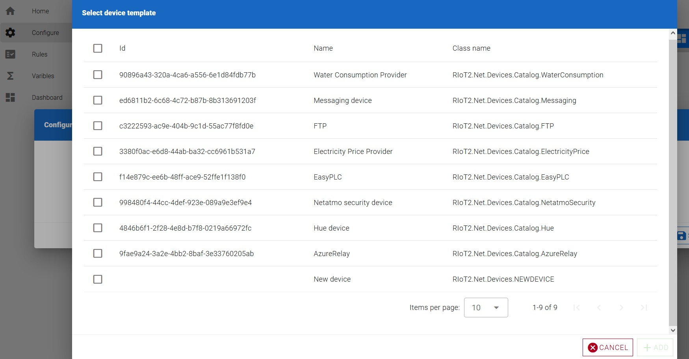

# Revolutionized-IoT2
Welcome to Revolutionized-IoT2 (RIoT2), a generic and scalable platform designed to run virtually any Internet of Things (IoT) scenario. It's not merely another HomeAssistant, but a versatile tool that can help control your smart home among many other applications.

## Basic concepts
To get started with RIoT2, it's important to understand its basic components: the MQTT server, a device, the orchestrator, and a node.

- A node is a thing connected to the MQTT network, hosting one or more devices.

- A device could be a sensor or an actuator within a node. Devices can send reports about their state (e.g., when the temperature changes). Some devices can receive commands to perform operations (e.g., turning on lights).

- The orchestrator serves as the central hub of the system. It listens to all reports and tracks the state of the system. The orchestrator can also enforce rules. For instance, if a certain type of report is received, the orchestrator issues a command. It also manages configurations for each node.

## Getting started
RIoT2 is designed to run in Docker containers. Here are the steps to set it up:

### 1. Installing MQTT
The first step is setting up MQTT. We recommend using the eclipse/mosquitto server. Here's an example configuration file for Mosquitto:

```
##Authentication #  
allow_anonymous false  
password_file /mosquitto/config/password.txt  
  
##Listeners #  
listener 1883 192.168.0.30  
listener 9001 192.168.0.30  
protocol websockets  
```

> [!NOTE]  
> The websocket protocol is required for the UI.

A good guide for setting up Mosquitto broker with Docker => https://github.com/sukesh-ak/setup-mosquitto-with-docker/blob/main/README.md

### 2. Setting up the Orchestrator
Build (or pull) the orchestrator container and set it up:
```
docker pull ghcr.io/revolutionized-iot2/riot2-orchestrator:latest
```

Set the following container environment parameters: 
- RIOT2_MQTT_IP - IP address for MQTT server  
- RIOT2_MQTT_PASSWORD - MQTT password set in password.txt  
- RIOT2_MQTT_USERNAME - MQTT username set in password.txt  
- RIOT2_ORCHESTRATOR_ID - Unique ID for Orchestrator across the whole system. GUID is recommended 
- RIOT2_ORCHESTRATOR_URL - Orchestrator endpoint URL. E.g. http://192.168.0.32
- RIOT2_USE_EXTERNAL_WORKFLOW_ENGINE - Set this to value 1 to Use Elsa3 workflow engine
- TZ - Timezone for Orchestrator. E.g. Europe/Helsinki  
  
Mount the volume at: 
- /app/StoredObjects - This location is where the Orchestrator stores persistent data, such as node configurations and rules

### 3. Setting up the Node
Build (or pull) the NET-node container and set it up:
```
docker pull ghcr.io/revolutionized-iot2/riot2-node:latest
```

Set the following container environment parameters:

- RIOT2_MQTT_IP - IP address for MQTT server  
- RIOT2_MQTT_PASSWORD - MQTT password set in password.txt  
- RIOT2_MQTT_USERNAME - MQTT username set in password.txt  
- RIOT2_NODE_ID - Unique ID for Node across the whole system. GUID is recommended  
- RIOT2_NODE_URL - Node endpoint URL. E.g. http://192.168.0.33  
- TZ - Timezone for the Node. E.g. Europe/Helsinki  

Mount the following container volumes:
- /app/Data - Contains all persistent data for the Node, like authentication objects 
- /app/Logs - Log files
- /app/Plugins - Device plugin location

You have the option to create your own device plugin or download the default one from the following link: https://github.com/Revolutionized-IoT2/RIoT2.Net.Devices/releases

If you are using custom plugins, upload all of them to your container's plugin folder. Remember also to upload all the dependencies they might have. If you are using the default device package, just unzip it to plugins folder.

> [!NOTE]  
> The plugins will be loaded when the container starts. Therefore, a reboot of the container is necessary for the plugins to take effect.

#### 3.1 Setting up the Raspberry Pi Node

Install Raspberry Pi OS 64 to your Raspberry Pi Device: https://www.raspberrypi.com/software/

Install docker to your Raspberry device by following debian instructions: https://docs.docker.com/engine/install/debian/

Create local directories for node data and plugins
```
mkdir /app/Data
mkdir /app/Logs
mkdir /app/Plugins
```

Upload plugins to plugins folder
> [!NOTE]  
> If you don't have any plugins, the node will shutdown automatically.


Pull the node image to your device

```
docker pull ghcr.io/revolutionized-iot2/riot2-node:latest-arm64v8
```

Update the docker command below according to your settings and start the node

```
docker run -d --restart=on-failure:5 \
-p 80:80 \
-v /app/Data:/app/Data \
-v /app/Logs:/app/Logs \
-v /app/Plugins:/app/Plugins \
-v /var/run/dbus:/var/run/dbus:ro \
--env RIOT2_MQTT_IP=192.168.0.30 \
--env RIOT2_MQTT_PASSWORD=password \
--env RIOT2_MQTT_USERNAME=edge \
--env RIOT2_NODE_ID=F811B5A0-E978-45BB-ADD3-584655DF21BF \
--env RIOT2_NODE_URL=http://riot2.local \
--env TZ=Europe/Helsinki \
--privileged \
ghcr.io/revolutionized-iot2/riot2-node:latest-arm64v8
```

You can check the status of the node by running the command
```
docker ps

docker logs {containerid}
```

Alternatively, you can check the logs in folder /app/Logs

### 4. Setting up the UI
While the UI is not essential for running the system, it offers substantial assistance in creating rules and node configurations, eliminating the need for manual creation. Additionally, the UI features a dashboard, providing an intuitive interface for monitoring the system's status and activities.

To set up the UI, you need to build (or pull) the UI container:
```
docker pull ghcr.io/revolutionized-iot2/riot2-ui:latest
```

Container environment parameters:  
- VITE_MQTT_SERVER - IP address for MQTT server  
- VITE_MQTT_USER - MQTT username set in password.txt  
- VITE_MQTT_PASSWORD - MQTT password set in password.txt  

Start the UI.

### 5. Configuring the system

Once the Mqtt-server, Orchestrator, Node (along with some devices), and UI are up and running, you can proceed to configure the Node. Start by launching your web browser. Navigate to the UI's address and select the "Configure" option. You should now be presented with the following view:


Begin the configuration process by adding a new Node. Click on the New Node button located in the toolbar. This action will open a dialog box where you can assign a name to your node and define its Id. Make sure to use the Id that you set in step three as RIOT2_NODE_ID. After entering these details, save the configuration to proceed.


The next step is to configure the devices. Initiate the process by clicking on the New Device button. This action will open a dialog box displaying all the devices associated with the node.



> [!NOTE]  
> If no devices are visible in the dialog box, ensure that the node is online. You can verify this by navigating back to the initial screen, which should display the configurations for all nodes.

Select the Web device and click on the Add button. This action will open the Device Configuration dialog box.

The Web device is a generic web device capable of receiving updates (webhooks) from the network and generating reports based on those updates.

Add a report template to the Web device using the following settings:


Save the settings.

> [!NOTE]  
> Once the configuration is saved, the Node will automatically reload the new settings and initiate a system restart.

Navigate to the Variables section and create a new Variable using the following settings:


In this example, we are going to use a Variable to store the state information from a WebHook. This connection is established by creating a rule. 

### 6. Installing workflow -engine

> [!NOTE]  
> The internal workflow engine will be retired and the default one will be Elsa3

Pull the Elsa workflow image to your device
```
docker pull ghcr.io/revolutionized-iot2/riot2-elsa:latest
```

Set the following container environment parameters:
- ASPNETCORE_ENVIRONMENT=Production
- RIOT2_MQTT_IP=192.168.0.30
- RIOT2_MQTT_PASSWORD=password
- RIOT2_MQTT_USERNAME=user
- RIOT2_WORKFLOW_ID=E27E898E-82DB-42C9-AC58-E93413CE7266
- RIOT2_WORKFLOW_URL=http://192.168.0.32
- TZ=Europe/Helsinki

Create local directory for persistent data (sqlite)
```
mkdir /app/Data
```
> [!NOTE]
> Please, refer to Elsa3 documentation for creating workflows: https://docs.elsaworkflows.io/
> RIoT2.Elsa -project contains 3 custom activities for interacting with RIoT2 system: Trigger, GetData and Output

### 7. Setting up the dashboard 

To visualize RIoT2 data you can use:

1. InfluxDB + Grafana by following instructions: https://github.com/Revolutionized-IoT2/RIoT2.Connector.InfluxDB
2. The dashboard provided by the default UI: https://github.com/Revolutionized-IoT2/RIoT2.UI
