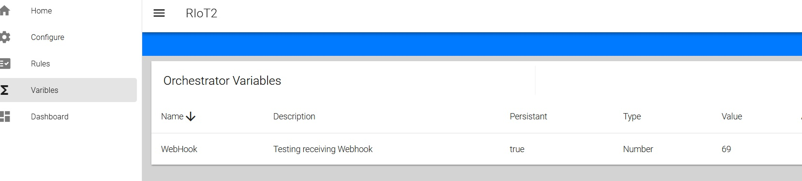

# Revolutionized-IoT2
Welcome to Revolutionized-IoT2 (RIoT2), a generic and scalable platform designed to run virtually any Internet of Things (IoT) scenario. It's not merely another HomeAssistant, but a versatile tool that can help control your smart home among many other applications.

## Basic concepts
To get started with RIoT2, it's important to understand its basic components: the MQTT server, a device, the orchestrator, and a node.

- A node is a thing connected to the MQTT network, hosting one or more devices.

- A device could be a sensor or an actuator within a node. Devices can send reports about their state (e.g., when the temperature changes). Some devices can receive commands to perform operations (e.g., turning on lights).

- The orchestrator serves as the central hub of the system. It listens to all reports and tracks the state of the system. The orchestrator can also enforce rules. For instance, if a certain type of report is received, the orchestrator issues a command. It also manages configurations for each node.

## Getting started
RIoT2 is designed to run in Docker containers. Here are the steps to set it up:

### 1. Installing MQTT
The first step is setting up MQTT. We recommend using the eclipse/mosquitto server. Here's an example configuration file for Mosquitto:

```
##Authentication #  
allow_anonymous false  
password_file /mosquitto/config/password.txt  
  
##Listeners #  
listener 1883 192.168.0.30  
listener 9001 192.168.0.30  
protocol websockets  
```

> [!NOTE]  
> The websocket protocol is required for the UI.

A good guide for setting up Mosquitto broker with Docker => https://github.com/sukesh-ak/setup-mosquitto-with-docker/blob/main/README.md

### 2. Setting up Orchestrator
Build (or pull) the orchestrator container and set it up:
```
docker pull ghcr.io/revolutionized-iot2/riot2-orchestrator:latest
```

Set the following container environment parameters: 
- RIOT2_MQTT_IP - IP address for MQTT server  
- RIOT2_MQTT_PASSWORD - MQTT password set in password.txt  
- RIOT2_MQTT_USERNAME - MQTT username set in password.txt  
- RIOT2_ORCHESTRATOR_ID - Unique ID for Orchestrator across the whole system. GUID is recommended 
- RIOT2_ORCHESTRATOR_URL - Orchestrator endpoint URL. E.g. http://192.168.0.32
- TZ - Timezone for Orchestrator. E.g. Europe/Helsinki  
  
Mount the volume at: 
- /app/StoredObjects - This location is where the Orchestrator stores persistent data, such as node configurations and rules

### 3. Setting up Node
Build (or pull) the NET-node container and set it up:
```
docker pull ghcr.io/revolutionized-iot2/riot2-node:latest
```

Set the following container environment parameters:

- RIOT2_MQTT_IP - IP address for MQTT server  
- RIOT2_MQTT_PASSWORD - MQTT password set in password.txt  
- RIOT2_MQTT_USERNAME - MQTT username set in password.txt  
- RIOT2_NODE_ID - Unique ID for Node across the whole system. GUID is recommended  
- RIOT2_NODE_URL - Node endpoint URL. E.g. http://192.168.0.33  
- TZ - Timezone for the Node. E.g. Europe/Helsinki  

Mount the following container volumes:
- /app/Data - Contains all persistent data for the Node, like authentication objects 
- /app/Logs - Log files
- /app/Plugins - Device plugin location

You have the option to create your own device plugin or download the default one from the following link: https://github.com/Revolutionized-IoT2/RIoT2.Net.Devices/releases

Once you have your device plugins ready, upload all of them to your container.

> [!NOTE]  
> The plugins will be loaded when the container starts. Therefore, a reboot of the container is necessary for the plugins to take effect.

### 4. Setting up UI
While the UI is not essential for running the system, it offers substantial assistance in creating rules and node configurations, eliminating the need for manual creation. Additionally, the UI features a dashboard, providing an intuitive interface for monitoring the system's status and activities.

To set up the UI, you need to build (or pull) the UI container:
```
docker pull ghcr.io/revolutionized-iot2/riot2-ui:latest
```

Container environment parameters:  
- VITE_MQTT_SERVER - IP address for MQTT server  
- VITE_MQTT_USER - MQTT username set in password.txt  
- VITE_MQTT_PASSWORD - MQTT password set in password.txt  

Start the UI.

### 5. Getting started

Once the Mqtt-server, Orchestrator, Node (along with some devices), and UI are up and running, you can proceed to configure the Node. Start by launching your web browser. Navigate to the UI's address and select the "Configure" option. You should now be presented with the following view:


Begin the configuration process by adding a new Node. Click on the New Node button located in the toolbar. This action will open a dialog box where you can assign a name to your node and define its Id. Make sure to use the Id that you set in step three as RIOT2_NODE_ID. After entering these details, save the configuration to proceed.


The next step is to configure the devices. Initiate the process by clicking on the New Device button. This action will open a dialog box displaying all the devices associated with the node.


> [!NOTE]  
> If no devices are visible in the dialog box, ensure that the node is online. You can verify this by navigating back to the initial screen, which should display the configurations for all nodes.

Select the Web device and click on the Add button. This action will open the Device Configuration dialog box.

The Web device is a generic web device capable of receiving updates (webhooks) from the network and generating reports based on those updates.

Add a report template to the Web device using the following settings:


Save the settings.

> [!NOTE]  
> Once the configuration is saved, the Node will automatically reload the new settings and initiate a system restart.

Navigate to the Variables section and create a new Variable using the following settings:


In this example, we are going to use a Variable to store the state information from a WebHook. This connection is established by creating a rule. To do this, navigate to the Rules section and click on 'Create new rule'.

The first step in creating a rule is always setting a trigger:


In this scenario, we will only add two steps. For the next step, select 'Variable' as an output:


Open the output by clicking on it and configure the following settings:


Next, define the Rules data model as 'number'. The default value can be any number of your choosing.

Finally, activate the rule:


Now that the rule is active, try calling the webhook:

```
curl -X POST -H 'Content-Type: application/json' -i 'http://{node-ip-address}/api/webhook/test' --data 69
```

If you receive a 200 response, you should also see that the Variable has been updated accordingly:



**TODO Dashboard**

## Next Steps

At this stage, the code may contain some bugs, so extensive testing is necessary. Creating some unit tests will be helpful to prevent regression. The current focus has been on getting everything functioning, so substantial code refactoring will be required at some point.

The next steps could include creating nodes for:

- Raspberry (UWP / Net Core)
- ESP32
- M5Core2
- M5Dial
- Arduino

In addition, developing a simple phone app to receive Firebase messages and display the dashboard would be a valuable enhancement.